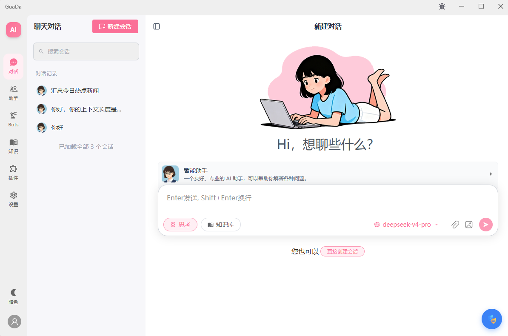
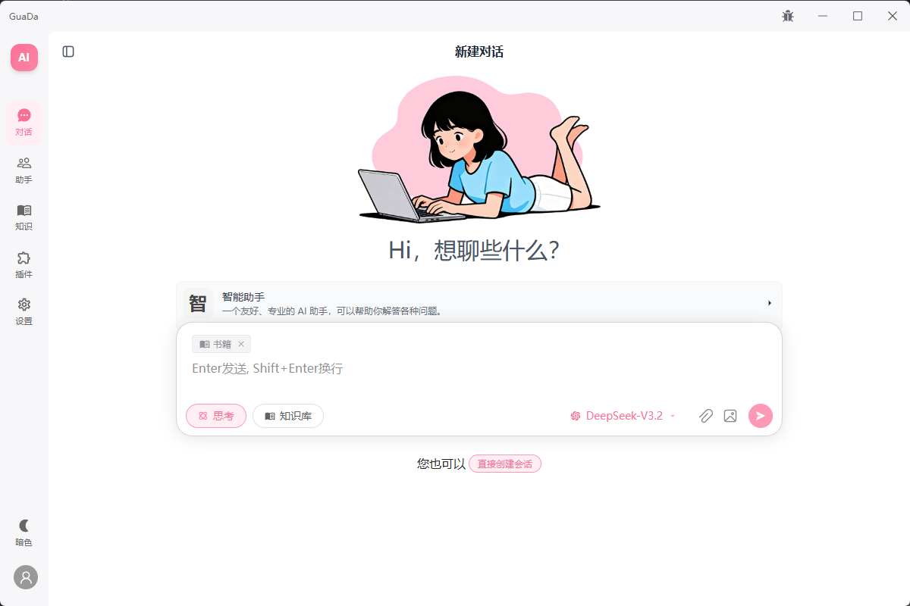
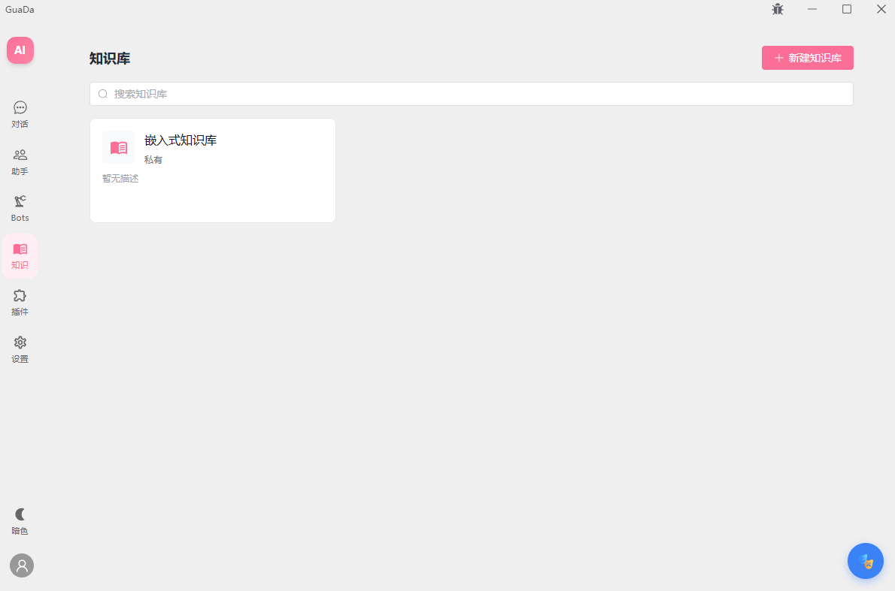
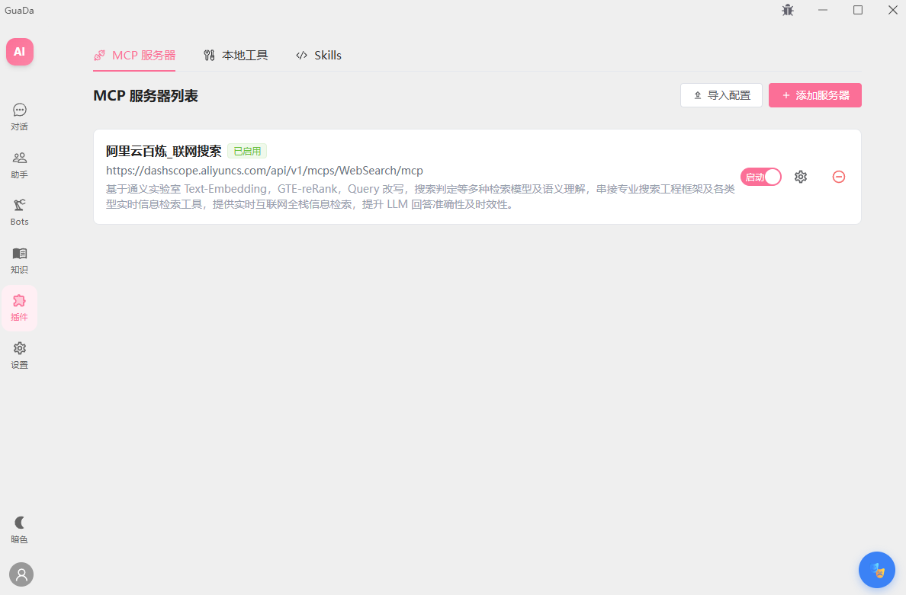
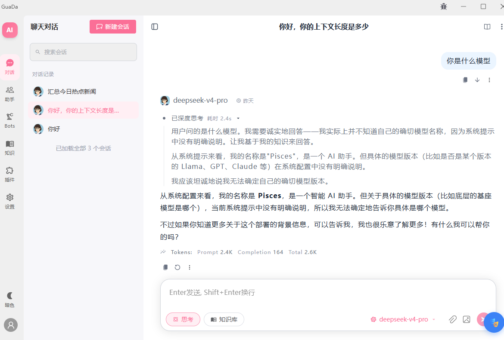

# GuaDa - 智能AI对话系统

> 一个功能强大的企业级AI对话平台，支持多模型接入、知识库检索增强(RAG)、MCP工具调用、长上下文管理等高级功能。


## 📋 目录

- [项目简介](#项目简介)
- [核心功能](#核心功能)
- [技术架构](#技术架构)
- [快速开始](#快速开始)
- [项目结构](#项目结构)
- [API文档](#api文档)
- [开发指南](#开发指南)
- [部署说明](#部署说明)
- [贡献指南](#贡献指南)

## 🎯 项目简介

GuaDa 是一个现代化的全栈AI对话应用,采用前后端分离架构。后端基于 NestJS + TypeScript 构建,前端使用 Vue 3 + Vite,同时支持 Electron 桌面应用打包。系统支持30+种LLM提供商(OpenAI、DeepSeek、Anthropic、阿里云百炼、智谱GLM、Google Gemini等),集成了RAG知识库、MCP协议工具调用、Shell命令执行、会话上下文压缩、多轮工具调用等高级特性。

这个项目断断续续开发了挺长时间,虽然跟 OpenClaw 这样的成熟项目相比还有差距,但一直在努力追赶。虽不能至,心向往之~

本项目的终极目标是打造一个易用、好用的 AI Agent 平台,让技术真正普惠每个人!

### 📸 项目截图











### 主要特点

- **多模型支持**: 兼容 OpenAI、阿里云百炼、智谱GLM、Google Gemini、DeepSeek、Anthropic Claude、硅基流动(SiliconFlow)、火山引擎、百度千帆、Moonshot、MiniMax、Groq、NVIDIA 等30+种LLM提供商
- **RAG知识库**: 支持PDF、Word、TXT等文档上传，自动分块向量化，实现精准检索增强生成
- **MCP工具集成**: 支持 Model Context Protocol，可连接外部MCP服务器扩展AI能力
- **智能上下文管理**: 自动摘要压缩、滑动窗口策略、Token统计与优化
- **多角色系统**: 支持创建个性化AI角色，分组管理，灵活切换
- **实时流式响应**: SSE流式输出，支持思考过程展示、工具调用可视化
- **用户权限管理**: JWT认证，主账户/子账户体系，细粒度权限控制
- **文件夹层级上传**: 知识库支持完整的文件夹层级结构管理
- **跨平台支持**: 支持 Web 浏览器访问和 Electron 桌面应用两种部署方式
- **多平台机器人集成**: 内置 Bot Gateway 模块，支持 QQ、企业微信智能机器人、飞书等多平台接入

### 🚀 后续开发计划

- **Skills技能系统**: 支持技能的安装、管理和执行，扩展AI助手能力边界
- **插件机制完善**: 构建更全面的插件生态系统，支持第三方功能扩展
- **记忆管理系统**: 增强长期记忆能力，支持用户偏好学习、对话历史回顾和个性化推荐
- **子账户系统**: 完善多用户管理体系，支持团队协作、权限分级和数据隔离

## ✨ 核心功能

### 💬 智能对话系统

- **流式对话**: 基于SSE的实时流式响应，支持文本、推理内容、工具调用的增量展示
- **消息再生**: 支持三种再生模式（覆盖、多版本、追加），灵活管理对话历史
- **会话锁定**: 防止并发请求冲突，确保会话一致性
- **中断处理**: 客户端断开时自动中止LLM请求，节省资源

### 🧠 上下文管理

- **智能摘要压缩**: 当对话超出上下文窗口时，自动生成历史摘要并压缩旧消息
- **滑动窗口策略**: 可配置的记忆长度，平衡上下文质量与Token消耗
- **语义轮次分组**: 按对话轮次组织消息，保持逻辑完整性
- **Token统计**: 实时监控Token使用情况，显示使用率和剩余容量

### 📚 RAG知识库

- **多格式支持**: PDF、DOCX、TXT等常见文档格式
- **智能分块**: 可配置的chunk大小、重叠率，支持最小分块过滤
- **混合检索**: 集成 sqlite-vec 向量搜索 + FTS5全文检索，支持语义+关键词加权融合
- **中文优化**: 内置 jieba 分词器，精准支持中文关键词搜索
- **文件夹层级**: 完整的目录树结构，支持批量上传和管理
- **处理进度追踪**: 实时显示文档处理状态和进度百分比

### 🔧 MCP工具调用

- **MCP协议支持**: 兼容 Model Context Protocol 标准
- **动态工具发现**: 自动从MCP服务器获取可用工具列表
- **多轮工具执行**: 支持Agent循环，连续调用多个工具完成任务
- **工具命名空间**: 清晰的工具分类和组织（mcp、time、memory、knowledge_base、shell、image_recognition）

### 👤 用户与角色系统

- **JWT认证**: 安全的用户认证机制
- **角色分组**: 将AI角色按用途分组，便于管理
- **个性化配置**: 每个角色可独立设置系统提示词、温度参数等

### 📊 监控与优化

- **思考时长统计**: 记录模型的推理时间
- **Token使用分析**: 详细的Token消耗统计
- **错误处理**: 完善的异常捕获和错误信息返回
- **性能优化**: 批量SQL操作、索引优化、缓存策略

### 🤖 多平台机器人集成（Bot Gateway）

GuaDa 支持将 AI 对话能力扩展到多个即时通讯平台，通过 Bot Gateway 模块实现多平台机器人集成：

#### **支持的平台**

- **QQ 机器人**: 基于 QQ 官方 Bot API，支持群聊和私聊
- **企业微信智能机器人**: 基于 WebSocket 长连接，支持企业内部沟通场景
- **飞书机器人**: 基于 Lark Open API，支持企业协作场景

#### **核心特性**

- **统一适配架构**: 采用策略模式设计 `IBotPlatform` 接口，各平台适配器实现统一的消息收发规范
- **自动重连机制**: WebSocket 连接断开时自动重试，支持指数退避策略，确保服务稳定性
- **消息合并与缓冲**: 智能合并短时间内的多条消息（1.5秒窗口），避免频繁调用 AI，提升响应效率
- **多模态消息支持**: 
  - 自动下载并存储图片和文件附件到本地
  - 生成图片预览图（256x256），优化前端展示性能
  - 无缝接入 AI 图片识别和文件解析流程
- **流式回复能力**: 支持边生成边推送，实时将 AI 回复发送回聊天平台
- **会话映射管理**: 自动将外部平台用户映射到内部 Session，保持对话上下文连续性
- **知识库集成**: 支持为不同机器人配置专属知识库，实现领域化问答
- **实例生命周期管理**: 支持动态启动、停止、重启机器人实例，配置热更新

## 🚀 快速开始

### 环境要求

- **Node.js**: >= 18.x (推荐 20.x LTS)
- **npm**: >= 9.x (或使用 pnpm/yarn)

### 安装步骤

#### 1. 克隆项目

```bash
git clone <repository-url>
cd ai_chat
```

#### 2. 后端设置

```bash
cd backend-ts

# 安装依赖
npm install

# 初始化数据库（首次运行或schema变更后）
npx prisma migrate dev

# 启动开发服务器
npm run start:dev
```

后端服务将在 `http://localhost:3000` 启动

#### 3. 前端设置

```bash
cd frontend

# 安装依赖
npm install

# 启动开发服务器
npm run dev
```

前端应用将在 `http://localhost:5173` 启动（或Vite分配的端口）

### 首次使用

#### Web 端开发环境

1. **数据库初始化**：首次运行后端时，需要执行种子脚本初始化数据库
   ```bash
   cd backend-ts
   npm run db:seed --force
   ```
   这将创建默认管理员账户：
   - 用户名：`guada`
   - 密码：`guada`

2. **访问应用**：打开浏览器访问前端地址（如 http://localhost:5173）

3. **登录系统**：使用默认账户登录后即可开始使用

4. **安全建议**：首次登录后，建议立即修改密码以确保账户安全

#### Electron 桌面应用

Electron 应用启动时会**自动初始化数据库**：

1. **首次启动**：从 `data/seed_template.db` 模板文件复制数据库到用户数据目录
2. **自动同步**：检测 Schema 版本变化，自动执行数据库结构同步
3. **默认账户**：已预置默认管理员账户（用户名：`guada`，密码：`guada`）
4. **直接登录**：启动后直接使用默认账户登录即可

> 💡 **提示**：Electron 应用的数据库存储在用户数据目录（`app.getPath('userData')`），应用更新时会保留数据。

## 📁 项目架构

### 系统架构图

```
 ===================================================================
                       客户端层
  ┌─────────────────────────┐  ┌─────────────────────────┐
  │     Web 浏览器           │  │   Electron 桌面应用      │
  │     Vue 3 + Vite        │  │                          │
  └───────────┬─────────────┘  └───────────┬─────────────┘
              │                            │
              └──────────────┬─────────────┘
                             │
                             ▼
 ===================================================================
                     API Gateway (REST + SSE)
                             │
              ┌──────────────┼──────────────┐
              │              │              │
              ▼              ▼              ▼
 ===================================================================
  核心业务模块                           支撑模块
  ┌─────────────────────┐   ┌─────────────────────────┐
  │  Chat Module        │   │  Auth Module             │
  │  对话引擎            │   │  JWT 认证                │
  ├─────────────────────┤   ├─────────────────────────┤
  │  Knowledge Base     │   │  LLM Core                │
  │  RAG 知识库          │   │  多模型适配              │
  ├─────────────────────┤   ├─────────────────────────┤
  │  Bot Gateway        │   │  File Service            │
  │  多平台机器人         │   │  文件管理                │
  ├─────────────────────┤   ├─────────────────────────┤
  │  Tools & MCP        │   │  User Management         │
  │  工具调用            │   │  用户管理                │
  └─────────────────────┘   └─────────────────────────┘
              │                            │
              └──────────────┬─────────────┘
                             │
                             ▼
 ===================================================================
                         数据层
  ┌─────────────────────┐  ┌─────────────────────┐  ┌──────────────┐
  │  SQLite             │  │  Vector DB          │  │ File Storage │
  │  主业务数据库        │  │  sqlite-vec         │  │ 静态文件      │
  └─────────────────────┘  └─────────────────────┘  └──────────────┘
                             │
                             ▼
 ===================================================================
                         外部服务
  ┌──────────┐ ┌──────────┐ ┌──────────┐ ┌──────────────────┐ ┌────────────┐
  │ QQ Bot   │ │ 企业微信  │ │ 飞书/Lark│ │ LLM Providers    │ │ MCP        │
  │ API      │ │          │ │          │ │ OpenAI/Gemini等  │ │ Servers    │
  └──────────┘ └──────────┘ └──────────┘ └──────────────────┘ └────────────┘
```

**数据流向说明**：
1. 客户端（Web/Electron）通过 REST + SSE 请求 API Gateway
2. API Gateway 路由到各业务模块（对话、知识库、机器人、工具）
3. 业务模块调用支撑模块（认证、模型适配、文件管理）
4. 数据持久化到 SQLite / Vector DB / 文件存储
5. 业务模块通过外部服务对接 LLM 提供商、MCP 服务器、IM 平台

### 核心模块说明

| 模块 | 职责 | 关键技术 |
|------|------|----------|
| **Chat Module** | 对话引擎、上下文管理、流式响应 | AgentService, ContextManager, SSE |
| **Knowledge Base** | 文档解析、向量检索、混合搜索 | sqlite-vec, FTS5, jieba 分词 |
| **Bot Gateway** | 多平台机器人适配、消息编排 | 策略模式, WebSocket, 消息缓冲 |
| **Tools & MCP** | 工具发现、执行编排、结果清理 | MCP SDK, ToolOrchestrator |
| **LLM Core** | 多模型适配、Token 计算 | OpenAI SDK, tiktoken |
| **File Service** | 文件上传、图片处理、预览生成 | sharp, UploadPathService |
| **Settings** | 系统设置、免登录配置、工具状态 | SettingsService |
| **Auth** | JWT 认证、用户鉴权 | passport-jwt, bcrypt |

## 📖 API文档

GuaDa 提供完整的 RESTful API，支持会话管理、知识库检索、MCP工具调用等功能。

### 主要API模块

| 模块 | 端点前缀 | 说明 |
|------|---------|------|
| **认证** | `/api/v1/auth` | 登录、注册、自动登录 |
| **会话** | `/api/v1/sessions` | 会话CRUD、标题生成、历史压缩 |
| **对话** | `/api/v1/chat` | SSE流式对话、POST流式对话 |
| **消息** | `/api/v1/messages` | 消息管理、多版本切换 |
| **知识库** | `/api/v1/knowledge-bases` | 知识库管理、文件上传、混合检索 |
| **MCP服务器** | `/api/v1/mcp-servers` | MCP服务器配置、工具刷新 |
| **模型** | `/api/v1/models` | 模型和提供商管理 |
| **角色** | `/api/v1/characters` | AI角色及分组管理 |
| **机器人** | `/api/v1/bot-admin` | Bot实例管理、配置更新 |
| **设置** | `/api/v1/settings` | 系统设置、免登录配置 |
| **文件** | `/api/v1/files` | 文件上传、预览管理 |

> 💡 **详细API文档**: 请参考后端代码中的 Controller 层，或使用 Swagger/OpenAPI 工具生成完整文档。

## 🛠️ 开发指南

### 后端开发

#### 添加新的业务模块

1. 在 `src/modules/` 下创建模块目录
2. 创建Module、Controller、Service文件
3. 在 `app.module.ts` 中导入新模块
4. 编写单元测试

#### 数据库迁移

```bash
# 修改 prisma/schema.prisma 后执行
npx prisma migrate dev --name <migration_name>

# 生成Prisma Client
npx prisma generate
```

#### 添加工具提供者

在 `src/modules/tools/providers/` 下创建新的Provider类，实现 `IToolProvider` 接口：

```typescript
export class MyToolProvider implements IToolProvider {
  readonly namespace = 'my_tools';
  
  async getToolsNamespaced(...) { ... }
  async executeWithNamespace(...) { ... }
}
```

### 前端开发

#### 添加新页面

1. 在 `src/components/` 下创建页面组件
2. 在路由配置中添加路由
3. 如需状态管理，在 `src/stores/` 中添加Store

#### API调用

使用 `src/services/` 中的API服务：

```javascript
import { sessionApi } from '@/services/api'

const sessions = await sessionApi.getSessions()
```

### 代码规范

项目遵循统一的代码规范（见 `.lingma/rules/develop.md`）：

- **缩进**: 4个空格
- **注释**: 使用中文，解释"为什么"而非"做什么"
- **命名**: 
  - 变量/函数: camelCase
  - 类/接口: PascalCase
  - 常量: UPPER_SNAKE_CASE
- **TypeScript**: 避免使用any，显式声明类型

## 🌐 部署说明

### 生产环境构建

#### 后端

```bash
cd backend-ts

# 构建
npm run build

# 启动生产服务器
npm run start:prod
```

#### 前端

```bash
cd frontend

# 构建
npm run build

# 生成的文件在 dist/ 目录，可部署到Nginx或其他静态服务器
```

### 环境变量配置

关键环境变量（`.env`）：

```bash
# 数据库配置
DATABASE_URL="file:./data/ai_chat.db"
VECTOR_DB_PATH=./data/vector_db.sqlite

# JWT配置
JWT_SECRET="your-super-secret-jwt-key-change-this-in-production-2026"
JWT_EXPIRES_IN="7d"

# 服务器配置
PORT=3000
NODE_ENV=development
BASE_URL=http://localhost:3000

# 静态资源配置
STATIC_DIR=./static
STATIC_URL=/static

# 文件上传配置
UPLOAD_ROOT_DIR=./data/uploads
UPLOAD_URL_PREFIX=/uploads

# 模型提供商API Keys（可选）
SILICONFLOW_API_KEY=sk-xxx

# QQ Bot 配置（可选）
QQ_BOT_ENABLED=true
QQ_APP_ID=your_app_id
QQ_APP_SECRET=your_app_secret
```

## 📄 许可证

本项目采用 MIT 许可证 - 详见 [LICENSE](LICENSE) 文件


---

**最后更新**: 2026-05-04  
**当前版本**: v2.0.0 (TypeScript重构版)