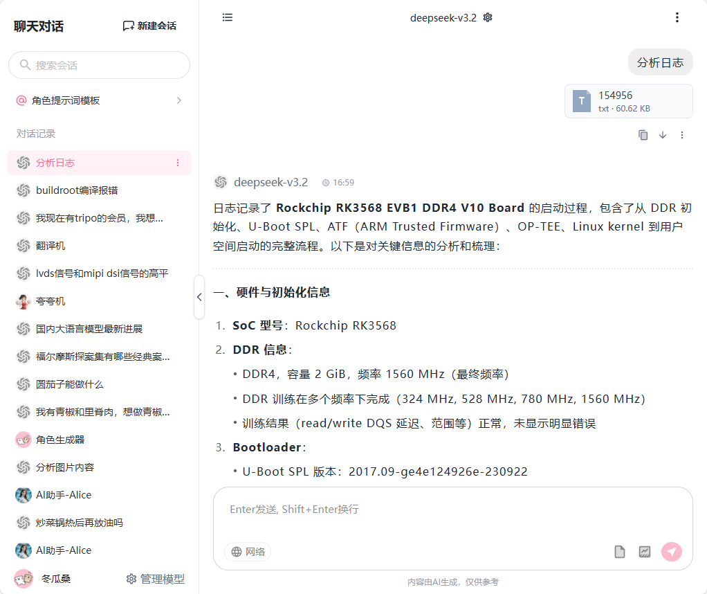
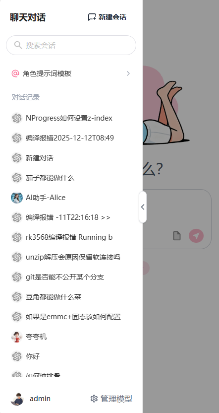
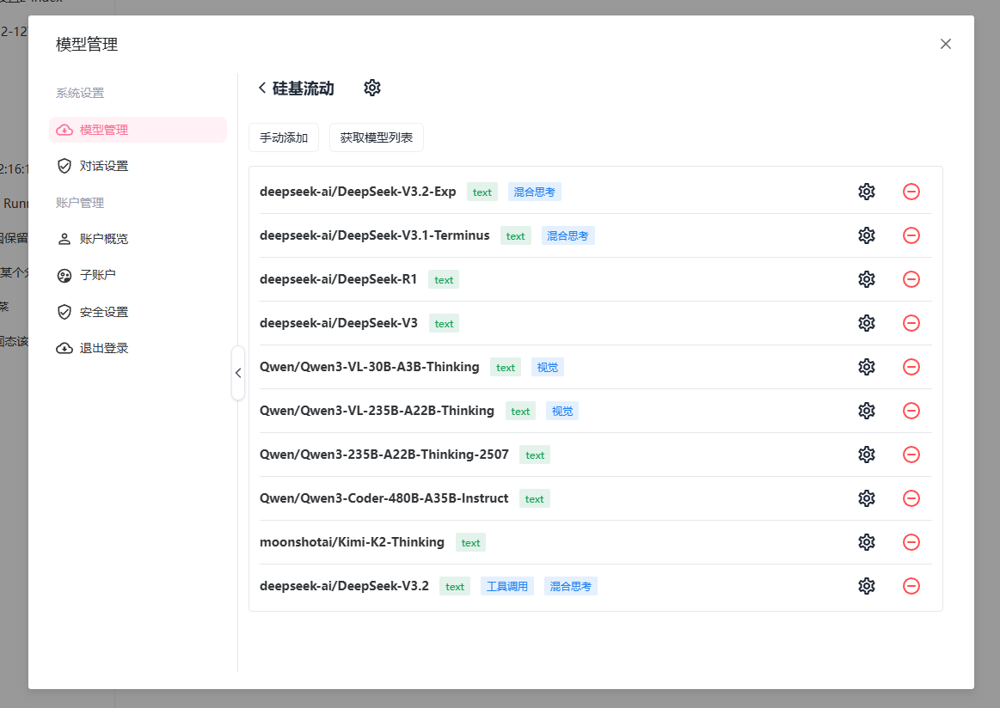

# AI Chat - 智能AI对话系统

> 本文档由AI起草~ 目前项目还在持续开发中，很多功能仍未实现。

AI Chat 是一个功能强大的AI对话系统，支持配置兼容的OpenAI 的API接口、支持多角色对话、会话管理、模型配置和多种高级AI功能。该项目采用前后端分离架构，后端基于Python Flask，前端使用Vue 3 + Vite构建。


## 功能特点

- 💬 实时AI对话体验
- 👤 多角色设定与个性化
- 🧠 高级记忆管理策略（滑动窗口、摘要增强等）
- 📝 对话历史记录与管理
- 🤖 多模型支持（兼容OpenAI、阿里云等多种LLM提供商）
- 🔍 RAG（检索增强生成）支持
- 🌐 Web搜索集成
- 📊 Token统计与分析
- 🔐 用户认证与权限管理
- 🎨 响应式前端界面
- 📁 文件上传与管理







## 技术架构

### 后端技术栈

- [Python 3.8+](https://www.python.org/)
- [Flask](https://flask.palletsprojects.com/) Web框架
- [SQLAlchemy](https://www.sqlalchemy.org/) ORM
- [Alembic](https://alembic.sqlalchemy.org/) 数据库迁移工具
- [SQLite](https://www.sqlite.org/) 默认数据库（支持扩展至MySQL/PostgreSQL）

### 前端技术栈

- [Vue 3](https://vuejs.org/) 渐进式JavaScript框架
- [Vite](https://vitejs.dev/) 构建工具
- [Pinia](https://pinia.vuejs.org/) 状态管理
- [Tailwind CSS](https://tailwindcss.com/) 样式框架
- [Naive UI](https://www.naiveui.com/) Vue 3 组件库

## 核心特性详解

### 多角色对话系统
系统支持创建和管理多个AI角色，每个角色可以有不同的个性、背景和对话风格设置。

### 高级记忆策略
AI Chat实现了多种记忆管理策略，确保在长对话中能够有效管理上下文：
- **无记忆策略**：每次对话独立，不保留历史记录
- **滑动窗口策略**：只保留最近的几条对话记录
- **摘要增强滑动窗口策略**：结合对话摘要和关键信息检索，实现更智能的上下文管理  **(开发中...)** 

### 多模型支持
系统支持接入多种大语言模型提供商：
- OpenAI
- 阿里云
- 硅基流动
- 可轻松扩展支持更多模型提供商

### RAG（检索增强生成）
通过向量数据库集成，实现基于知识库的问答功能，提升AI回答的准确性和专业性。

## 快速开始

### 环境要求

- Python 3.8+
- Node.js 16+
- npm/yarn

### 后端部署

1. 进入后端目录：
```bash
cd backend
```

2. 创建虚拟环境并安装依赖：
```bash
python -m venv venv
source venv/bin/activate  # Linux/Mac
# 或 venv\Scripts\activate  # Windows

pip install -r requirements.txt
```

3. 初始化数据库：
```bash
alembic upgrade head
```

4. 启动后端服务：
```bash
python run.py
```

### 前端部署

1. 进入前端目录：
```bash
cd frontend
```

2. 安装依赖：
```bash
npm install
```

3. 启动开发服务器：
```bash
npm run dev
```

4. 构建生产版本：
```bash
npm run build
```

## 设置密码

 **注意初次访问请访问 http://xxxxx/password设置管理员账户！！！
** 
## API文档

后端API遵循RESTful设计原则，主要接口包括：

- 用户认证：`/api/v1/auth/*`
- 会话管理：`/api/v1/sessions/*`
- 消息管理：`/api/v1/messages/*`
- 角色管理：`/api/v1/characters/*`
- 模型管理：`/api/v1/models/*`

详细接口文档可通过Swagger或Postman查看。

## 配置说明

### 环境变量

后端支持通过环境变量进行配置：
- `SECRET_KEY`：Flask密钥
- `DATABASE_URL`：数据库连接URL
- `JWT_SECRET_KEY`：JWT密钥

### 模型提供商配置

系统支持动态配置模型提供商，可以在管理界面中添加不同的模型提供商及其API密钥。

## 开发指南

### 项目结构

```
.
├── backend/                 # 后端代码
│   ├── app/                 # 核心应用代码
│   │   ├── models/          # 数据模型
│   │   ├── repositories/    # 数据访问层
│   │   ├── routes/          # API路由
│   │   ├── services/        # 业务逻辑层
│   │   └── utils/           # 工具类
│   ├── migrations/          # 数据库迁移文件
│   └── tests/               # 测试代码
└── frontend/                # 前端代码
    ├── src/
    │   ├── components/      # Vue组件
    │   ├── composables/     # Vue组合式函数
    │   ├── services/        # API服务
    │   ├── stores/          # 状态管理
    │   └── utils/           # 工具函数
    └── public/              # 静态资源
```

### 数据库设计

系统使用关系型数据库存储用户、会话、消息等数据，通过Alembic进行数据库版本管理。

### 扩展开发

1. 添加新的记忆策略：继承MemoryStrategy类并实现相应方法
2. 添加新的模型提供商：实现LLMService接口
3. 添加新功能模块：按照现有的MVC模式进行扩展

## 贡献指南

欢迎提交Issue和Pull Request来改进项目。在贡献代码之前，请确保：

1. Fork项目
2. 创建功能分支 (`git checkout -b feature/AmazingFeature`)
3. 提交更改 (`git commit -m 'Add some AmazingFeature'`)
4. 推送到分支 (`git push origin feature/AmazingFeature`)
5. 开启Pull Request

## 许可证

本项目采用MIT许可证，详情请见 [LICENSE](LICENSE) 文件。

## 联系方式

如有任何问题或建议，请通过以下方式联系我们：
- 提交Issue
- 发送邮件至项目维护者