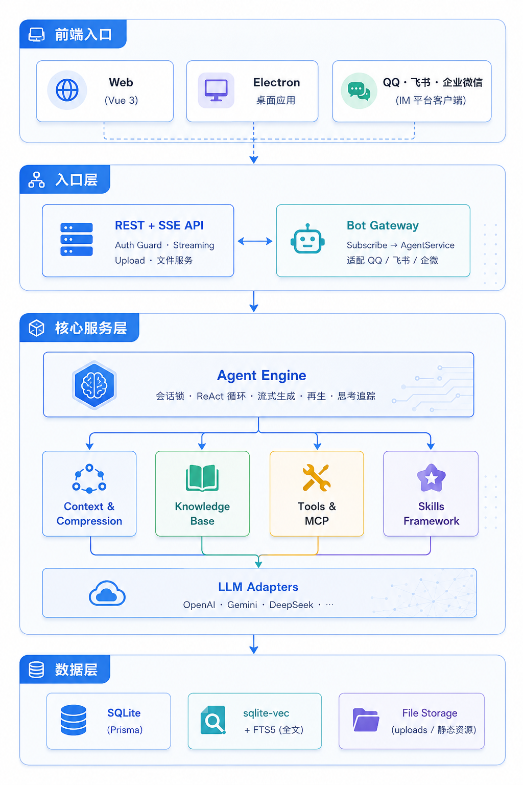
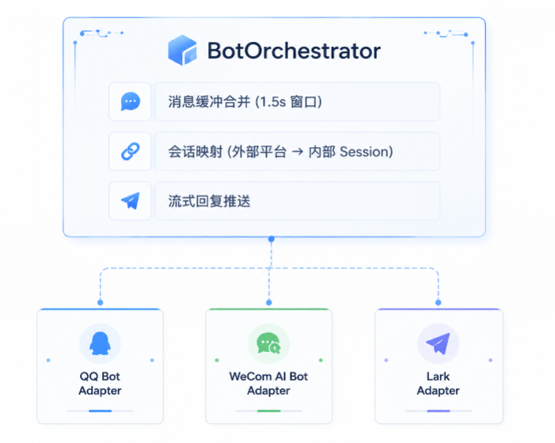

# GuaDa — 智能 AI 对话平台

> 智能 AI 对话系统，支持 ReAct Agent、多模型适配、RAG 知识库检索、MCP 工具调用与 Skills 技能框架。目标是打造一个可用、易用、好用的个人智能助理。**目前处于早期开发阶段，部分功能正在持续快速迭代中。**

[](https://nestjs.com)
[](https://vuejs.org)
[](https://www.typescriptlang.org)
[](https://www.prisma.io)
[](LICENSE)

---

## 目录

- [系统概览](#系统概览)
- [整体架构](#整体架构)
- [核心引擎](#核心引擎)
  - [Agent 对话引擎](#agent-对话引擎)
  - [上下文管理与压缩](#上下文管理与压缩)
  - [工具调用系统](#工具调用系统)
- [知识库 (RAG)](#知识库-rag)
- [Skills 技能框架](#skills-技能框架)
- [Bot 网关](#bot-网关)
- [技术栈](#技术栈)
- [快速开始](#快速开始)
- [项目结构](#项目结构)
- [许可证](#许可证)

---

## 系统概览

GuaDa 是一个功能完备的 AI 对话平台，围绕 **ReAct Agent** 设计，将 LLM 推理与工具调用深度结合，形成多轮自治循环。系统同时集成了 **RAG 知识库**、**MCP 协议** 和 **Skills 技能框架**，支持多种模型提供商，可作为企业内部 AI 中台、聊天机器人后端或个人智能助理使用。

**架构特点**：

- **双入口**：REST + SSE API 和 Bot Gateway 是两个对等入口，分别服务 Web/桌面用户和即时通讯平台用户，最终汇聚到同一个 Agent 引擎
- **Agent 中心化**：所有能力（知识检索、工具执行、技能调用）经由 Agent 循环统一调度
- **插拔式扩展**：工具、技能、模型适配器均采用接口抽象，支持热插拔（目前skills支持热插拔，其余正在开发）
- **长上下文管理**：两级压缩，优先裁剪工具结果再进行语义压缩，压缩支持回退

### 产品截图


---

## 整体架构



### 架构层次介绍

| 层级 | 职责 | 核心组件 |
|------|------|----------|
| **前端入口** | 用户交互层,提供三种访问方式:Web 应用、Electron 桌面应用、IM 平台客户端 | Vue 3 Web 端、Electron 桌面应用、QQ/飞书/企业微信等 IM 平台 |
| **入口层** | 请求处理与路由分发,将不同来源的请求统一转换为内部协议 | REST + SSE API(面向 Web/Electron)、Bot Gateway(面向 IM 平台) |
| **核心服务层** | 业务逻辑中枢,由 Agent Engine 统一调度对话、知识检索、工具调用等能力 | Agent Engine、上下文压缩、知识库 RAG、工具与 MCP、Skills 框架、LLM 适配器 |
| **数据层** | 持久化存储基础设施,管理关系型数据、向量索引和文件资源 | SQLite(Prisma)、sqlite-vec + FTS5、文件系统存储 |

---

## 核心引擎

### Agent 对话引擎

GuaDa 的核心是一个实现了 **ReAct (Reasoning + Acting) 模式** 的多轮自治循环引擎：

**关键设计**：

| 机制 | 说明 |
|------|------|
| **会话锁 (Session Lock)** | 基于内存 Map 的排他锁，同一会话同时仅处理一个请求，防止并发冲突 |
| **流式传输 (SSE)** | 异步生成器逐块产出事件，前端实时渲染文本、思维链、工具调用进度 |
| **ReAct 循环** | LLM 推理 → 工具调用 → 结果注入 → 再度推理 |
| **中断处理** | `AbortSignal` 传递至 LLM 请求层，客户端断开时自动中止，节省 Token 成本 |
| **再生模式** | 支持 `overwrite`（覆盖）和 `multi_version`（多版本并存）两种消息重生策略 |
| **思考追踪** | 记录推理开始/结束时间戳，计算思维链耗时，存储于消息元数据中 |

---

### 上下文管理与压缩

系统采用 **两级压缩策略** 管理长对话的上下文窗口，在 Token 限制与信息保真之间取得平衡。

#### 架构层次

```
┌─────────────────────────────────────────────┐
│            Agent (agent.service.ts)         │
│   设置 effectiveContextWindow，传入 initialize │
└───────────────────┬─────────────────────────┘
                    ▼
┌─────────────────────────────────────────────┐
│       ConversationContext (上下文管理器)       │
│   · Token 计数缓存 (增量维护)                 │
│   · 压缩触发判断 (阈值检查)                    │
│   · 摘要注入 (追加至 System Prompt)           │
│   · 最终消息组装 (System + 摘要 + 历史)       │
└──────┬───────────────────────┬──────────────┘
       ▼                       ▼
┌──────────────┐     ┌─────────────────────────┐
│ MessageStore │     │   CompressionEngine      │
│ 消息存取      │     │   Stage 1: Pruning       │
│ 格式转换      │     │   Stage 2: Compaction     │
└──────────────┘     └─────────────────────────┘
```

**核心特性**：

- **Token 计数**：使用 `@huggingface/tokenizers` 进行精准 Token 计数，避免字符预估的不准确性
- **检查点 (Checkpoint)**：每次压缩持久化游标到 `SessionContextState` 表，重启/中断后从检查点恢复
- **保护机制**：最近 5 条消息强制保留不受压缩影响，最新 3 条工具结果免于裁剪
- **专用压缩模型**：支持配置独立模型执行压缩，降低摘要生成成本

**三种压缩模式**：

系统定义了三种摘要生成策略：

| 模式 | 枚举值 | 行为 |
|------|--------|------|
| **丢弃** | `disabled` | 直接丢弃超出目标的旧消息，仅保留最新的 N 条。最快、零 Token 成本，但不保留历史语义 |
| **快速压缩** | `fast` | 单次 LLM 调用生成摘要。将待压缩消息序列化为 JSON 格式输入模型，一次性产出总结 |
| **迭代压缩** | `iterative` | Agent 自检优化循环（最多 3 轮）。模型通过 `write_summary` 提交草稿，自我审查后调用 `confirm_submit` 确认最终版本，质量最高但耗时较长 |

压缩模式可通过角色级 `summaryMode` 或全局 `enableSummary` 配置项切换，默认使用 `iterative`；若迭代未产出结果则自动回退到 `fast`。

---

### 工具调用系统

工具系统采用 **命名空间隔离 + Provider 插件** 架构，支持内置工具和外部动态工具的混合编排。




#### 当前内置的 Provider

| 命名空间 | Provider | 功能 |
|----------|----------|------|
| `knowledge_base` | KnowledgeBaseToolProvider | 知识库语义搜索、文件列表、分块查看 |
| `memory` | MemoryToolProvider | 会话记忆读写 |
| `time` | TimeToolProvider | 时间日期查询 |
| `shell` | ShellToolProvider | 系统命令执行 |
| `image_recognition` | ImageRecognitionToolProvider | 图片内容识别 |
| `mcp` | MCPToolProvider | MCP 服务器远程工具 |
| `skill` | SkillToolBridgeService | Skills 技能调用与管理 |

#### MCP 协议集成

基于 [`@modelcontextprotocol/sdk`](https://github.com/modelcontextprotocol/sdk)，支持三种传输协议：

- **Streamable HTTP** — 适用于远程 HTTP MCP 服务器
- **SSE (Server-Sent Events)** — 长连接流式传输
- **Stdio** — 本地进程间通信

MCP 服务器连接后，工具定义会被自动发现、添加 `mcp__` 前缀并注入到 Agent 的可用工具列表中。

---

## 知识库 (RAG)

知识库模块实现了完整的 **检索增强生成 (RAG)** 流程。

### 文档处理管线

文件上传后经过格式解析(PDF/DOCX/TXT)、智能分块(可配置重叠与最小过滤)、向量嵌入(Embedding Service),最终存储到 sqlite-vec 向量数据库,同时建立 FTS5 全文索引和文档 ID 过滤。

### 混合检索

系统在检索时融合 **语义搜索** 和 **关键词搜索**，并通过加权公式计算最终得分：

```
最终得分 = semanticWeight × 语义分数 + keywordWeight × 关键词分数
```

- 语义搜索基于向量余弦相似度 (sqlite-vec)
- 关键词搜索基于 FTS5 全文检索 + jieba 中文分词
- 权重可配置（默认语义 30%、关键词 70%）
- 支持 BM25 重排序增强

### 文件夹管理

知识库支持层级目录结构，前端以树形组件展示，可批量上传、移动、重命名文件及文件夹。

---

## Skills 技能框架

Skills 模块基于 **Anthropic Skills 协议** 设计，以文件系统为存储，支持热插拔和渐进式加载。


### 核心能力

| 组件 | 功能 |
|------|------|
| **SkillDiscoveryService** | 扫描 skills 目录，发现并注册技能 |
| **SkillLoaderService** | 解析 YAML frontmatter，加载 L1/L2 内容 |
| **SkillRegistry** | 内存中的技能注册表 |
| **SkillOrchestrator** | 技能调度、关键词匹配、元数据注入 |
| **SkillToolBridgeService** | 将技能注册为 `skill__` 命名空间工具 |
| **SkillVersionManager** | 语义化版本 + SHA256 哈希变更检测 |

### 与 Agent 的集成

1. 启动时扫描技能目录 → 注入 L1 元数据到 System Prompt
2. Agent 根据用户请求判断是否需要激活某技能
3. 当需要时，调用 `skill__call({skillName: "xxx"})` 获取 L2 指令
4. 技能内的脚本可通过执行引擎运行，结果返回 Agent 继续处理

---

## Bot 网关

Bot 网关将 AI 对话能力扩展到即时通讯平台，通过统一的适配接口实现多平台无缝接入。

```
┌─────────────────────────────────────────────────────────────┐
│                      BotOrchestrator                         │
│                                                              │
│  消息缓冲合并 (1.5s 窗口)                                       │
│  会话映射 (外部平台 → 内部 Session)                              │
│  流式回复推送                                                 │
└───────┬──────────────┬───────────────┬──────────────────────┘
┌───────────┐  ┌───────────────┐  ┌──────────┐
│ QQ Bot    │  │ WeCom AI Bot  │  │   Lark   │
│ Adapter   │  │   Adapter     │  │ Adapter  │
└───────────┘  └───────────────┘  └──────────┘
```

- **统一适配接口 (`IBotPlatform`)**：策略模式设计，新平台接入只需实现接口
- **自动重连**：WebSocket 断连后指数退避重试
- **消息合并**：1.5 秒窗口内多条消息合并为一条处理
- **会话映射**：通过 `(platform, type, nativeId)` 三元组建立外部用户到内部 Session 的映射
- **生命周期管理**：支持动态启动、停止、重启机器人实例

---

## 技术栈

### 后端

| 类别 | 技术 |
|------|------|
| 运行时 | Node.js ≥ 18 |
| 框架 | NestJS 11 |
| 语言 | TypeScript 6 |
| ORM | Prisma 7 (better-sqlite3) |
| 数据库 | SQLite |
| 向量数据库 | sqlite-vec + FTS5 |
| 分词 | jieba (中文分词) |
| Token 计算 | tiktoken + HuggingFace Tokenizers |
| MCP 协议 | @modelcontextprotocol/sdk |
| 日志 | Winston (winston-daily-rotate-file) |
| 认证 | JWT (Passport) |

### 前端

| 类别 | 技术 |
|------|------|
| UI 框架 | Vue 3 (Composition API) |
| 构建工具 | Vite |
| UI 组件库 | Element Plus |
| CSS | Tailwind CSS |
| 状态管理 | Pinia |
| Markdown 渲染 | marked + highlight.js |
| HTTP 客户端 | Axios |

---

## 快速开始

### 环境要求

- Node.js ≥ 18.x （推荐 20.x LTS）
- npm ≥ 9.x

### 启动后端

```bash
cd backend-ts
npm install
npx prisma migrate dev    # 初始化数据库
npm run db:seed:force     # 初始化种子数据（默认账户 guada / guada）
npm run start:dev         # 开发模式启动 → http://localhost:3000
```

### 启动前端

```bash
cd frontend
npm install
npm run dev               # 开发模式启动 → http://localhost:5173
```

---

## 项目结构

```
ai_chat/
├── backend-ts/                  # NestJS 后端
│   ├── prisma/
│   │   └── schema.prisma        # 数据库 Schema
│   ├── src/
│   │   ├── common/              # 基础设施
│   │   │   ├── database/        # Prisma + Repository 层
│   │   │   ├── vector-db/       # 向量数据库抽象 + sqlite-vec 实现
│   │   │   ├── mcp/             # MCP 客户端
│   │   │   └── utils/           # Tokenizer 等工具
│   │   ├── modules/
│   │   │   ├── chat/            # 核心对话模块
│   │   │   │   ├── agent.service.ts         # Agent 循环引擎
│   │   │   │   ├── compression-engine.ts    # 两级压缩引擎
│   │   │   │   ├── conversation-context.ts  # 上下文管理器
│   │   │   │   └── message-store.service.ts # 消息持久化
│   │   │   ├── tools/           # 工具调用系统
│   │   │   │   └── providers/   # 各工具 Provider 实现
│   │   │   ├── skills/          # Skills 技能框架
│   │   │   │   ├── core/        # 核心服务 (发现/加载/注册/调度)
│   │   │   │   ├── integration/ # Skill-Tool 桥接
│   │   │   │   └── execution/   # 脚本执行引擎
│   │   │   ├── knowledge-base/  # 知识库模块 (RAG)
│   │   │   ├── llm-core/        # LLM 适配层
│   │   │   │   └── adapters/    # OpenAI / Gemini 适配器
│   │   │   ├── bot-gateway/     # 多平台机器人网关
│   │   │   ├── auth/            # JWT 认证
│   │   │   ├── models/          # 模型管理
│   │   │   ├── settings/        # 系统设置
│   │   │   └── users/           # 用户管理
│   │   └── main.ts              # 应用入口
│   └── skills/                  # Skills 技能目录
├── frontend/                    # Vue 3 前端
│   ├── src/
│   │   ├── components/
│   │   │   ├── chat/            # 对话界面
│   │   │   ├── knowledge-base/  # 知识库管理
│   │   │   ├── plugins/         # 工具/MCP/Skills 管理
│   │   │   ├── bot/             # 机器人管理
│   │   │   └── setting/         # 系统设置
│   │   ├── composables/         # 组合式函数
│   │   ├── stores/              # Pinia 状态管理
│   │   └── services/            # API 服务层
│   └── package.json
└── LICENSE
```

---

## 许可证

本项目基于 [MIT License](LICENSE) 开源。

---
