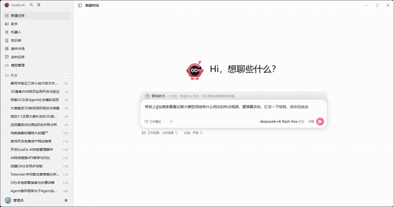
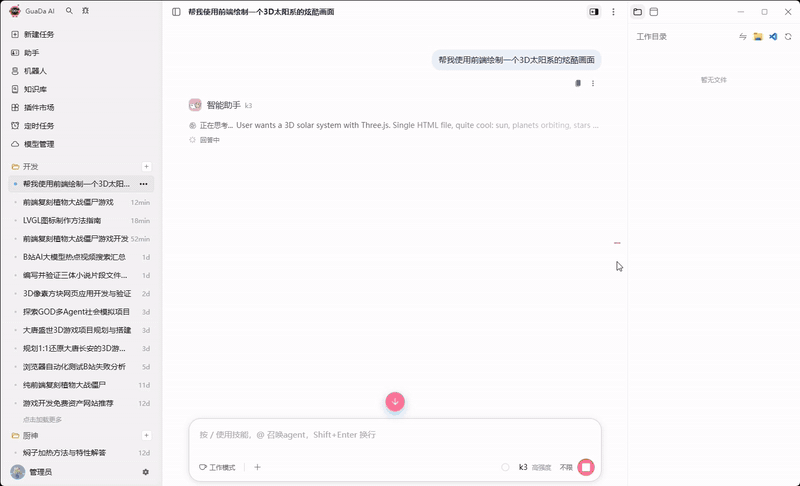
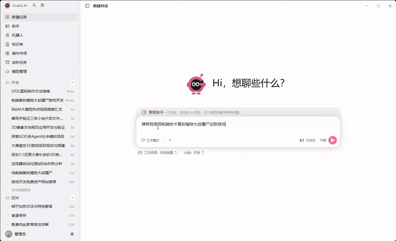
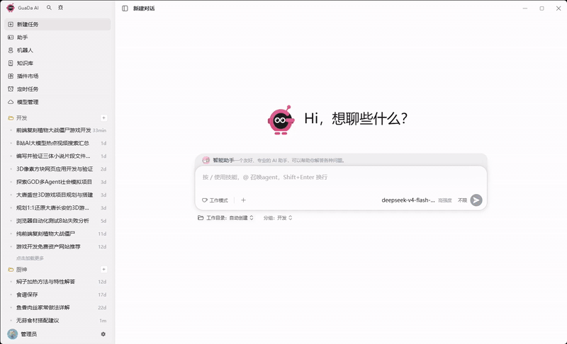
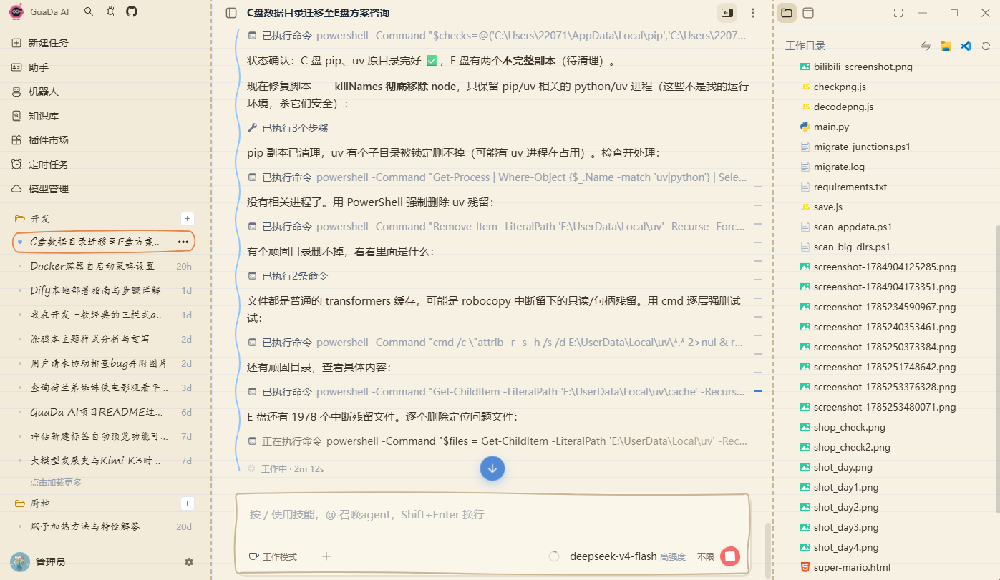
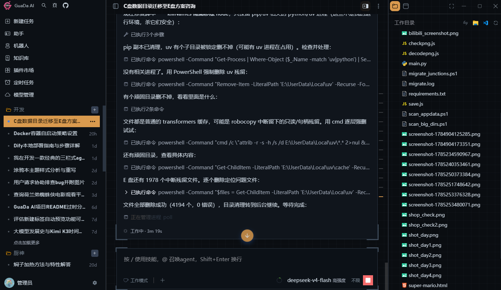
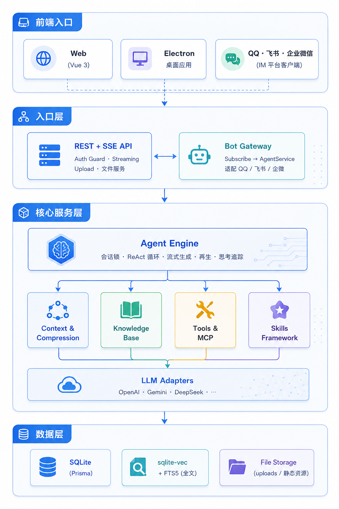

# ⚡ GuaDa AI — 把你的电脑变成 AI 工作站

> **看得见、摸得着、能动手**的桌面 AI 工作站。基于 ReAct Agent + 子 Agent 分层架构，一个引擎统一服务 **Web / 桌面 / IM** 三大入口。

<p align="center">
  <a href="https://gitee.com/zhendongdong/guada_ai/stargazers"></a>
  <a href="https://gitee.com/zhendongdong/guada_ai/members"></a>
  
  
  
  
  
  
</p>

<p align="center">
  <a href="#-项目介绍"><b>💡 项目介绍</b></a> ·
  <a href="#-与同类工具对比"><b>📊 对比</b></a> ·
  <a href="#-核心能力"><b>🧠 核心能力</b></a> ·
  <a href="#-快速开始5分钟上手"><b>🚀 快速开始</b></a> ·
  <a href="https://gitee.com/zhendongdong/guada_ai/issues"><b>💬 反馈</b></a> ·
  <a href="#-社区"><b>🤝 加入社区</b></a>
</p>

<p align="center">
  <a href="README.en.md">English</a> · 
  <b>Gitee</b> ·
  <a href="https://github.com/donggua-zen/guada">GitHub</a> ·
  <a href="https://atomgit.com/donggua_sherlock/GuaDaAI">GitCode</a>
</p>

---

## 📖 项目介绍

GuaDa 是一个**本地优先**的开源 AI 工作站——它不只是聊天框，而是一个能动手干活的 AI 工作台：读写文件、执行命令、操控内嵌浏览器，任务从规划到执行自动闭环。

一套 Agent 引擎，三种使用方式：**桌面端**开箱即用，**Web 端**可私有化部署，**QQ / 企业微信 / 飞书 / Discord / 微信** 群里也能直接召唤。配合 RAG 知识库、长期记忆和定时任务，它能记住你的资料、按你的习惯工作、在你睡觉时继续干活。数据默认存在你自己的机器上，安全可控。

无论你是写脚本追热点的**新媒体人**、想让 Agent 代写代码的**程序员**、需要它记住人物设定的**创作者**，还是想搭一个绑定知识库、接入 IM 的内部 AI 助手的**团队**——GuaDa 都能直接上手。如果这个项目对你有帮助，欢迎点亮 Star ⭐，你的支持是持续更新的动力。

---

## 🖼️ 产品截图

<p align="center">
  
  
</p>
<p align="center">
  
  
</p>
<p align="center">
  
  
</p>

---

## 📊 与同类工具对比

| 维度 | **GuaDa** | Claude Code | Codex | Trae Work |
|------|:---------:|:-----------:|:-----:|:---------:|
| **产品定位** | 🏠 通用 AI 工作站 | 💻 编程 Agent | 💻 编程 Agent | 📋 AI 任务执行平台 |
| **开源** | ✅ | ❌ | ✅ CLI | ❌ |
| **自托管 Web 部署** | ✅ | ❌ | ❌ | ❌ |
| **Desktop 桌面端** | ✅ | ✅ | ✅ | ✅ |
| **CLI** | ❌ | ✅ | ✅ | ⚠️ |
| **Bot / IM 接入** | ✅ QQ·企微·飞书·Discord·微信 | ❌ | ❌ | ❌ |
| **知识库 (RAG)** | ✅ 混合检索·40+ 格式 | ❌ | ❌ | ⚠️ 代码索引 |
| **浏览器自动化** | ✅ 内嵌·可视操控 | ✅ 内嵌·可视操控（2026.7） | ⚠️ 需 Chrome 扩展·内置仅预览 | ⚠️ 远端投屏·内嵌仅预览 |
| **沙盒** | ✅ 轻沙盒 | ✅ 文件+网络双隔离 | ✅ 云端容器+本地 | ✅ 云端容器+本地文件权限 |
| **长期记忆** | ✅ 可编辑可回退 | ⚠️ 文件式 | ⚠️ 文件式 | ❌ |
| **定时任务** | ✅  | ❌ | ❌ | ❌ |
| **多Agent** | ✅ 全能力独立配置（角色/模型/工具/知识库） | ⚠️ 仅子代理·限 Claude 模型·不可嵌套 | ⚠️ 仅子代理·不可嵌套 | ❌ |
| **多模型支持** | ✅ 17 家厂商·含国产模型 | ❌ 仅 Claude | ❌ 仅 OpenAI | ⚠️ |
| **数据本地可控** | ✅ | ❌ | ❌ | ❌ |
| **配置难易** | ⭐⭐⭐⭐ 开箱即用 | ⭐⭐⭐ 登录即用 | ⭐⭐⭐ API Key 即用 | ⭐⭐⭐⭐⭐ 登录即用 |
| **费用** | 免费（自备 Key） | $20+/月 | $20+/月 | 内测免费 |


## 🧠 核心能力

| 能力 | 亮点说明 | 文档 |
|------|---------|------|
| **🤖 智能体（Agent）** | ReAct 多轮自治循环 + 子 Agent 分层委派，支持会话锁、流式传输、中断处理与三种再生模式 | [→ 详情](docs/agent-engine.md) |
| **👥 子 Agent 系统** | 全能力独立配置（角色/模型/工具/知识库），复杂任务自动拆解 → 委派执行 → 结果归集 | [→ 详情](docs/sub-agent.md) |
| **🔌 插件系统** | 核心功能全部插件化（浏览器/文件/搜索/记忆/定时任务/角色等），PluginBase 生命周期 + 热插拔即时生效，工具包级权限过滤 | — |
| **📚 知识库 (RAG)** | 语义 + 关键词双混合检索，Agent 自助多轮搜索与写入，支持 **40+ 文件格式**（含 OCR） | [→ 详情](docs/knowledge-base.md) |
| **🧠 长期记忆** | 两级压缩（裁剪→语义），可编辑、可回退、有历史，非破坏性压缩 | [→ 详情](docs/memory.md) |
| **🛠️ 技能管理** | 文件即技能，chokidar 热更新即时生效，渐进式加载省 Token | [→ 详情](docs/skills.md) |
| **⏰ 定时任务** | Agent 按 Cron 自动执行，独立会话隔离，完整执行记录 | [→ 详情](docs/scheduler.md) |
| **🤖 Bot 网关** | 统一接入 **QQ / 企业微信 / 飞书 / Discord / 个人微信**，自动重连、消息合并、动态启停 | [→ 详情](docs/bot-gateway.md) |
| **🌐 浏览器自动化** | Electron 内嵌 Chromium，Agent 实时可视操控。 | [→ 详情](docs/browser-automation.md) |
| **🧩 多模型管理** | 5 种协议适配器 × **17 家厂商**（OpenAI / Claude / Gemini / Azure / DeepSeek / 通义 / 文心 / 智谱 / Kimi / 火山 / Minimax 等），角色级/会话级/全局级配置 | [→ 详情](docs/models.md) |
| **🛡️ 沙箱模式** | Shell 命令经独立沙箱进程隔离执行，Agent 动手更安全 | [→ 详情](docs/windows-sandbox-isolation-design.md) |
| **🔗 MCP 集成** | 原生支持 MCP 协议，接入外部工具生态 | — |
| **📦 多部署方式** | Electron 桌面 + Web 应用 + Docker 容器化，开箱即用 | [→ 部署指南](#-快速开始5分钟上手) |
| **🗄️ 企业级数据** | 默认 SQLite，Prisma 7 ORM 可无缝切换 MySQL / PostgreSQL | — |
| **🎨 自定义壁纸** | 自定义背景、透明度、毛玻璃效果，打造你的专属工作站 | — |

---

## 🚀 快速开始（5 分钟上手）

### 方式一：Docker 一键部署（推荐）

```bash
git clone https://gitee.com/zhendongdong/guada_ai.git
cd guada_ai
docker compose up -d --build

# 打开浏览器访问 http://localhost:8787
# 开始跟你的 AI 助手对话！
```

### 方式二：Electron 桌面端

下载预编译安装包（见 [QQ 群 1047993501](#-社区)），或从源码构建：

```bash
npm install
npm run build:electron   # 安装包输出在 release/ 目录
```

### 方式三：源码开发

```bash
# 终端 1：启动后端（首次需初始化数据库）
cd backend-ts
npm install
npm run db:seed:force
npm run start:dev

# 终端 2：启动前端
cd frontend
npm install
npm run dev
# 访问 http://localhost:5173
```

> 更多部署细节：[Docker 部署](docs/DOCKER_DEPLOYMENT.md) · [Electron 部署](docs/ELECTRON_DEPLOYMENT.md) · [生产环境部署](docs/PRODUCTION_DEPLOYMENT.md) · [快速上手](QUICK_START.md)

---

## 🏗️ 系统架构



**架构四层：** `前端入口 → 入口层 → 核心服务层 → 数据层`

| 层级 | 职责 | 核心组件 |
|------|------|----------|
| **前端入口** | 用户交互 | Vue 3、Electron（内嵌 Chromium）、QQ/企微/飞书/Discord/微信 Bot |
| **入口层** | 路由与协议转换 | REST + SSE API、Bot Gateway、Bridge（命名管道 ↔ Electron） |
| **核心服务层** | Agent 引擎 + 子 Agent + 插件 + RAG + Skills + LLM 适配 | Agent Engine（ReAct 循环）、Sub-Agent Manager、插件系统、Skills 框架、上下文压缩、RAG、MCP、定时任务、Shell 沙箱、LLM 适配器 |
| **数据层** | 持久化存储 | SQLite（Prisma 7，可切换 MySQL/PostgreSQL）、sqlite-vec + FTS5、文件系统 |

**浏览器自动化链路**：Agent 决策（后端）→ 命名管道 Bridge → Electron 操控内嵌 Chromium → 无障碍快照 6 层压缩回传 → Agent 继续推理。

---

## 🗂️ 项目结构

```
ai_chat/
├── backend-ts/                  # NestJS 后端
│   ├── prisma/schema.prisma     # 数据库 Schema
│   ├── src/
│   │   ├── common/              # 基础设施（数据库、向量库、MCP、日志、工具函数）
│   │   └── modules/
│   │       ├── chat/            # ⭐ 核心对话（Agent 引擎、压缩、上下文、审批）
│   │       ├── sub-agent/       # ⭐ 子 Agent 系统（分层委派、前台/后台）
│   │       ├── plugins/         # ⭐ 插件系统（PluginBase、热插拔、工具包级权限）
│   │       ├── skills/          # ⭐ Skills 技能框架（文件即技能、热更新）
│   │       ├── knowledge-base/  # ⭐ 知识库（RAG、分块、向量化、OCR）
│   │       ├── llm-core/        # LLM 适配层（5 协议 × 17 厂商）
│   │       ├── bot-gateway/     # 机器人网关（QQ/企微/飞书/Discord/微信）
│   │       ├── scheduler/       # 定时任务（Cron、会话隔离）
│   │       ├── shell/           # Shell 执行 + 轻沙箱
│   │       ├── bridge/          # 命名管道通信（↔ Electron）
│   │       ├── tools/           # 工具编排
│   │       ├── mcp-servers/     # MCP 服务器集成
│   │       ├── commands/        # 斜杠命令
│   │       ├── characters/      # 角色管理
│   │       └── ...              # auth、files、models、settings、users
│   └── main.ts
├── frontend/                    # Vue 3 前端（Vite + Pinia + Element Plus + Tailwind 4）
├── electron/                    # Electron 桌面端（内嵌 Chromium 浏览器自动化）
├── sandbox/                     # 沙箱进程（sandbox.exe）
├── docs/                        # 文档
└── LICENSE
```

---

## 🤝 社区

**遇到问题？想交流技术？下载预编译客户端？来这里：**

| 渠道 | 直达 |
|:----|:----|
| 🐧 **QQ 群** | **1047993501** |
| 📱 **公众号** | **冬瓜编程实验室** |
| 🐛 **反馈 Issue** | [Gitee Issues](https://gitee.com/zhendongdong/guada_ai/issues) |
| ⭐ **支持项目** | [点个 Star](https://gitee.com/zhendongdong/guada_ai)（你的鼓励是持续更新的动力 ❤️） |

---

## 📄 许可证

本项目基于 [MIT License](LICENSE) 开源，可自由使用、修改和商用。

---

<p align="center">
  <b>如果 GuaDa 对你有帮助，欢迎在 Gitee 上点个 Star ⭐</b><br>
  <sub>你的每一次 Star，都是让这个项目变得更好的动力</sub>
</p>
