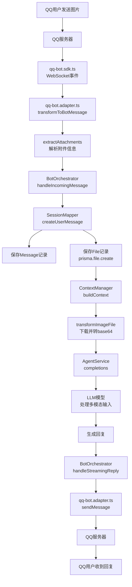

# QQ 机器人多模态消息处理机制

## 📋 概述

本文档详细说明 QQ 机器人如何处理图片和文本文件等多模态消息，包括接收、存储、AI 处理和发送的完整链路。

---

## 🔄 完整处理流程

### 1. 消息接收阶段

#### 1.1 QQ 平台 → SDK → 适配器

```
QQ 服务器
  ↓ WebSocket 事件
qq-bot.sdk.ts (handleEvent)
  ↓ emit('message.group' / 'message.private')
qq-bot.adapter.ts (transformToBotMessage)
  ↓ 提取附件信息
BotOrchestrator (handleIncomingMessage)
```

**关键代码位置**：
- [`qq-bot.sdk.ts:434-470`](file://d:\AI\ai_chat\backend-ts\src\modules\bot-gateway\adapters\qq\qq-bot.sdk.ts#L434-L470) - 事件分发
- [`qq-bot.adapter.ts:198-215`](file://d:\AI\ai_chat\backend-ts\src\modules\bot-gateway\adapters\qq-bot.adapter.ts#L198-L215) - 消息转换
- [`qq-bot.adapter.ts:239-267`](file://d:\AI\ai_chat\backend-ts\src\modules\bot-gateway\adapters\qq-bot.adapter.ts#L239-L267) - 附件提取

#### 1.2 附件信息提取

```typescript
// qq-bot.adapter.ts: extractAttachments()
private extractAttachments(rawEvent: any): BotMessage['attachments'] {
  if (!rawEvent.attachments || rawEvent.attachments.length === 0) {
    return undefined;
  }

  const attachments = rawEvent.attachments.map((att: any) => {
    // 根据 content_type 判断类型
    let type: 'image' | 'file' | 'voice' | 'video' = 'file';
    
    if (att.content_type?.startsWith('image/')) {
      type = 'image';
    } else if (att.content_type?.startsWith('audio/')) {
      type = 'voice';
    } else if (att.content_type?.startsWith('video/')) {
      type = 'video';
    }

    return {
      type,
      url: att.url,                    // QQ 服务器的 URL
      fileId: att.id || att.file_id,   // 媒体 ID
      fileName: att.filename,
      fileSize: att.size,
    };
  });

  return attachments.length > 0 ? attachments : undefined;
}
```

**支持的附件类型**：
- ✅ **图片** (`image/jpeg`, `image/png`, etc.)
- ✅ **语音** (`audio/*`)
- ✅ **视频** (`video/*`)
- ✅ **文件** (其他类型)

---

### 2. 消息存储阶段

#### 2.1 BotOrchestrator → SessionMapper

```typescript
// bot-orchestrator.service.ts:119-123
const userMessage = await this.sessionMapper.createUserMessage(
  session.id,
  message.content,
  config.knowledgeBaseIds,
  message.attachments,  // ✅ 传递附件信息
);
```

#### 2.2 创建消息记录和附件记录

```typescript
// session-mapper.service.ts:186-221
async createUserMessage(
  sessionId: string,
  content: string,
  knowledgeBaseIds?: string[],
  attachments?: Array<{...}>,  // ✅ 新增参数
): Promise<any> {
  // 1. 创建 Message 记录
  const message = await this.messageRepo.create({...});

  // 2. 创建 MessageContent 记录
  await this.prisma.messageContent.create({...});

  // 3. 保存附件到 File 表
  if (attachments && attachments.length > 0) {
    await this.saveAttachments(message.id, sessionId, attachments);
  }

  return message;
}
```

#### 2.3 附件存储结构

```typescript
// session-mapper.service.ts:228-287
private async saveAttachments(
  messageId: string,
  sessionId: string,
  attachments: Array<{...}>,
): Promise<void> {
  for (const att of attachments) {
    await this.prisma.file.create({
      data: {
        fileName: att.fileName || 'unknown',
        displayName: att.fileName || 'Attachment',
        fileSize: att.fileSize || 0,
        fileType: 'image' | 'text' | 'binary',  // 根据类型映射
        fileExtension: '.jpg' | '.png' | ...,
        url: att.url,              // QQ 服务器的 URL
        contentHash: att.fileId,   // 使用 fileId 作为哈希
        sessionId,
        messageId,
        isPublic: false,
        fileMetadata: {
          source: 'qq-bot',
          originalFileId: att.fileId,
          originalUrl: att.url,
        },
      },
    });
  }
}
```

**数据库关系**：
```
Message (1) ──── (N) File
  ├─ id
  ├─ sessionId
  ├─ role: 'user'
  └─ files[] ← 关联的附件

File
  ├─ id
  ├─ messageId (FK)
  ├─ fileName
  ├─ fileType: 'image' | 'text' | 'binary'
  ├─ url (外部URL)
  ├─ contentHash
  └─ fileMetadata (JSON)
```

---

### 3. AI 处理阶段

#### 3.1 ContextManager 加载消息和附件

```typescript
// context-manager.service.ts:389-399
if (msg.files && Array.isArray(msg.files)) {
  msg.files.forEach((file: any, index: number) => {
    if (file.fileType === "image") {
      // 图片转换为 base64 或 URL
      const imagePart = this.transformImageFile(file, supportsImageInput);
      if (imagePart) textParts.push(imagePart);
    } else if (file.fileType === "text") {
      // 文本文件嵌入内容
      const textPart = this.transformTextFile(file, index);
      if (textPart) textParts.push(textPart);
    }
  });
}
```

#### 3.2 图片处理

```typescript
// context-manager.service.ts:445-493
private transformImageFile(file: any, supportsImageInput: boolean): any | null {
  if (!supportsImageInput) {
    // 模型不支持图片，返回文本描述
    return { type: "text", text: `[图片ID：${file.id}]` };
  }

  if (!file.url) return null;

  try {
    // 下载图片并转换为 base64
    const response = await fetch(file.url);
    const buffer = await response.arrayBuffer();
    const base64Data = Buffer.from(buffer).toString('base64');

    // 确定 MIME 类型
    let mimeType = "image/jpeg";
    const ext = file.fileExtension?.toLowerCase();
    switch (ext) {
      case ".png": mimeType = "image/png"; break;
      case ".gif": mimeType = "image/gif"; break;
      case ".webp": mimeType = "image/webp"; break;
    }

    const dataUri = `data:${mimeType};base64,${base64Data}`;

    return {
      type: "image_url",
      image_url: { url: dataUri },
    };
  } catch (error) {
    this.logger.error(`Failed to transform image file: ${error.message}`);
    return null;
  }
}
```

#### 3.3 文本文件处理

```typescript
// context-manager.service.ts:498-509
private transformTextFile(file: any, index: number): any | null {
  const fileName = file.fileName || "unknown";
  const content = file.content || "";
  
  const fileText =
    `\n\n<ATTACHMENT_FILE>\n` +
    `<FILE_INDEX>File ${index}</FILE_INDEX>\n` +
    `<FILE_NAME>${fileName}</FILE_NAME>\n` +
    `<FILE_CONTENT>\n${content}\n</FILE_CONTENT>\n` +
    `</ATTACHMENT_FILE>\n`;

  return { type: "text", text: fileText };
}
```

#### 3.4 最终消息格式

**支持多模态的模型**（如 GPT-4V、Gemini）：
```json
{
  "role": "user",
  "content": [
    { "type": "text", "text": "这张图片是什么？" },
    { 
      "type": "image_url", 
      "image_url": { "url": "data:image/jpeg;base64,..." }
    },
    { 
      "type": "text", 
      "text": "\n\n<ATTACHMENT_FILE>\n<File_INDEX>File 1</FILE_INDEX>\n..." 
    }
  ]
}
```

**不支持多模态的模型**：
```json
{
  "role": "user",
  "content": "这张图片是什么？ [图片ID：cmoh56gjw0000v0kzmenk939r]\n\n<ATTACHMENT_FILE>..."
}
```

---

### 4. 回复发送阶段

#### 4.1 AI 生成回复

```typescript
// bot-orchestrator.service.ts:126-130
const iterator = this.agentService.completions(
  session.id,
  userMessage.id,
  'overwrite',
);
```

#### 4.2 流式发送回复

```typescript
// bot-orchestrator.service.ts:183-234
private async handleStreamingReply(...) {
  for await (const chunk of iterator) {
    if (chunk.type === 'text' && chunk.msg) {
      accumulatedContent += chunk.msg;
      
      // 定期更新消息
      if (now - lastUpdateTime >= UPDATE_INTERVAL) {
        await adapter.sendStreamReply({
          conversationId: message.conversationId,
          content: accumulatedContent,
          ...
        }, { streamId, finish: false });
      }
    }
  }
  
  // 发送最终内容
  await adapter.sendStreamReply({...}, { streamId, finish: true });
}
```

#### 4.3 QQ 适配器发送消息

```typescript
// qq-bot.adapter.ts:101-154
async sendMessage(response: BotResponse): Promise<void> {
  const params: any = {
    msg_type: 0,  // 0=文本消息
    content: response.content,
  };
  
  // TODO: 如果回复中包含图片，需要先上传媒体
  // if (response.rawFrame?.attachments) {
  //   const fileInfo = await this.client.uploadMedia(filePath, 'image');
  //   params.msg_type = 7;  // 富媒体消息
  //   params.media = { file_info: fileInfo.file_info };
  // }
  
  if (response.sourceType === 'private') {
    await this.client.sendC2CMessage(response.conversationId, params);
  } else if (response.sourceType === 'group') {
    await this.client.sendGroupMessage(response.conversationId, params);
  }
}
```

---

## 📤 发送图片的实现方案

### 当前状态

⚠️ **部分实现**：接收图片已完全支持，但发送图片需要进一步完善。

### QQ 官方 API 要求

1. **先上传媒体文件**获取 `file_info`
2. **使用 `msg_type=7`** 发送富媒体消息
3. **在 `media` 字段中引用** `file_info`

### 实现步骤

#### Step 1: 上传图片到 QQ 服务器

```typescript
// qq-bot.sdk.ts:635-676
async uploadMedia(
  filePath: string,
  fileType: 'image' | 'video' = 'image',
): Promise<{ file_info: string }> {
  const token = await this.getAccessToken();
  
  // 读取文件
  const fs = await import('fs');
  const path = await import('path');
  const fileBuffer = fs.readFileSync(filePath);
  const fileName = path.basename(filePath);
  
  // 构建 FormData
  const formData = new FormData();
  const blob = new Blob([fileBuffer], { 
    type: fileType === 'image' ? 'image/jpeg' : 'video/mp4' 
  });
  formData.append('media', blob, fileName);
  formData.append('srv_send_msg', 'false');

  // 上传到 QQ 服务器
  const response = await fetch(`${this.baseURL}/v2/groups/0/files`, {
    method: 'POST',
    headers: {
      'Authorization': `QQBot ${token}`,
      'X-Union-Appid': this.config.appId,
    },
    body: formData,
  });

  const data = await response.json();
  return { file_info: data.file_info };
}
```

#### Step 2: 发送富媒体消息

```typescript
// qq-bot.adapter.ts (待完善)
async sendImageMessage(
  conversationId: string,
  imagePath: string,
  caption?: string,
): Promise<void> {
  // 1. 上传图片
  const { file_info } = await this.client.uploadMedia(imagePath, 'image');
  
  // 2. 构建富媒体消息
  const params = {
    msg_type: 7,  // 富媒体消息
    content: caption || '',
    media: {
      file_info,  // 引用上传的媒体
    },
  };
  
  // 3. 发送消息
  if (this.isGroupChat(conversationId)) {
    await this.client.sendGroupMessage(conversationId, params);
  } else {
    await this.client.sendC2CMessage(conversationId, params);
  }
}
```

#### Step 3: 从 AI 回复中提取图片

```typescript
// bot-orchestrator.service.ts (待实现)
private async extractImagesFromReply(content: string): Promise<string[]> {
  // 方法1: 解析 Markdown 图片语法
  const markdownImages = content.match(/!\[.*?\]\((.*?)\)/g);
  
  // 方法2: 解析 HTML img 标签
  const htmlImages = content.match(/]+src="([^"]+)"/g);
  
  // 方法3: 检测 base64 图片
  const base64Images = content.match(/data:image\/[^;]+;base64,[^"'\s]+/g);
  
  return [...(markdownImages || []), ...(htmlImages || []), ...(base64Images || [])];
}
```

---

## 🔧 配置建议

### 1. 模型能力声明

在 `platform-metadata.ts` 中声明平台是否支持多模态：

```typescript
qq: {
  capabilities: {
    supportsStreaming: false,
    supportsPushMessage: true,
    supportsMultimedia: true,  // ✅ 支持多媒体
  },
}
```

### 2. 模型选择

**推荐支持多模态的模型**：
- ✅ OpenAI GPT-4V / GPT-4o
- ✅ Google Gemini Pro Vision
- ✅ Claude 3 (Opus/Sonnet/Haiku)
- ❌ 纯文本模型（如 GPT-3.5）

### 3. 文件大小限制

建议在适配器中添加文件大小检查：

```typescript
// qq-bot.adapter.ts
private validateAttachmentSize(attachment: any): boolean {
  const MAX_IMAGE_SIZE = 10 * 1024 * 1024;  // 10MB
  const MAX_FILE_SIZE = 50 * 1024 * 1024;   // 50MB
  
  if (attachment.type === 'image' && attachment.fileSize > MAX_IMAGE_SIZE) {
    this.logger.warn(`Image too large: ${attachment.fileSize} bytes`);
    return false;
  }
  
  if (attachment.fileSize > MAX_FILE_SIZE) {
    this.logger.warn(`File too large: ${attachment.fileSize} bytes`);
    return false;
  }
  
  return true;
}
```

---

## 📊 数据流图



---

## 🎯 下一步优化方向

### 短期目标（已完成）
- ✅ 接收图片并正确解析
- ✅ 将附件保存到数据库
- ✅ ContextManager 正确处理图片
- ✅ AI 模型能接收多模态输入

### 中期目标（待实现）
- ⏳ 实现图片上传到 QQ 服务器
- ⏳ 支持发送图片回复
- ⏳ 支持发送文件回复
- ⏳ 优化大图片压缩

### 长期目标
- 🔮 支持图片编辑/生成
- 🔮 支持语音消息
- 🔮 支持视频消息
- 🔮 本地缓存媒体文件避免重复下载

---

## 📝 测试清单

### 接收测试
- [ ] QQ 群聊发送图片
- [ ] QQ 私聊发送图片
- [ ] 发送多个图片
- [ ] 发送图文混合消息
- [ ] 发送文本文件
- [ ] 验证附件信息正确解析
- [ ] 验证 File 记录正确创建

### AI 处理测试
- [ ] GPT-4V 能识别图片内容
- [ ] Gemini 能识别图片内容
- [ ] 纯文本模型能降级处理
- [ ] 文本文件内容被正确读取

### 发送测试（待实现）
- [ ] AI 回复包含图片时能发送
- [ ] 图片上传成功
- [ ] 富媒体消息发送成功
- [ ] 群聊和私聊都能发送

---

## 🔗 相关文档

- [QQ 官方机器人文档](https://bot.q.qq.com/wiki/)
- [OneBots QQ 适配器参考](../../onebots-temp/adapters/adapter-qq/src/bot.ts)
- [ContextManager 多模态处理](../chat/context-manager.service.ts)
- [SessionMapper 服务](./session-mapper.service.ts)

---

**最后更新**: 2026-04-28  
**版本**: 1.0.0
