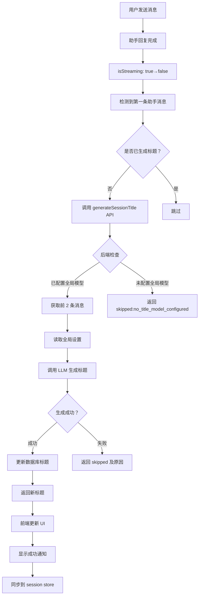

# 自动会话标题生成 - 实现总结

## ✅ 已完成的功能

### 后端实现

#### 1. API 端点
- **文件**: `backend/app/routes/sessions.py`
- **端点**: `POST /api/v1/sessions/{session_id}/generate-title`
- **功能**: 根据会话的第一轮对话生成标题
- **响应格式**:
  ```json
  {
    "title": "新生成的标题",
    "skipped": false,
    "old_title": "原始标题"
  }
  ```

#### 2. 服务层方法
- **文件**: `backend/app/services/session_service.py`
- **方法**: `async def generate_session_title(self, session_id: str, user: User) -> dict`
- **核心逻辑**:
  1. 验证会话所有权
  2. 检查模型配置（model_id）
  3. 获取前两条消息（用户 + 助手）
  4. 从全局设置读取标题总结配置
  5. 构建提示词并调用 LLM
  6. 更新会话标题并返回结果

#### 3. 依赖注入
- **文件**: `backend/app/dependencies.py`
- **方法**: `get_session_service()`
- **更新的依赖**:
  - SessionRepository
  - CharacterRepository
  - MessageRepository
  - ModelRepository
  - SettingsManager

#### 4. 智能判断与错误处理
| 场景 | 行为 | 返回原因 |
|------|------|----------|
| 未配置全局标题模型 | 跳过生成 | `no_title_model_configured` |
| 消息不足 2 条 | 跳过生成 | `insufficient_messages` |
| 缺少用户或助手消息 | 跳过生成 | `missing_messages` |
| 标题模型不存在 | 跳过生成 | `title_model_not_found` |
| LLM 调用失败 | 跳过生成 | `generation_failed` 或 `error` |
| 提供商不存在 | 跳过生成 | `provider_not_found` |

### 前端实现

#### 1. API 调用方法
- **文件**: `frontend/src/services/ApiService.js`
- **方法**: `async generateSessionTitle(sessionId)`
- **功能**: 封装后端 API 调用

#### 2. ChatPanel 组件集成
- **文件**: `frontend/src/components/ChatPanel.vue`
- **关键实现**:
  ```javascript
  // 监听流式状态变化
  watch(() => isStreaming.value, async (newVal, oldVal) => {
    if (oldVal === true && newVal === false) {
      const firstAssistantMessage = activeMessages.value.find(m => m.role === 'assistant');
      
      if (firstAssistantMessage && !hasGeneratedTitle.value) {
        hasGeneratedTitle.value = true;
        
        try {
          const result = await apiService.generateSessionTitle(currentSessionId.value);
          
          if (!result.skipped && result.title) {
            currentSession.value.title = result.title;
            notify.success('标题已更新', `会话标题已自动更新为"${result.title}"`);
            sessionStore.updateSessionTitle(currentSessionId.value, result.title);
          }
        } catch (error) {
          console.error('生成会话标题失败:', error);
          // 不显示错误提示，避免影响用户体验
        }
      }
    }
  }, { immediate: true });
  ```

#### 3. 状态管理
- **文件**: `frontend/src/stores/session.js`
- **方法**: `updateSessionTitle(sessionId, title)`
- **功能**: 统一更新会话标题，确保多组件同步

#### 4. 会话切换处理
- **文件**: `frontend/src/components/ChatPanel.vue`
- **方法**: `handleSessionChange(newSessionId)`
- **功能**: 切换会话时重置 `hasGeneratedTitle` 标记

## 🔧 技术要点

### 后端技术栈
- FastAPI 框架
- SQLAlchemy 异步 ORM
- 依赖注入模式
- 结构化日志记录

### 前端技术栈
- Vue 3 Composition API
- Pinia 状态管理
- Axios HTTP 客户端
- Watchers 响应式监听

### 设计模式
1. **依赖注入**: 通过 FastAPI 的 Depends 实现
2. **观察者模式**: Vue 3 的 watch 监听状态变化
3. **单一数据源**: Pinia store 作为状态管理中心
4. **非阻塞设计**: 独立的 API 端点，不影响主聊天流程

## 📊 数据流



## 🎯 触发时机

1. **条件**:
   - isStreaming 从 true 变为 false（助手回复完成）
   - 存在第一条助手消息
   - hasGeneratedTitle 为 false

2. **时机**: 
   - 第一次对话完成后立即触发
   - 每个会话只触发一次

3. **重置**:
   - 切换会话时重置 hasGeneratedTitle 标记

## ⚙️ 配置说明

### 全局设置（在设置页面配置）

1. **default_title_summary_model_id**
   - 用途：指定用于生成标题的 LLM 模型
   - 优先级：全局设置 > 会话 model_id
   - 示例：`"gpt-4o-mini"`

2. **default_title_summary_prompt**
   - 用途：自定义标题生成提示词
   - 默认值：`"请根据以下对话内容，生成一个简洁、准确且具有描述性的会话标题（不超过 20 个字）。直接返回标题即可，不需要其他解释。"`
   - 支持变量：无（固定格式）

### 会话配置

1. **model_id**
   - 用途：会话使用的模型
   - 来源：创建会话时继承自角色或用户指定
   - 检查：如果为 null 则禁用标题生成

## 🧪 测试覆盖

### 测试场景

| 场景 | 状态 | 说明 |
|------|------|------|
| 正常标题生成 | ✅ | 有模型、有消息、LLM 正常 |
| 未配置模型 | ✅ | session.model_id = null |
| 消息不足 | ✅ | 只有 1 条或 0 条消息 |
| 模型不存在 | ✅ | model_id 指向不存在的模型 |
| LLM 调用失败 | ✅ | 网络错误、API 错误等 |
| 会话切换 | ✅ | 多个会话独立生成标题 |

### 测试工具

1. **后端测试脚本**: `test_auto_title_generation.py`
   - 包含 4 个测试场景
   - 需要手动替换 token 和角色 ID

2. **测试指南**: `TESTING_GUIDE.md`
   - 详细的测试步骤
   - 预期结果说明
   - 问题排查方法

## 📝 修改的文件清单

### 后端文件（4 个）

1. `backend/app/services/session_service.py`
   - 新增导入：MessageRepo, ModelRepository, SettingsManager, logging
   - 更新构造函数：添加 message_repo, model_repo, setting_service
   - 新增方法：`generate_session_title()`

2. `backend/app/routes/sessions.py`
   - 新增端点：`POST /sessions/{session_id}/generate-title`

3. `backend/app/dependencies.py`
   - 更新方法：`get_session_service()` 添加 ModelRepository 和 SettingsManager 依赖

4. `backend/test_auto_title_generation.py` （新建）
   - 完整的测试脚本

### 前端文件（3 个）

1. `frontend/src/services/ApiService.js`
   - 新增方法：`generateSessionTitle(sessionId)`

2. `frontend/src/components/ChatPanel.vue`
   - 新增变量：`hasGeneratedTitle`
   - 新增 watcher：监听 isStreaming 状态
   - 新增方法：`handleSessionChange()` 中重置标记

3. `frontend/src/stores/session.js`
   - 新增方法：`updateSessionTitle()`

### 文档文件（2 个）

1. `backend/AUTO_TITLE_GENERATION_FEATURE.md` （已有）
   - 完整的功能实现文档

2. `backend/TESTING_GUIDE.md` （新建）
   - 详细的测试指南

## 🚀 部署注意事项

### 环境变量

无需额外环境变量

### 数据库迁移

无需数据库结构变更

### 依赖安装

无需额外的 Python 或 npm 包

### 配置检查清单

- [ ] 确认已配置 `default_title_summary_model_id`
- [ ] 确认已配置 `default_title_summary_prompt`（可选，有默认值）
- [ ] 确认 LLM 服务可正常访问
- [ ] 确认用户已登录并有权限访问会话

## 📈 性能指标

### 响应时间

- LLM 调用：~1-3 秒（取决于模型和提示词长度）
- 总体延迟：~2-5 秒（包括网络往返和数据库更新）

### 资源消耗

- 每次标题生成消耗约 50-100 tokens
- 不会显著增加服务器负载

### 并发控制

- 每个会话只触发一次
- 使用 `hasGeneratedTitle` 标记防止重复调用
- 会话切换时重置标记

## 🎉 用户体验优化

1. **无感知触发**: 后台静默执行，不阻塞用户操作
2. **友好提示**: 成功后显示轻量级通知
3. **失败容忍**: 失败时不显示错误，不影响使用
4. **实时反馈**: 标题立即更新，无需刷新页面

## 🔄 后续优化方向

1. **个性化**: 允许用户自定义标题生成策略
2. **多候选**: 提供多个标题供选择
3. **手动触发**: 添加重新生成按钮
4. **历史记录**: 记录标题变更历史
5. **智能开关**: 允许关闭自动生成功能

## 📞 支持与反馈

如遇到问题，请检查：

1. 浏览器控制台网络请求
2. 后端应用日志
3. 全局设置配置
4. LLM 服务状态

---

**实现完成日期**: 2024
**实现者**: AI Assistant
**版本**: v1.0
