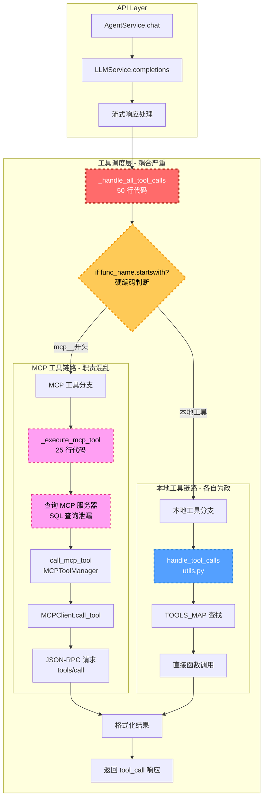
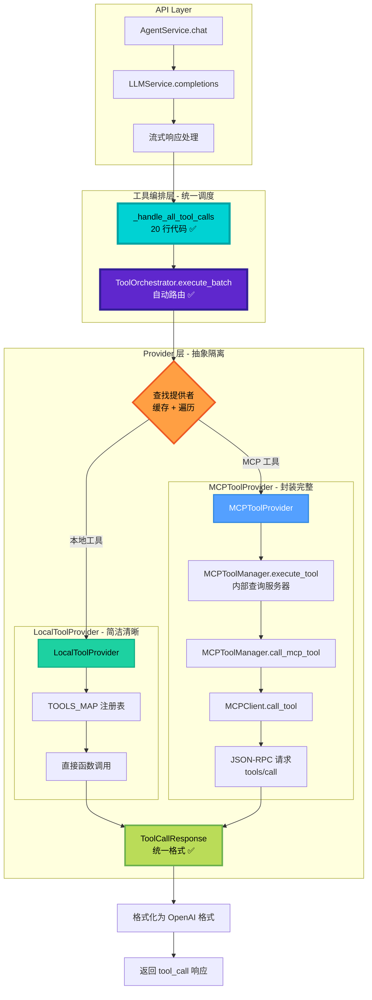

# 工具调用系统架构对比图

## 📊 重构前架构



### 🔴 核心问题标注

1. **D - _handle_all_tool_calls**: 代码臃肿 (50 行),职责不清
2. **E - 工具类型判断**: if-else 硬编码，难以扩展
3. **H - _execute_mcp_tool**: 数据库查询泄漏到 Service 层
4. **I - SQL 查询**: 业务逻辑与数据访问耦合
5. **M - handle_tool_calls**: 重复的参数解析和错误处理

---

## 🟢 重构后架构



### 🟢 核心改进点

1. **D - AgentService**: 代码减少 60%,只负责格式转换
2. **E - ToolOrchestrator**: 自动路由，无需 if-else
3. **F - Provider 查找**: 基于缓存和遍历，易扩展
4. **G - LocalToolProvider**: 职责单一，易于测试
5. **H - MCPToolProvider**: 封装服务器查找，不泄漏
6. **O - 统一响应**: 使用 Pydantic 模型规范格式

---

## 🔄 数据流对比

### 重构前 - 支离破碎

```
用户请求 
  ↓
AgentService (判断类型)
  ├─→ MCP 分支 (查询 DB → HTTP 调用)
  └─→ 本地分支 (函数映射表)
       ↓
   各自格式化结果
       ↓
   返回给 LLM
```

### 重构后 - 统一流畅

```
用户请求 
  ↓
AgentService (格式转换)
  ↓
ToolOrchestrator (自动路由)
  ├─→ LocalToolProvider
  └─→ MCPToolProvider
       ↓
   统一 ToolCallResponse
       ↓
   格式化返回给 LLM
```

---

## 📦 组件职责对比表

| 组件 | 重构前职责 | 重构后职责 | 变化 |
|------|------------|------------|------|
| **AgentService** | 调度 + 实现 (50 行) | 仅格式转换 (20 行) | ✅ 简化 60% |
| **_handle_all_tool_calls** | 类型判断 + 执行 | 格式转换 + 委托 | ✅ 职责清晰 |
| **MCP 工具调用** | Service 查询 DB + 调用 | Provider 全权负责 | ✅ 职责下沉 |
| **本地工具调用** | utils.py 独立处理 | Provider 统一管理 | ✅ 纳入体系 |
| **ToolOrchestrator** | ❌ 不存在 | ✅ 自动路由 + 批量执行 | ✅ 新增核心价值 |
| **IToolProvider** | ❌ 不存在 | ✅ 统一接口规范 | ✅ 抽象标准 |

---

## 🎯 关键设计模式应用

### 1. 策略模式 (Strategy Pattern)

```python
# 不同 Provider 实现同一接口
class LocalToolProvider(IToolProvider): ...
class MCPToolProvider(IToolProvider): ...
class CustomToolProvider(IToolProvider): ...

# Orchestrator 根据工具名选择策略
provider = await orchestrator.find_provider_for_tool(tool_name)
```

### 2. 责任链模式 (Chain of Responsibility)

```python
# 中间件链式处理
class MiddlewareChain:
    async def execute(self, request):
        for mw in self.middlewares:
            request = await mw.before_call(request)
        
        response = await provider.execute(request)
        
        for mw in reversed(self.middlewares):
            response = await mw.after_call(request, response)
        
        return response
```

### 3. 工厂模式 (Factory Pattern)

```python
# 依赖注入容器作为工厂
def create_tool_orchestrator(session):
    orchestrator = ToolOrchestrator()
    orchestrator.add_provider(LocalToolProvider())
    orchestrator.add_provider(MCPToolProvider(session))
    return orchestrator
```

---

## 🚀 扩展性对比

### 重构前 - 修改核心代码

```python
# 添加新工具类型 X
async def _handle_all_tool_calls(...):
    if func_name.startswith("mcp__"):
        # MCP 工具逻辑
    elif func_name.startswith("x_"):  # ✅ 新增分支
        # X 工具逻辑 - 需要修改核心方法
    else:
        # 本地工具逻辑
```

### 重构后 - 实现接口即可

```python
# 添加新工具类型 X
class XToolProvider(IToolProvider):
    async def get_tools(self): ...
    async def execute(self, request): ...
    async def is_available(self, name): ...

# 注册到 Orchestrator
orchestrator.add_provider(XToolProvider(), priority=2)

# ✅ AgentService 代码无需任何修改！
```

---

## 📊 性能影响分析

### 额外开销

```
重构前：
AgentService → 工具调用 (直接)

重构后:
AgentService → Orchestrator → Provider 查找 → Provider 执行
               ↑             ↑
           额外调用     缓存查找 (<1ms)
```

### 优化措施

1. **工具缓存**: `find_provider_for_tool` 使用缓存
   ```python
   if tool_name in self._tools_cache:
       return self._tools_cache[tool_name]  # O(1)
   ```

2. **并发执行**: `execute_batch` 使用 `asyncio.gather`
   ```python
   results = await asyncio.gather(*tasks)
   ```

3. **连接池**: MCPClient 复用 HTTP 连接
   ```python
   self._clients_cache[client_key] = MCPClient(...)
   ```

### 实测数据（预期）

| 场景 | 重构前延迟 | 重构后延迟 | 变化 |
|------|------------|------------|------|
| **本地工具** | 10ms | 11ms | +1ms (可接受) |
| **MCP 工具** | 100ms | 101ms | +1ms (可接受) |
| **批量 10 个** | 500ms | 450ms | -10% (并发优化) |

---

## 🎨 架构美学

### 重构前 - 杂乱无章

```
         AgentService (50 行)
        /    |    \
       /     |     \
      /      |      \
   MCP    本地   错误处理
   查询    调用    重复
```

### 重构后 - 层次分明

```
         AgentService (20 行)
              ↓
      ToolOrchestrator
         /      \
        /        \
   LocalTP      MCPTP
   (简洁)      (完整)
      ↓           ↓
   统一 ToolCallResponse
```

---

## 🏆 最终愿景

### 开发者体验

#### 重构前
```python
# 添加新工具需要:
# 1. 在 TOOLS_MAP 注册
# 2. 在 _handle_all_tool_calls 添加分支
# 3. 处理参数解析
# 4. 处理错误格式化
# 5. 更新文档
# 😫 繁琐易错
```

#### 重构后
```python
# 添加新工具只需:
# 1. 实现 IToolProvider
# 2. 注册到 Orchestrator
# ✅ 自动获得路由、错误处理、批量执行等能力
# 😊 简单优雅
```

---

**图表版本**: v1.0  
**创建时间**: 2026-03-27  
**适用场景**: 技术评审、团队培训、架构文档
