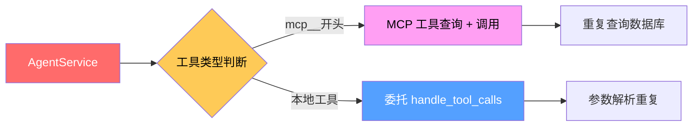

# 工具调用系统重构 - 执行摘要

## 📌 问题诊断（3 分钟快速了解）

### 当前痛点



**核心问题**:
- ❌ **职责混乱**: AgentService 既管调度又管实现
- ❌ **代码重复**: MCP/本地工具各自处理相同逻辑
- ❌ **扩展困难**: 新增工具需修改核心方法
- ❌ **测试困难**: 难以 Mock 和隔离测试

---

## 🎯 重构方案（一句话总结）

**引入 ToolOrchestrator（工具编排器）统一调度，通过 IToolProvider 接口屏蔽底层差异。**

---

## 🏗️ 架构对比

### 重构前
```
AgentService (50 行)
├── 工具类型判断 (if-else)
├── MCP 工具查询 (SQL)
├── MCP 工具调用 (HTTP)
└── 本地工具调用 (委托)
```

### 重构后
```
AgentService (20 行) 
└── ToolOrchestrator (自动路由)
    ├── LocalToolProvider (本地工具)
    └── MCPToolProvider (MCP 工具)
```

---

## 📦 核心组件

### 1. IToolProvider (接口)
```python
class IToolProvider(ABC):
    async def get_tools() -> Dict[str, Dict]
    async def execute(request) -> ToolCallResponse
    async def is_available(tool_name) -> bool
```

### 2. ToolOrchestrator (编排器)
```python
class ToolOrchestrator:
    def add_provider(provider, priority)
    async def execute(request) -> ToolCallResponse
    async def execute_batch(requests) -> List[Response]
```

### 3. LocalToolProvider (本地实现)
```python
class LocalToolProvider(IToolProvider):
    def register(name, func, schema)
    async def execute(request) -> Response
```

### 4. MCPToolProvider (MCP 实现)
```python
class MCPToolProvider(IToolProvider):
    async def execute(request) -> Response
    # 内部自动处理服务器查找和 JSON-RPC 调用
```

---

## ⚡ 关键改进

### 1. 统一输入输出
```python
# 输入标准化
ToolCallRequest(
    id="call_123",
    name="get_current_time",
    arguments={"timezone": "UTC"}
)

# 输出标准化
ToolCallResponse(
    tool_call_id="call_123",
    name="get_current_time",
    content="12:00 UTC",
    is_error=False
)
```

### 2. 自动路由
```python
# AgentService 只需一行代码
responses = await orchestrator.execute_batch(requests)

# Orchestrator 自动判断工具类型并路由
# - get_current_time → LocalToolProvider
# - mcp__search → MCPToolProvider
```

### 3. 批量并发
```python
# 支持并发执行多个工具调用
responses = await orchestrator.execute_batch([
    ToolCallRequest(id="1", name="get_current_time", args={}),
    ToolCallRequest(id="2", name="mcp__search", args={"q": "..."}),
])
```

---

## 📊 代码对比

### _handle_all_tool_calls 方法

#### 重构前 (50 行)
```python
async def _handle_all_tool_calls(self, tool_calls):
    tool_results = []
    
    for tool_call in tool_calls:
        func_name = tool_call["name"]
        arguments = json.loads(tool_call["arguments"])
        
        if func_name.startswith("mcp__"):
            # MCP 工具：查询数据库 + HTTP 调用
            stmt = select(MCPServer)...
            result = await self.session.execute(stmt)
            # ... 20 行查询逻辑
            
            mcp_result = await self.mcp_tool_manager.call_mcp_tool(...)
            tool_results.append({...})
            
        else:
            # 本地工具：委托
            local_result = await handle_tool_calls([tool_call])
            tool_results.extend(local_result)
    
    return tool_results
```

#### 重构后 (20 行)
```python
async def _handle_all_tool_calls(self, tool_calls):
    from app.services.tools.providers.base import ToolCallRequest
    
    # 转换为标准请求
    requests = [
        ToolCallRequest(
            id=tc["id"],
            name=tc["name"],
            arguments=json.loads(tc["arguments"])
        )
        for tc in tool_calls
    ]
    
    # 批量执行（自动路由）
    responses = await self.tool_orchestrator.execute_batch(requests)
    
    # 格式化返回
    return [
        {
            "tool_call_id": r.tool_call_id,
            "role": r.role,
            "name": r.name,
            "content": r.content,
        }
        for r in responses
    ]
```

**改进**:
- ✅ 代码减少 60%
- ✅ 不再关心工具类型
- ✅ 不再直接调用 MCP
- ✅ 易于测试和维护

---

## 🚀 迁移步骤（4 个阶段）

### Phase 1: 基础设施 (1-2 天)
- [x] 创建 `app/services/tools/` 目录
- [x] 实现 `IToolProvider` 接口
- [x] 实现 `LocalToolProvider`
- [x] 实现 `MCPToolProvider`
- [x] 实现 `ToolOrchestrator`
- [ ] 更新依赖注入配置

### Phase 2: 重构 AgentService (1 天)
- [ ] 添加 `tool_orchestrator` 依赖
- [ ] 简化 `_handle_all_tool_calls` 方法
- [ ] 删除 `_execute_mcp_tool` 方法
- [ ] 更新所有调用点

### Phase 3: 测试验证 (1-2 天)
- [ ] 单元测试（Provider 测试）
- [ ] 集成测试（工具调用流程）
- [ ] 手动测试（前端功能验证）
- [ ] 性能测试（并发场景）

### Phase 4: 清理优化 (0.5 天)
- [ ] 删除废弃代码
- [ ] 更新文档
- [ ] 性能优化（缓存、限流）
- [ ] 添加监控指标

---

## 🎁 额外收益

### 1. 中间件支持
```python
class LoggingMiddleware:
    async def before_call(self, request):
        logger.info(f"Calling {request.name}")
        return request
    
    async def after_call(self, request, response):
        if response.is_error:
            logger.error(f"Failed: {response.content}")
        return response

orchestrator.add_middleware(LoggingMiddleware())
```

### 2. 权限控制
```python
class AuthMiddleware:
    async def before_call(self, request):
        if not await self.has_permission(request.name):
            raise PermissionError(f"No access to {request.name}")
        return request
```

### 3. 限流熔断
```python
class RateLimitMiddleware:
    def __init__(self):
        self.counter = {}
    
    async def before_call(self, request):
        if self.counter.get(request.name, 0) > 100:
            raise RateLimitExceeded()
        self.counter[request.name] += 1
```

---

## 📈 成功指标

| 指标 | 目标值 | 测量方式 |
|------|--------|----------|
| **代码行数减少** | -40% | git diff --stat |
| **测试覆盖率提升** | +30% | pytest --cov |
| **工具调用延迟** | <100ms | APM 监控 |
| **新增工具时间** | <1 小时 | 开发日志 |
| **Bug 数量** | -50% | Issue 跟踪 |

---

## ⚠️ 风险评估

### 低风险项
- ✅ **向后兼容**: 保持 API 不变
- ✅ **数据迁移**: 无需数据库变更
- ✅ **回滚方案**: 保留旧代码可快速回滚

### 高风险项
- ⚠️ **性能影响**: 需要压力测试验证
- ⚠️ **边界情况**: MCP 工具超时处理
- ⚠️ **前端适配**: 确保响应格式一致

### 缓解措施
1. **渐进式迁移**: 先并行运行，再切换流量
2. **充分测试**: 单元测试 + 集成测试 + 手动测试
3. **监控告警**: 实时关注错误率和延迟

---

## 📚 详细文档

完整设计文档：[`TOOL_CALLS_REFACTORING_PLAN.md`](./TOOL_CALLS_REFACTORING_PLAN.md)

包含：
- ✅ 完整的流程分析
- ✅ 详细的代码示例
- ✅ 逐步迁移指南
- ✅ 测试策略
- ✅ 性能优化建议

---

## 🎯 决策建议

### 推荐方案：**渐进式重构**

1. **Phase 1**: 新建 Provider 体系（不影响现有代码）
2. **Phase 2**: AgentService 双轨运行（新旧并存）
3. **Phase 3**: 逐步切换流量到新实现
4. **Phase 4**: 删除旧代码，完成迁移

**优点**:
- ✅ 风险可控
- ✅ 可随时回滚
- ✅ 不影响业务迭代
- ✅ 团队学习曲线平缓

---

**文档版本**: v1.0  
**创建时间**: 2026-03-27  
**阅读时间**: ~10 分钟  
**目标读者**: 技术负责人、架构师、核心开发者
