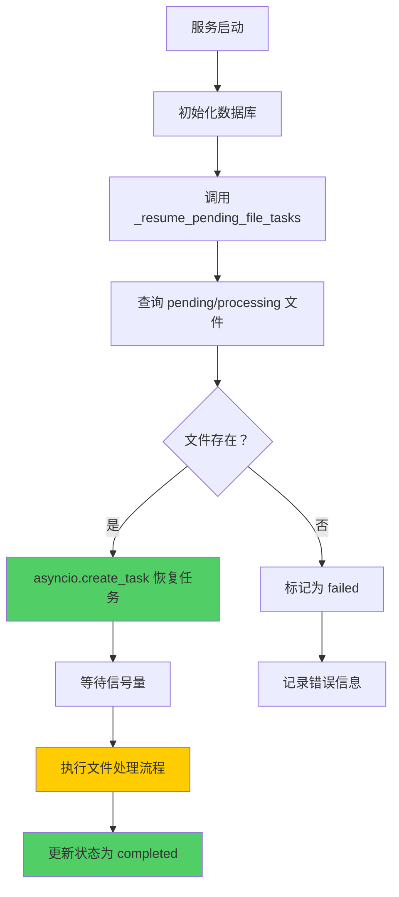
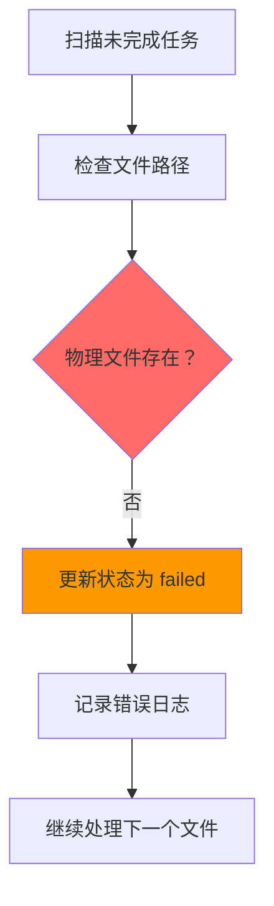

# 知识库文件处理自动恢复功能 - 实现文档

## 📋 功能概述

本功能确保后端服务在重启或意外中断后，能够自动扫描并恢复未完成的文件处理任务。

**核心特性**：
1. ✅ 自动扫描数据库中状态为 `pending` 或 `processing` 的文件
2. ✅ 检查物理文件是否存在
3. ✅ 使用 `asyncio.create_task` 重新启动处理任务
4. ✅ 对丢失的文件自动标记为 `failed`
5. ✅ 保持现有的信号量并发控制机制
6. ✅ 使用独立的数据库会话上下文

---

## 🏗️ 架构设计

### 1. **应用生命周期管理 (lifespan)**

**文件位置**: `app/__init__.py`

**核心函数**:
- `_resume_pending_file_tasks()` - 主入口，扫描并恢复所有未完成任务
- `_resume_single_file_task()` - 恢复单个文件处理任务

**执行时机**:
```python
@asynccontextmanager
async def lifespan(app: FastAPI):
    await init_db(database_url)
    
    # ✅ 关键：在应用启动后立即恢复未完成任务
    await _resume_pending_file_tasks()
    
    logger.info("应用启动完成")
    yield
    await close_db()
```

### 2. **数据库会话管理**

**关键设计**:
```python
async def _resume_pending_file_tasks():
    # ✅ 使用 async for 获取数据库会话
    async for session in get_db_session():
        file_repo = KBFileRepository(session)
        pending_files = await file_repo.get_files_by_status(
            statuses=["pending", "processing"]
        )
        
        for file_record in pending_files:
            asyncio.create_task(_resume_single_file_task(...))
        
        break  # 只执行一次
```

**为什么需要独立会话？**
- lifespan 中的会话与正常请求的会话是隔离的
- 避免会话关闭导致的连接问题
- 确保恢复任务的数据库操作独立性

### 3. **并发控制机制**

**信号量保证**:
```python
# KBFileService 类级别信号量
_processing_semaphore: Optional[asyncio.Semaphore] = None

def __init__(self, session: AsyncSession):
    # 确保全局唯一
    if KBFileService._processing_semaphore is None:
        KBFileService._processing_semaphore = asyncio.Semaphore(1)
```

**恢复任务时的行为**:
```python
async def _resume_single_file_task(...):
    async with get_db_session() as session:
        kb_file_service = KBFileService(session)
        # ✅ 会自动等待信号量（即使多个任务同时恢复）
        await kb_file_service.process_file(...)
```

**效果**:
- 即使启动了 10 个恢复任务，也只有 1 个在执行
- 其他任务会依次排队等待
- 完全符合原有的并发控制策略

---

## 🔄 完整处理流程

### 场景 1: 服务正常重启



### 场景 2: 文件丢失处理



---

## 📊 状态转换图

```
┌─────────────┐
│   pending   │ ← 文件刚上传
└──────┬──────┘
       │ 开始处理
       ↓
┌─────────────┐
│ processing  │ ← 正在解析/分块/向量化
└──────┬──────┘
       │
       ├──────────────┐
       │              │
       ↓              ↓
┌─────────────┐  ┌─────────────┐
│  completed  │  │   failed    │
└─────────────┘  └─────────────┘
```

**重启后的状态处理**:
- `pending` → 重新启动任务 → `processing` → `completed`
- `processing` → 重新启动任务 → `processing` → `completed`
- `pending/processing` (文件丢失) → `failed`

---

## 🔍 详细日志示例

### 正常恢复流程

```
INFO: 🔄 开始扫描未完成的知识库文件任务...
INFO: 📋 发现 2 个未完成任务
INFO: 🔄 准备恢复任务：test.pdf (ID: 01JQWGZ8X5Y6M7N8P9Q0R1S2T3, 状态：processing)
INFO: 🔄 准备恢复任务：report.docx (ID: 01JQWGZ9A1B2C3D4E5F6G7H8I9, 状态：pending)
INFO: ▶️ 开始恢复任务：test.pdf (ID: 01JQWGZ8X5Y6M7N8P9Q0R1S2T3)
INFO: ▶️ 开始恢复任务：report.docx (ID: 01JQWGZ9A1B2C3D4E5F6G7H8I9)
INFO: 开始处理文件：test.pdf (KB: 01JQWGZ7K1L2M3N4O5P6Q7R8S9)
INFO: 创建文件记录：01JQWGZ8X5Y6M7N8P9Q0R1S2T3
INFO: 文件解析完成，正在分块...
INFO: 文本分块完成：共 15 个分块
INFO: 使用向量模型：provider=https://api.siliconflow.cn, model=BAAI/bge-m3
INFO: 向量化完成 (15/15)
INFO: 文件处理完成：test.pdf, 分块数=15
INFO: ✅ 任务恢复成功：test.pdf (ID: 01JQWGZ8X5Y6M7N8P9Q0R1S2T3)
INFO: 开始处理文件：report.docx (KB: 01JQWGZ7K1L2M3N4O5P6Q7R8S9)
...
INFO: ✅ 任务恢复完成：成功 2 个，失败 0 个
```

### 文件丢失情况

```
INFO: 🔄 开始扫描未完成的知识库文件任务...
INFO: 📋 发现 1 个未完成任务
WARNING: ⚠️ 文件不存在，标记为失败：missing.txt (ID: 01JQWGZABCDEF123456789)
ERROR: ❌ 恢复任务失败：missing.txt, error=FileNotFoundError
INFO: ✅ 任务恢复完成：成功 0 个，失败 1 个
```

---

## ⚙️ 关键技术点

### 1. **异步任务调度**

```python
# ✅ 正确：使用 asyncio.create_task
asyncio.create_task(_resume_single_file_task(...))

# ❌ 错误：直接 await（会阻塞启动）
# await _resume_single_file_task(...)
```

**原因**:
- `create_task` 会让任务独立运行，不阻塞 lifespan
- 应用可以正常启动并提供服务
- 恢复任务在后台逐步执行

### 2. **数据库会话隔离**

```python
# ✅ 正确：使用 async for
async for session in get_db_session():
    kb_file_service = KBFileService(session)
    await kb_file_service.process_file(...)
    break  # 只获取一次会话

# ❌ 错误：async with 不支持生成器协议
# async with get_db_session() as session:
#     ...
```

**原因**:
- `get_db_session()` 是异步生成器（使用 yield）
- 必须使用 `async for` 而不是 `async with`
- `break` 确保只获取一次会话并正常退出

### 3. **信号量全局唯一性**

```python
class KBFileService:
    _processing_semaphore: Optional[asyncio.Semaphore] = None
    
    def __init__(self, session: AsyncSession):
        # ✅ 类级别单例模式
        if KBFileService._processing_semaphore is None:
            KBFileService._processing_semaphore = asyncio.Semaphore(1)
```

**验证方法**:
```python
service1 = KBFileService(session1)
service2 = KBFileService(session2)
assert service1._processing_semaphore is service2._processing_semaphore
```

---

## 🧪 测试验证方案

### 测试场景 1: 正常上传 + 服务重启

**步骤**:
1. 上传一个 PDF 文件（约 10MB，预计处理时间 30 秒）
2. 等待状态变为 `processing` (进度 30%-50%)
3. **立即重启后端服务**
4. 观察日志和数据库状态变化

**预期结果**:
```
T+0s:  用户上传文件
T+1s:  状态 → processing (30%)
T+5s:  服务重启
T+6s:  日志："📋 发现 1 个未完成任务"
T+7s:  日志："🔄 恢复任务：test.pdf"
T+10s: 状态 → processing (50%) - 继续分块
T+20s: 状态 → processing (90%) - 向量化中
T+40s: 状态 → completed
```

**验证 SQL**:
```sql
-- 查看文件状态变化
SELECT 
    id, 
    display_name, 
    processing_status, 
    progress_percentage, 
    current_step,
    processed_at
FROM kb_file
ORDER BY uploaded_at DESC
LIMIT 1;
```

### 测试场景 2: 文件丢失处理

**步骤**:
1. 上传一个文本文件
2. 手动删除物理文件（位于 `static/uploads/files/`）
3. 重启后端服务

**预期结果**:
```
T+0s:  服务重启
T+1s:  日志："⚠️ 文件不存在，标记为失败：test.txt"
T+2s:  数据库状态 → failed
T+3s:  error_message = "文件物理路径不存在：..."
```

**验证 SQL**:
```sql
SELECT 
    id,
    display_name,
    processing_status,
    error_message,
    file_path
FROM kb_file
WHERE processing_status = 'failed'
ORDER BY uploaded_at DESC;
```

### 测试场景 3: 并发恢复测试

**步骤**:
1. 连续上传 5 个文件（每个 5-10MB）
2. 等待所有文件进入 `processing` 状态
3. 重启服务

**预期结果**:
```
日志："📋 发现 5 个未完成任务"
日志："🔄 准备恢复任务：file1.pdf"
日志："🔄 准备恢复任务：file2.pdf"
...
日志："▶️ 开始恢复任务：file1.pdf"
日志："开始处理文件：file1.pdf"
(等待 file1 完成)
日志："✅ 任务恢复成功：file1.pdf"
日志："▶️ 开始恢复任务：file2.pdf"
...
```

**关键点**:
- ✅ 5 个任务都会被恢复
- ✅ 但只有 1 个在执行（信号量控制）
- ✅ 其他任务会依次排队

---

## 📝 配置要求

### 1. **数据库字段**

确保 `KBFile` 模型包含以下字段：
```python
class KBFile(ModelBase):
    # ... 现有字段 ...
    
    # ✅ 必需：文件存储路径
    file_path = Column(String(500), nullable=True)
    
    # ✅ 必需：处理状态
    processing_status = Column(String(50), default="pending")
    progress_percentage = Column(Integer, default=0)
    current_step = Column(String(255))
    error_message = Column(Text)
```

### 2. **文件路径持久化**

上传时必须保存绝对路径：
```python
# routes/kb_files.py
file_path = temp_dir / unique_filename
# ... 保存文件 ...

# ✅ 保存到数据库
file_record.file_path = str(file_path.absolute())
await session.commit()
```

### 3. **日志配置**

确保日志级别为 `INFO` 以便观察恢复过程：
```python
# run.py 或 main.py
logging.basicConfig(
    level=logging.INFO,
    format="%(asctime)s - %(name)s - %(levelname)s - %(message)s"
)
```

---

## 🚨 注意事项

### 1. **不要手动修改数据库状态**

❌ **错误做法**:
```sql
UPDATE kb_file SET processing_status = 'pending' WHERE id = 'xxx';
```

✅ **正确做法**:
- 让系统自动管理状态
- 如果需要重新处理，使用前端上传功能

### 2. **不要删除临时文件**

文件处理完成后，建议保留原始文件：
- 用于未来的重新处理
- 用于审计和追溯
- 如果确实需要清理，可以实现定期清理策略

### 3. **监控日志输出**

重点关注以下日志模式：
- `🔄 开始扫描...` - 恢复流程开始
- `📋 发现 X 个未完成任务` - 扫描结果
- `🔄 准备恢复任务` - 即将恢复
- `▶️ 开始恢复任务` - 恢复开始
- `✅ 任务恢复成功` - 恢复成功
- `❌ 任务恢复失败` - 恢复失败
- `⚠️ 文件不存在` - 文件丢失

---

## 🔧 故障排查

### 问题 1: 重启后没有恢复任务

**可能原因**:
1. 数据库中没有 `pending/processing` 状态的记录
2. 日志级别不是 `INFO`，看不到恢复日志
3. `_resume_pending_file_tasks()` 没有被调用

**排查步骤**:
```sql
-- 检查是否有未完成的任务
SELECT 
    id, 
    display_name, 
    processing_status, 
    progress_percentage
FROM kb_file
WHERE processing_status IN ('pending', 'processing')
ORDER BY uploaded_at DESC;
```

**检查启动日志**:
```bash
# 应该看到类似输出
INFO - 🔄 开始扫描未完成的知识库文件任务...
INFO - 📋 发现 X 个未完成任务
```

### 问题 2: 恢复任务卡住不动

**可能原因**:
1. 信号量被占用（有其他任务正在处理）
2. ChromaDB 连接问题
3. Embedding API 限流或超时

**排查步骤**:
```sql
-- 查看所有处理中的任务
SELECT 
    id,
    display_name,
    processing_status,
    progress_percentage,
    current_step,
    datetime(uploaded_at, 'localtime') as uploaded_time
FROM kb_file
WHERE processing_status = 'processing'
ORDER BY uploaded_at;
```

**解决方案**:
- 等待当前任务完成（观察日志）
- 检查 Embedding API 是否正常
- 检查 ChromaDB 服务状态

### 问题 3: 文件状态一直是 pending

**可能原因**:
1. `asyncio.create_task` 没有被调用
2. 后台任务抛出异常但没有被捕获
3. 信号量死锁

**排查步骤**:
```bash
# 查看详细错误日志
tail -f logs/app.log | grep "恢复任务失败"
```

**检查代码**:
```python
# 确保 kb_files.py 中有这行
asyncio.create_task(_process_file_in_background(...))
```

---

## 📈 性能优化建议

### 1. **调整并发数**

如果 Embedding API 支持更高的并发，可以修改信号量：
```python
# KBFileService
_processing_semaphore = asyncio.Semaphore(3)  # 同时处理 3 个文件
```

**注意**: 需要评估 API 限流策略

### 2. **批量恢复优化**

对于大量未完成任务，可以分批恢复：
```python
BATCH_SIZE = 5
for i in range(0, len(pending_files), BATCH_SIZE):
    batch = pending_files[i:i+BATCH_SIZE]
    for file_record in batch:
        asyncio.create_task(_resume_single_file_task(...))
    await asyncio.sleep(1)  # 避免瞬间创建过多任务
```

### 3. **添加健康检查**

定期检查是否有卡住的任务：
```python
async def health_check_stuck_tasks():
    """检查卡住超过 1 小时的任务"""
    async with get_db_session() as session:
        file_repo = KBFileRepository(session)
        stuck_files = await file_repo.get_stuck_files(hours=1)
        
        for file_record in stuck_files:
            logger.warning(f"⚠️ 检测到卡住的任务：{file_record.display_name}")
            # 可以选择重新标记为 pending
```

---

## 🎯 总结

### 实现的核心功能

1. ✅ **自动扫描**: 启动时自动扫描 `pending/processing` 状态的文件
2. ✅ **文件检查**: 验证物理文件是否存在
3. ✅ **智能恢复**: 对存在的文件重新启动处理任务
4. ✅ **错误处理**: 对丢失的文件标记为 `failed`
5. ✅ **并发控制**: 保持信号量机制，避免并发失控
6. ✅ **会话隔离**: 使用独立的数据库会话上下文

### 技术亮点

- **异步任务调度**: 使用 `asyncio.create_task` 实现真正的后台任务
- **生命周期管理**: 在 `lifespan` 中集成恢复逻辑
- **资源管理**: 确保数据库会话正确关闭
- **日志完善**: 详细的进度追踪和错误记录

### 预期效果

| 场景 | 修复前 | 修复后 |
|------|--------|--------|
| 服务重启 | ❌ 任务丢失，状态永久停留在 pending/processing | ✅ 自动恢复，继续执行 |
| 文件丢失 | ❌ 状态永久不变，形成死锁 | ✅ 自动标记为 failed |
| 并发控制 | ⚠️ 可能失控 | ✅ 严格保持 Semaphore(1) |
| 会话管理 | ⚠️ 可能冲突 | ✅ 独立会话，互不干扰 |

---

**实现日期**: 2026-04-01  
**版本**: v5.0 (Auto-Recovery Feature)  
**状态**: ✅ 已完成  
**文档位置**: `backend/docs/knowledge_base/AUTO_RECOVERY_FEATURE.md`
