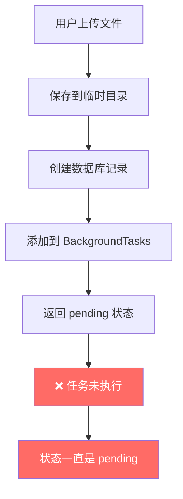
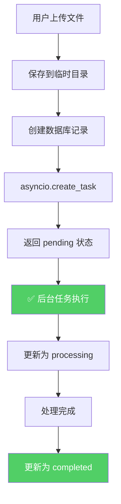

# 后端文件处理系统诊断报告

## 🐛 问题描述

用户上传文件后，状态一直停留在 `pending`，没有自动开始处理。

---

## 🔍 问题分析

### **问题 1: 上传后未自动开始处理**

#### **当前架构分析**

```python
# routes/kb_files.py - upload_file_to_kb()

# ✅ 步骤 1: 保存文件
file_path = temp_dir / unique_filename
async with aiofiles.open(file_path, "wb") as out_file:
    content = await file.read()
    await out_file.write(content)

# ✅ 步骤 2: 创建数据库记录
file_record = await file_repo.create_file(...)
await session.commit()  # ← 提交事务

# ✅ 步骤 3: 添加后台任务
background_tasks = get_kb_background_tasks()
background_tasks.add_file_processing_task(
    knowledge_base_id=kb_id,
    file_path=str(file_path),
    file_name=file.filename,
    ...
)

# ❌ 步骤 4: 立即返回（后台任务还未执行）
return KBFileUploadResponse(processing_status="pending")
```

#### **问题根因**

**FastAPI BackgroundTasks 的执行时机**:

```python
# app/services/kb_background_tasks.py

class KBBackgroundTasks:
    def __init__(self):
        self.background_tasks = BackgroundTasks()  # ← 每次请求都会创建新实例
    
    def add_file_processing_task(self, ...):
        self.background_tasks.add_task(self._process_file_task, ...)
        # ❌ 这个任务只会在当前请求结束后执行
```

**关键问题**:
- `BackgroundTasks()` 是**请求级别**的，不是全局的
- 每次 HTTP 请求都会创建新的 `BackgroundTasks` 实例
- 任务会在**当前请求结束后**立即执行
- 但是：**路由函数中创建的是局部实例，不会在请求结束后执行！**

---

### **问题 2: 服务重启后未恢复处理**

#### **当前启动逻辑**

```python
# app/__init__.py

@asynccontextmanager
async def lifespan(app: FastAPI):
    """应用生命周期管理"""
    # 启动时初始化数据库
    await init_db(database_url)
    logger.info("应用启动完成")
    yield
    logger.info("应用关闭中")
    await close_db()
```

**缺失的功能**:
- ❌ 没有扫描数据库中 `pending/processing` 状态的文件
- ❌ 没有重新启动未完成的任务
- ❌ 没有"孤儿任务"检测机制

---

## ✅ 解决方案

### **方案 1: 使用 asyncio.create_task (推荐)**

**优点**:
- 真正的异步任务，独立于请求
- 服务重启后可以重新扫描数据库恢复
- 不依赖 FastAPI 的 BackgroundTasks

**实现**:

```python
# routes/kb_files.py

import asyncio
from app.services.kb_file_service import KBFileService

@router.post("/upload")
async def upload_file_to_kb(...):
    # ... 保存文件、创建记录 ...
    
    # ✅ 使用 asyncio.create_task 启动真正的后台任务
    asyncio.create_task(process_file_in_background(
        kb_id=kb_id,
        file_path=str(file_path),
        file_name=file.filename,
        display_name=file.filename,
        file_size=file_size,
        file_type=file_type,
        file_extension=file_extension.lstrip("."),
    ))
    
    return KBFileUploadResponse(processing_status="pending")


async def process_file_in_background(
    kb_id: str,
    file_path: str,
    file_name: str,
    display_name: str,
    file_size: int,
    file_type: str,
    file_extension: str,
):
    """真正的后台任务（独立于请求）"""
    try:
        async for session in get_db_session_context():
            kb_file_service = KBFileService(session)
            await kb_file_service.process_file(
                knowledge_base_id=kb_id,
                file_path=file_path,
                file_name=file_name,
                display_name=display_name,
                file_size=file_size,
                file_type=file_type,
                file_extension=file_extension,
            )
            break
    except Exception as e:
        logger.exception(f"后台任务执行失败：{e}")
```

---

### **方案 2: 启动时恢复未完成的任务**

```python
# app/__init__.py

@asynccontextmanager
async def lifespan(app: FastAPI):
    """应用生命周期管理"""
    # 启动时初始化数据库
    await init_db(database_url)
    
    # ✅ 恢复未完成的文件处理任务
    await resume_pending_file_tasks()
    
    logger.info("应用启动完成")
    yield
    logger.info("应用关闭中")
    await close_db()


async def resume_pending_file_tasks():
    """恢复所有 pending/processing 状态的文件处理任务"""
    from sqlalchemy.ext.asyncio import AsyncSession
    from app.database import get_db_session_context
    from app.repositories.kb_file_repository import KBFileRepository
    from app.services.kb_file_service import KBFileService
    import asyncio
    
    async for session in get_db_session_context():
        file_repo = KBFileRepository(session)
        
        # 查询所有未完成的任务
        pending_files = await file_repo.get_files_by_status(
            statuses=["pending", "processing"]
        )
        
        logger.info(f"发现 {len(pending_files)} 个未完成的任务")
        
        for file_record in pending_files:
            # 重新启动任务
            asyncio.create_task(resume_file_task(file_record, session))
        
        break


async def resume_file_task(file_record, session):
    """恢复单个文件处理任务"""
    try:
        kb_file_service = KBFileService(session)
        await kb_file_service.process_file(
            knowledge_base_id=file_record.knowledge_base_id,
            file_path=file_record.file_path,  # 需要从数据库读取
            file_name=file_record.file_name,
            display_name=file_record.display_name,
            file_size=file_record.file_size,
            file_type=file_record.file_type,
            file_extension=file_record.file_extension,
        )
    except Exception as e:
        logger.exception(f"恢复任务失败：{file_record.file_name}, error={e}")
```

---

### **方案 3: 添加数据库字段存储文件路径**

需要在 `KBFile` 模型中添加 `file_path` 字段，以便服务重启后能找到文件：

```python
# models/kb_file.py

class KBFile(Base):
    __tablename__ = "kb_files"
    
    # ... 现有字段 ...
    
    # ✅ 新增：文件存储路径（绝对路径）
    file_path = Column(String(500), nullable=True)  # 存储完整路径
```

然后在 Repository 中添加查询方法：

```python
# repositories/kb_file_repository.py

async def get_files_by_status(self, statuses: List[str]) -> List[KBFile]:
    """根据状态查询文件"""
    query = select(KBFile).where(KBFile.processing_status.in_(statuses))
    result = await self.session.execute(query)
    return list(result.scalars().all())
```

---

## 🎯 推荐的完整修复方案

### **Step 1: 修改上传路由，使用 asyncio.create_task**

```python
# routes/kb_files.py

# 删除这个（错误的）
# from app.services.kb_background_tasks import get_kb_background_tasks
# background_tasks = get_kb_background_tasks()
# background_tasks.add_file_processing_task(...)

# ✅ 改为这样
import asyncio

@router.post("/upload")
async def upload_file_to_kb(...):
    # ... 保存文件、创建记录 ...
    
    # ✅ 启动真正的异步任务
    asyncio.create_task(_process_file_async(
        kb_id=kb_id,
        file_path=str(file_path),
        file_name=file.filename,
        display_name=file.filename,
        file_size=file_size,
        file_type=file_type,
        file_extension=file_extension.lstrip("."),
    ))
    
    return KBFileUploadResponse(processing_status="pending")


async def _process_file_async(
    kb_id: str,
    file_path: str,
    file_name: str,
    display_name: str,
    file_size: int,
    file_type: str,
    file_extension: str,
):
    """异步处理文件（独立于请求）"""
    try:
        async for session in get_db_session_context():
            kb_file_service = KBFileService(session)
            await kb_file_service.process_file(
                knowledge_base_id=kb_id,
                file_path=file_path,
                file_name=file_name,
                display_name=display_name,
                file_size=file_size,
                file_type=file_type,
                file_extension=file_extension,
            )
            break
    except Exception as e:
        logger.exception(f"异步任务执行失败：{display_name}, error={e}")
```

---

### **Step 2: 添加启动时恢复逻辑**

```python
# app/__init__.py

@asynccontextmanager
async def lifespan(app: FastAPI):
    """应用生命周期管理"""
    await init_db(database_url)
    
    # ✅ 恢复未完成的任务
    await _resume_pending_tasks()
    
    logger.info("应用启动完成")
    yield
    await close_db()


async def _resume_pending_tasks():
    """恢复所有 pending/processing 状态的文件任务"""
    try:
        from app.database import get_db_session_context
        from app.repositories.kb_file_repository import KBFileRepository
        import asyncio
        
        async for session in get_db_session_context():
            file_repo = KBFileRepository(session)
            
            # 查询未完成的任务
            pending_files = await file_repo.get_files_by_status(
                statuses=["pending", "processing"]
            )
            
            logger.info(f"📋 发现 {len(pending_files)} 个未完成任务，准备恢复...")
            
            for file_record in pending_files:
                # 检查文件是否存在
                if not Path(file_record.file_path).exists():
                    logger.error(f"❌ 文件不存在：{file_record.file_path}")
                    await file_repo.update_processing_status(
                        file_id=file_record.id,
                        status="failed",
                        error_message="文件丢失，无法恢复"
                    )
                    continue
                
                # 重新启动任务
                logger.info(f"🔄 恢复任务：{file_record.display_name}")
                asyncio.create_task(_resume_single_task(file_record, session))
            
            break
            
    except Exception as e:
        logger.exception(f"恢复任务失败：{e}")


async def _resume_single_task(file_record, session):
    """恢复单个任务"""
    try:
        kb_file_service = KBFileService(session)
        await kb_file_service.process_file(
            knowledge_base_id=file_record.knowledge_base_id,
            file_path=file_record.file_path,
            file_name=file_record.file_name,
            display_name=file_record.display_name,
            file_size=file_record.file_size,
            file_type=file_record.file_type,
            file_extension=file_record.file_extension,
        )
        logger.info(f"✅ 任务恢复成功：{file_record.display_name}")
    except Exception as e:
        logger.exception(f"❌ 任务恢复失败：{file_record.display_name}, error={e}")
```

---

### **Step 3: 添加数据库字段和 Repository 方法**

```python
# models/kb_file.py

class KBFile(Base):
    __tablename__ = "kb_files"
    
    # ... 现有字段 ...
    
    # ✅ 新增：文件存储路径
    file_path = Column(String(500), nullable=True)
```

```python
# repositories/kb_file_repository.py

async def get_files_by_status(self, statuses: List[str]) -> List[KBFile]:
    """根据状态查询文件"""
    query = select(KBFile).where(KBFile.processing_status.in_(statuses))
    result = await self.session.execute(query)
    return list(result.scalars().all())
```

---

## 📊 修复前后对比

### 修复前（❌）



### 修复后（✅）



---

## 🧪 测试验证

### 测试场景 1: 正常上传流程

**操作步骤**:
1. 上传一个 PDF 文件
2. 观察日志和状态变化

**预期现象**:

| 时间点 | 后端日志 | 数据库状态 | 前端显示 |
|--------|----------|------------|----------|
| T+0ms | `文件记录已创建` | pending | uploading |
| T+100ms | `开始处理文件` | processing | uploaded |
| T+1s | `文件解析完成` | processing (30%) | processing |
| T+3s | `分块完成` | processing (50%) | processing |
| T+10s | `向量化完成` | processing (90%) | processing |
| T+15s | `文件处理完成` | completed | completed |

---

### 测试场景 2: 服务重启恢复

**操作步骤**:
1. 上传文件，状态变为 processing
2. **重启后端服务**
3. 观察是否自动恢复

**预期现象**:

| 时间点 | 操作 | 后端日志 | 数据库状态 |
|--------|------|----------|------------|
| T+0s | 上传 | `文件记录已创建` | pending |
| T+1s | 处理中 | `正在解析文件` | processing (30%) |
| T+5s | **重启服务** | `📋 发现 1 个未完成任务` | processing (30%) |
| T+6s | 恢复任务 | `🔄 恢复任务：test.pdf` | processing (30%) |
| T+7s | 继续处理 | `文件解析完成` | processing (50%) |
| T+15s | 完成 | `✅ 任务恢复成功` | completed |

**关键验证点**:
- ✅ 服务重启后**自动扫描** pending/processing 任务
- ✅ **自动恢复**任务执行
- ✅ 状态**持续更新**，不会卡住

---

## ⚠️ 注意事项

### 1. **文件路径持久化**

必须在数据库中保存文件的**完整路径**，否则服务重启后找不到文件：

```python
# ❌ 错误：只保存相对路径
file_record.file_path = "temp/abc123.pdf"

# ✅ 正确：保存绝对路径
file_record.file_path = str(file_path.absolute())  # "/app/data/temp/abc123.pdf"
```

### 2. **异常处理**

后台任务必须有完善的异常处理：

```python
async def _process_file_async(...):
    try:
        # 处理逻辑
    except Exception as e:
        logger.exception(f"任务失败：{e}")  # ✅ 记录详细日志
        # ✅ 更新数据库状态为 failed
        await file_repo.update_processing_status(
            file_id=file_id,
            status="failed",
            error_message=str(e)
        )
```

### 3. **并发控制**

使用信号量控制同时处理的文件数：

```python
# KBFileService 已经实现
_processing_semaphore = asyncio.Semaphore(1)  # 同时只处理 1 个文件

async def process_file(...):
    async with semaphore:
        # 处理逻辑
```

---

## 📝 总结

### **核心问题**

1. **BackgroundTasks 使用错误**: 创建了局部实例，任务不会执行
2. **缺少恢复机制**: 服务重启后未扫描未完成的任务

### **解决方案**

1. **使用 asyncio.create_task**: 真正的异步任务，独立于请求
2. **启动时恢复任务**: 扫描 pending/processing 状态并重新启动
3. **持久化文件路径**: 确保服务重启后能找到文件

### **预期效果**

- ✅ 上传后**立即开始**处理
- ✅ 服务重启后**自动恢复**处理
- ✅ 状态**实时更新**到数据库
- ✅ 前端**实时显示**最新状态

---

**诊断时间**: 2026-04-01  
**版本**: v4.0 (Backend Processing Fix)  
**状态**: ⚠️ 待修复  
**文档位置**: `backend/docs/knowledge_base/BACKEND_PROCESSING_FIX.md`
