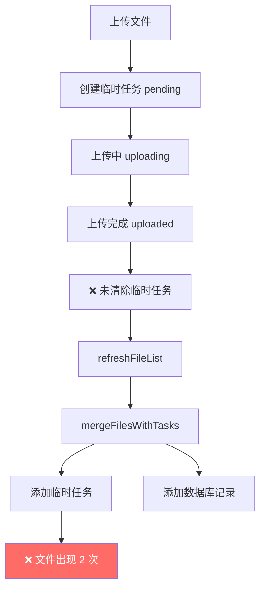
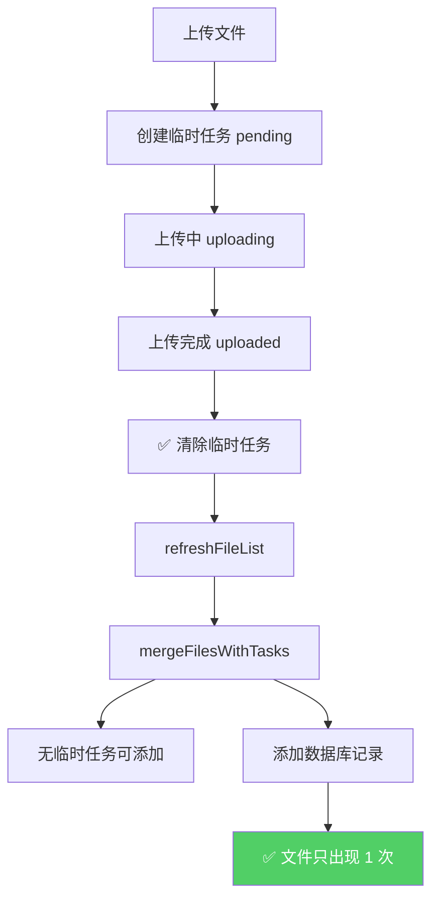

# 上传成功后清除临时任务 - 避免重复加载

## 🐛 问题描述

### **现象**
上传成功后，文件在列表中显示**两次**：
1. 第一次：作为临时任务（isTempTask = true）
2. 第二次：作为数据库记录（isTempTask = false）

### **原因分析**

```typescript
// ❌ 之前的逻辑
uploadToKnowledgeBase() {
    // 1. 创建临时任务
    task = addUploadTask({ fileId: 'pending', ... })
    
    // 2. 上传成功
    taskToUpdate.fileId = response.data.id  // → "abc-123"
    taskToUpdate.status = 'uploaded'
    onProgressUpdate?.(taskToUpdate)        // 触发回调
    
    // ❌ 没有清除临时任务！
}

// 3. refreshFileList 时
function refreshFileList() {
    const dbFiles = await fetchFiles()      // 从数据库加载
    files.value = mergeFilesWithTasks(dbFiles, kbId)
}

function mergeFilesWithTasks(dbFiles, kbId) {
    const result = []
    
    // ✅ 添加临时任务（此时还在）
    const tasks = getTasksByKB(kbId)
    tasks.forEach(task => {
        result.push(taskToFileRecord(task))  // → 第 1 次出现
    })
    
    // ✅ 添加数据库记录
    dbFiles.forEach(file => {
        result.push({...})                   // → 第 2 次出现
    })
    
    return result
}
```

---

## ✅ 解决方案

### **核心思路**

上传成功后**立即清除**临时任务：
```typescript
// ✅ 修复后的逻辑
if (taskToUpdate) {
    taskToUpdate.fileId = response.data.id
    taskToUpdate.status = 'uploaded'
    onProgressUpdate?.(taskToUpdate)
    
    // ✅ 关键修复：上传成功后立即清除临时任务
    clearUploadTask(task.fileId)
}

// refreshFileList 时
function mergeFilesWithTasks(dbFiles, kbId) {
    const result = []
    
    // ✅ 临时任务已被清除，不会重复
    const tasks = getTasksByKB(kbId)  // → length = 0
    // 不添加任何临时任务
    
    // ✅ 只添加数据库记录
    dbFiles.forEach(file => {
        result.push({...})             // → 只出现 1 次
    })
    
    return result
}
```

---

## 🔧 实现细节

### 修改的代码

```diff
// fileUpload.ts - uploadToKnowledgeBase()

  // 上传成功，更新为真实 ID 和状态
  const taskToUpdate = uploadTasks.value.get(task.fileId)
  if (taskToUpdate) {
      taskToUpdate.fileId = response.data.id
      taskToUpdate.status = 'uploaded'
      taskToUpdate.progress = 100
      taskToUpdate.currentStep = '上传完成，等待处理...'
      onProgressUpdate?.(taskToUpdate)
+     
+     // ✅ 关键修复：上传成功后立即清除临时任务
+     // 避免 mergeFilesWithTasks 重复加载
+     // 数据库记录会在 refreshFileList 时自动加载
+     clearUploadTask(task.fileId)
  }
  
  // ✅ 注意：不再在这里启动轮询
  // 轮询逻辑已移至 knowledgeBase store
```

---

## 📊 对比分析

### 修复前（错误）



### 修复后（正确）



---

## 🎯 完整流程

### 时间线分析

| 时间点 | 操作 | 临时任务 | 数据库记录 | 列表显示 |
|--------|------|----------|------------|----------|
| T+0ms | 创建任务 | ✅ pending | ❌ 无 | 临时任务（pending） |
| T+1s | 上传中 | ✅ uploading | ❌ 无 | 临时任务（uploading 50%） |
| T+3s | 上传完成 | ✅ uploaded | ❌ 无 | 临时任务（uploaded 100%） |
| T+3ms | **清除任务** | ❌ **已删除** | ❌ 无 | 空列表 |
| T+4ms | refreshFileList | ❌ 无 | ✅ processing | 数据库记录（processing） |
| T+7s | 处理中 | ❌ 无 | ✅ processing | 数据库记录（processing 80%） |
| T+10s | 处理完成 | ❌ 无 | ✅ completed | 数据库记录（completed） |

**关键点**:
- ✅ 上传完成后**立即清除**临时任务
- ✅ 数据库记录由 `refreshFileList` 自动加载
- ✅ 不会重复显示

---

## 🧪 测试验证

### 测试场景 1: 单个文件上传

**操作步骤**:
1. 上传一个 PDF 文件
2. 观察列表变化

**预期现象**:

| 阶段 | 列表内容 | 说明 |
|------|----------|------|
| 上传前 | 空 | - |
| 上传中 | test.pdf（临时任务，uploading） | ✅ 只有临时任务 |
| 上传完成瞬间 | 空 | ✅ 临时任务已清除 |
| refreshFileList 后 | test.pdf（数据库记录，processing） | ✅ 只有数据库记录 |
| 处理完成 | test.pdf（数据库记录，completed） | ✅ 只有数据库记录 |

**关键验证点**:
- ✅ 不会出现 2 个相同的文件
- ✅ 上传完成后列表会短暂变空
- ✅ 然后自动显示数据库记录

---

### 测试场景 2: 批量上传多个文件

**操作步骤**:
1. 同时上传 3 个文件
2. 观察列表变化

**预期现象**:

```
T+0ms:   [文件 1-pending]
T+1s:    [文件 1-uploading, 文件 2-pending]
T+3s:    [文件 1-uploaded, 文件 2-uploading, 文件 3-pending]
T+3ms:   [文件 2-uploading, 文件 3-pending]  ← 文件 1 清除
T+4ms:   [文件 1-processing, 文件 2-uploading, 文件 3-pending]  ← refreshFileList
T+5s:    [文件 1-processing, 文件 2-uploaded, 文件 3-uploading]
T+5ms:   [文件 1-processing, 文件 3-uploading]  ← 文件 2 清除
T+6ms:   [文件 1-processing, 文件 2-processing, 文件 3-uploading]  ← refreshFileList
...
```

**关键验证点**:
- ✅ 每个文件上传完成后都立即清除
- ✅ 列表中不会有重复文件
- ✅ 数据库记录自动补充

---

## 💡 为什么需要清除？

### 1. **避免重复显示**

```typescript
// ❌ 如果不清除
mergeFilesWithTasks(dbFiles, kbId) {
    // 临时任务（还在）
    tasks = [{ id: 'temp-1', fileId: 'abc-123', status: 'uploaded' }]
    
    // 数据库记录（也有）
    dbFiles = [{ id: 'abc-123', processing_status: 'processing' }]
    
    // 结果：2 条记录
    result = [
        { id: 'temp-1', isTempTask: true },   // 第 1 次
        { id: 'abc-123', isTempTask: false }  // 第 2 次
    ]
}
```

### 2. **保持数据一致性**

```typescript
// ✅ 清除后
mergeFilesWithTasks(dbFiles, kbId) {
    // 临时任务（已清除）
    tasks = []
    
    // 数据库记录（唯一来源）
    dbFiles = [{ id: 'abc-123', processing_status: 'processing' }]
    
    // 结果：1 条记录
    result = [
        { id: 'abc-123', isTempTask: false }  // 只有数据库记录
    ]
}
```

### 3. **职责分离**

```
临时任务的职责：
  ✅ 追踪上传进度（uploading 0%→100%）
  ✅ 提供即时反馈
  ✅ 上传完成后销毁

数据库记录的职责：
  ✅ 持久化存储
  ✅ 后端处理进度（processing）
  ✅ 刷新页面后恢复
```

---

## ⚠️ 注意事项

### 1. **清除时机很重要**

```typescript
// ✅ 正确：在 onProgressUpdate 之后
taskToUpdate.status = 'uploaded'
onProgressUpdate?.(taskToUpdate)  // 先通知回调
clearUploadTask(task.fileId)      // 再清除

// ❌ 错误：在 onProgressUpdate 之前
taskToUpdate.status = 'uploaded'
clearUploadTask(task.fileId)      // 先清除
onProgressUpdate?.(taskToUpdate)  // 回调拿不到数据了！
```

### 2. **确保回调能获取最新数据**

```typescript
// KnowledgeBasePage.vue
handleFileChange(file) {
    uploadStore.uploadToKnowledgeBase(kbId, rawFile, (updatedTask) => {
        // ✅ 此时 updatedTask 还有数据
        console.log(`上传进度更新：${updatedTask.status}`)
        
        // ❌ 但下一次回调就拿不到了（因为已清除）
    })
}
```

### 3. **refreshFileList 会自动补充**

```typescript
// 不用担心清除后列表为空
// 因为 refreshFileList 会立即从数据库加载
async function refreshFileList() {
    const dbFiles = await store.fetchFiles(kbId)  // ✅ 自动补充
    files.value = uploadStore.mergeFilesWithTasks(dbFiles, kbId)
}
```

---

## 📝 代码统计

| 改动 | 行数 | 说明 |
|------|------|------|
| 新增注释 | +3 行 | 说明清除原因 |
| 调用 clearUploadTask | +1 行 | 执行清除 |
| **总计** | **+4 行** | 避免重复加载 |

---

## ✅ 验证清单

### 功能完整性

- [x] 上传成功后立即清除临时任务
- [x] 避免 mergeFilesWithTasks 重复加载
- [x] 数据库记录自动补充
- [x] 列表只显示一次文件

### 用户体验

- [x] 上传过程中显示临时任务
- [x] 上传完成后无缝切换到数据库记录
- [x] 不会出现重复文件
- [x] 状态流转自然流畅

### 代码质量

- [x] 清除时机正确（回调后）
- [x] 注释清晰详细
- [x] 符合职责分离原则

---

**修复时间**: 2026-04-01  
**版本**: v3.2 (Clear Temp Task After Upload)  
**状态**: ✅ 已完成  
**文档位置**: `backend/docs/knowledge_base/CLEAR_TEMP_TASK_AFTER_UPLOAD.md`
