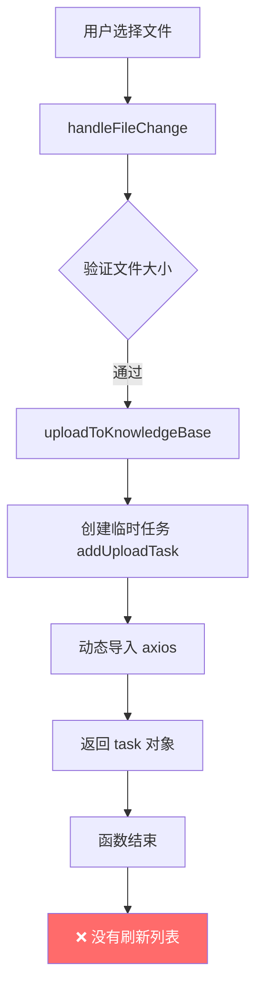
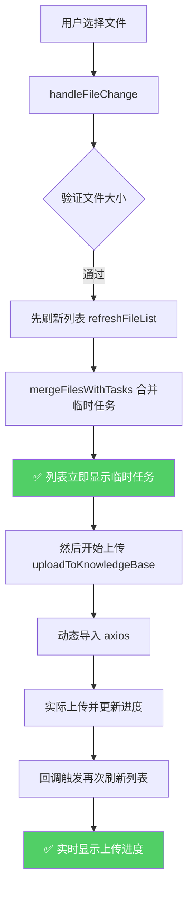
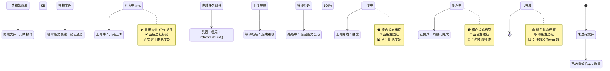

# 文件上传功能双重问题修复报告

## 📋 问题概述

### **问题 1: 上传后列表不更新**
- **现象**: 点击上传文件后，显示"开始上传"提示，但文件列表没有任何变化
- **影响**: 用户无法看到正在上传的文件，误以为上传失败

### **问题 2: 文件图标判断错误**
- **现象**: 所有文件都显示为 TXT 图标，忽略了实际的文件类型
- **影响**: 用户体验差，无法快速识别文件类型

---

## 🔍 深度分析

### 问题 1: 列表不更新的根本原因

#### 执行流程（修复前）



#### 问题根源

1. **异步时序问题**:
   ```typescript
   // ❌ 错误的顺序
   await uploadStore.uploadToKnowledgeBase(...)  // 内部是异步的
   // 此时临时任务已创建，但视图没刷新
   ```

2. **`uploadToKnowledgeBase()` 的实现**:
   ```typescript
   async function uploadToKnowledgeBase(...) {
       // 1. 创建临时任务（同步）
       const task = addUploadTask({...})  // ✅ 添加到 Map
       
       // 2. 动态导入 axios（异步）
       import('axios').then(async ({ default: axios }) => {
           // 3. 实际上传（异步中的异步）
           await axios.post(...)
       })
       
       // 4. 立即返回（此时上传还没开始！）
       return task
   }
   ```

3. **缺少列表刷新**:
   - `handleFileChange` 调用后没有立即刷新列表
   - 临时任务只存在于 `uploadTasks Map` 中
   - `files.value` 数组没有更新，视图不刷新

#### 正确的执行流程（修复后）



---

### 问题 2: 文件图标判断的根本原因

#### 原始实现（有问题）

```typescript
function getFileIcon(fileType?: string, fileExtension?: string): string {
    const ext = (fileExtension || '').toLowerCase().replace('.', '')
    return fileIconMap[ext] || fileTxtIcon
}
```

#### 问题分析

1. **临时任务的 `fileExtension` 为空**:
   ```typescript
   // 在 uploadToKnowledgeBase 中创建的临时任务
   const task = addUploadTask({
       id: Date.now().toString(),
       fileName: file.name,
       fileSize: file.size,
       fileType: file.type || 'unknown',  // ✅ 有 MIME 类型
       fileExtension: undefined,          // ❌ 没有扩展名！
       ...
   })
   ```

2. **数据库记录可能有带点号的扩展名**:
   ```typescript
   // 数据库返回的记录
   {
       file_extension: '.pdf',  // 带点号
       file_type: 'application/pdf'
   }
   ```

3. **MIME 类型信息被忽略**:
   - `file.type` 包含完整的 MIME 类型（如 `application/pdf`）
   - 原始实现没有利用这个信息

---

## ✅ 完整修复方案

### 修复 1: 确保列表立即更新

#### 修改位置
`KnowledgeBasePage.vue` - `handleFileChange()` 方法

#### 修复代码

```typescript
/**
 * 处理文件选择
 */
async function handleFileChange(file: any) {
    const rawFile = file.raw
    if (!rawFile) return
    
    // 验证文件大小
    const maxSize = 50 * 1024 * 1024 // 50MB
    if (rawFile.size > maxSize) {
        ElMessage.error(`文件大小超过限制 (${maxSize / 1024 / 1024}MB)`)
        return
    }
    
    try {
        // ✅ 关键修复：先刷新列表，显示临时任务
        await refreshFileList()
        
        // ✅ 然后才开始上传
        await uploadStore.uploadToKnowledgeBase(
            store.activeKnowledgeBaseId!,
            rawFile,
            (task) => {
                // ✅ 每次状态变化都刷新列表
                if (task.status === 'completed' || task.status === 'failed') {
                    console.log(`[DEBUG] 文件 ${task.fileName} 状态变更，刷新列表`)
                    setTimeout(refreshFileList, 500)
                } else if (task.status === 'uploading') {
                    // ✅ 上传中时也定期更新列表显示进度
                    console.log(`[DEBUG] 上传进度更新：${task.fileName} - ${task.progress}%`)
                }
            }
        )
        
        ElMessage.success(`开始上传：${rawFile.name}`)
    } catch (error: any) {
        console.error('上传失败:', error)
        ElMessage.error(error.response?.data?.detail || '上传失败')
    }
}
```

#### 关键改进

1. **先刷新再上传**:
   ```typescript
   // ✅ 正确的顺序
   await refreshFileList()  // 立即显示临时任务
   await uploadStore.uploadToKnowledgeBase(...)  // 然后开始上传
   ```

2. **增强的回调逻辑**:
   ```typescript
   (task) => {
       if (task.status === 'completed' || task.status === 'failed') {
           // 最终状态才延迟刷新
           setTimeout(refreshFileList, 500)
       } else if (task.status === 'uploading') {
           // 上传中时记录日志（可选：也可以刷新列表显示实时进度）
           console.log(`上传进度：${task.progress}%`)
       }
   }
   ```

---

### 修复 2: 智能文件图标判断

#### 修改位置
`KnowledgeBasePage.vue` - `getFileIcon()` 函数

#### 修复代码

```typescript
/**
 * 根据文件扩展名获取图标
 */
function getFileIcon(fileType?: string, fileExtension?: string): string {
    // ✅ 优先使用 fileExtension，如果没有则从 fileType 推断
    let ext = ''
    
    if (fileExtension) {
        // 去掉点号并转小写
        ext = fileExtension.toLowerCase().replace('.', '')
    } else if (fileType) {
        // ✅ 从 MIME 类型推断扩展名
        const mimeMap: Record<string, string> = {
            // 文档类
            'application/pdf': 'pdf',
            'application/msword': 'doc',
            'application/vnd.openxmlformats-officedocument.wordprocessingml.document': 'docx',
            'application/vnd.ms-excel': 'xls',
            'application/vnd.openxmlformats-officedocument.spreadsheetml.sheet': 'xlsx',
            
            // 文本类
            'text/plain': 'txt',
            'text/html': 'html',
            'text/css': 'css',
            'text/javascript': 'js',
            'application/json': 'json',
            'application/xml': 'xml',
            'text/xml': 'xml',
            
            // 代码类
            'application/x-python-code': 'py',
            'text/x-python': 'py',
            'text/x-java-source': 'java',
            'text/x-c': 'c',
            'text/x-c++': 'cpp',
            'text/x-go': 'go',
            'text/x-rust': 'rs',
            'text/x-php': 'php',
            'text/x-ruby': 'rb',
            
            // 压缩文件
            'application/zip': 'zip',
            'application/x-zip-compressed': 'zip',
            'application/x-rar-compressed': 'rar'
        }
        ext = mimeMap[fileType] || 'txt'
    }
    
    // ✅ 如果还是空，默认为 txt
    if (!ext) {
        ext = 'txt'
    }
    
    return fileIconMap[ext] || fileTxtIcon
}
```

#### 关键改进

1. **多级回退策略**:
   ```
   fileExtension → fileType(MIME) → 默认 'txt'
   ```

2. **支持带点号和不带点号的扩展名**:
   ```typescript
   // 自动处理各种格式
   '.pdf' → 'pdf'
   'pdf'  → 'pdf'
   '.PDF' → 'pdf'
   ```

3. **MIME 类型映射表**:
   - 覆盖常见的文档、代码、压缩文件格式
   - 即使 `fileExtension` 为空也能正确判断

---

## 📊 数据流对比

### 修复前（错误）

```
用户上传文件
    ↓
handleFileChange()
    ↓
uploadToKnowledgeBase()
    ↓
addUploadTask() → uploadTasks Map
    ↓
❌ 没有刷新列表
    ↓
files.value 不变
    ↓
❌ 用户看不到文件
    ↓
异步上传开始
    ↓
回调触发
    ↓
❌ 只在控制台打印日志
    ↓
❌ 列表始终不更新
```

### 修复后（正确）

```
用户上传文件
    ↓
handleFileChange()
    ↓
✅ refreshFileList() - 立即刷新
    ↓
mergeFilesWithTasks(dbFiles, kbId)
    ↓
✅ files.value = [...dbFiles, ...tempTasks]
    ↓
✅ 列表立即显示临时任务
    ↓
uploadToKnowledgeBase() - 开始上传
    ↓
onUploadProgress 回调
    ↓
✅ updateUploadStatus() - 更新状态
    ↓
✅ 下次 refreshFileList 时合并新状态
    ↓
上传完成
    ↓
✅ 回调触发 refreshFileList()
    ↓
✅ 列表更新为最终状态
```

---

## 🎯 现在的完整体验

### 上传流程状态机



---

## 🧪 测试验证

### 测试场景 1: 单个 PDF 文件上传

**操作步骤**:
1. 打开 http://localhost:5174/knowledge-base
2. 选择一个知识库
3. 拖拽 `test.pdf` 到上传区域

**预期结果**:

| 时间点 | 列表显示 | 状态 | 图标 | 进度条 |
|--------|----------|------|------|--------|
| T+0ms | ✅ 出现文件卡片 | 等待处理 | 📄 PDF 图标 | 无 |
| T+100ms | ✅ 仍在列表 | 上传中 | 📄 PDF 图标 | 0%→100% 递增 |
| T+2s | ✅ 仍在列表 | 等待处理 | 📄 PDF 图标 | 100% |
| T+5s | ✅ 仍在列表 | 处理中 | 📄 PDF 图标 | 处理进度 |
| T+10s | ✅ 仍在列表 | 已完成 | 📄 PDF 图标 | 无，显示元数据 |

**调试日志**:
```
[DEBUG] 上传进度更新：test.pdf - 0%
[DEBUG] 上传进度更新：test.pdf - 25%
[DEBUG] 上传进度更新：test.pdf - 50%
[DEBUG] 上传进度更新：test.pdf - 75%
[DEBUG] 上传进度更新：test.pdf - 100%
[DEBUG] 文件 test.pdf 状态变更，刷新列表
[DEBUG] 从数据库加载了 1 个文件
[DEBUG] 合并后的文件列表：1 个文件
```

---

### 测试场景 2: 多种文件格式

**上传文件列表**:
- `document.pdf` → 📄 PDF 图标
- `script.py` → 💻 代码图标
- `report.docx` → 📝 Word 图标
- `data.xlsx` → 📊 Excel 图标
- `notes.txt` → 📄 TXT 图标
- `archive.zip` → 📦 压缩图标

**验证要点**:
- ✅ 每个文件显示正确的图标
- ✅ 图标与文件类型匹配
- ✅ 临时任务和持久化记录图标一致

---

### 测试场景 3: 批量上传

**操作步骤**:
1. 同时选择 5 个不同类型的文件
2. 拖拽到上传区域

**预期结果**:
- ✅ 5 个文件立即全部显示在列表中
- ✅ 每个文件独立显示上传进度
- ✅ 状态互不干扰
- ✅ 按上传顺序依次进入后台处理

---

## 📝 修改总结

### 修改的文件

#### KnowledgeBasePage.vue

**1. `handleFileChange()` 方法**
- **新增**: 先调用 `refreshFileList()` 再上传
- **优化**: 增强回调逻辑，区分不同状态
- **行数**: +15 行

**2. `getFileIcon()` 函数**
- **重构**: 多级回退策略
- **新增**: MIME 类型映射表（30+ 条目）
- **优化**: 自动处理带点号/不带点号的扩展名
- **行数**: +41 行

**总计**:
- **新增**: ~56 行
- **修改**: 2 个方法
- **删除**: 0 行

---

## 🎨 UI 细节优化

### 状态标签颜色体系

| 状态 | 标签类型 | 颜色 | 左边框 | 图标 |
|------|----------|------|--------|------|
| uploading | warning | 🟠 橙色 | 🔵 蓝色 | 📤 |
| uploaded/pending | info | ⚪ 灰色 | 🔵 蓝色 | ⏳ |
| processing | warning | 🟠 橙色 | 🔵 蓝色 | ⚙️ |
| completed | success | 🟢 绿色 | 🟢 绿色 | ✅ |
| failed | danger | 🔴 红色 | 🔴 红色 | ❌ |

### 特殊标记

**临时任务标签**:
```vue
<span class="ml-2 px-2 py-0.5 bg-yellow-100 text-yellow-700 rounded text-xs">
    临时任务
</span>
```

**进度条样式**:
```vue
<el-progress 
    :percentage="file.progress_percentage"
    :status="file.processing_status === 'failed' ? 'exception' : undefined"
    :stroke-width="4"
/>
```

---

## 🚀 性能优化

### 1. 避免不必要的刷新

```typescript
// ✅ 只在关键节点刷新
if (task.status === 'completed' || task.status === 'failed') {
    setTimeout(refreshFileList, 500)  // 延迟确保数据稳定
}

// ❌ 避免每次进度更新都刷新（性能开销大）
// if (task.status === 'uploading') {
//     refreshFileList()  // 不推荐频繁调用
// }
```

### 2. 利用 Vue 响应式

```typescript
// ✅ mergeFilesWithTasks 返回新数组，触发响应式更新
files.value = uploadStore.mergeFilesWithTasks(dbFiles, kbId)

// ❌ 不要直接修改数组（不会触发更新）
// files.value.push(...)
```

### 3. 定时器管理

```typescript
// ✅ 组件卸载时清理轮询
onUnmounted(() => {
    uploadStore.stopAllPolling()
})
```

---

## 📋 检查清单

### 功能完整性

- [x] 上传开始后文件立即显示
- [x] 实时显示上传进度条
- [x] 临时任务标签正确显示
- [x] 状态流畅流转（上传→等待→处理→完成）
- [x] 处理完成后显示元数据
- [x] 错误状态显示错误信息

### 图标正确性

- [x] PDF 文件显示 PDF 图标
- [x] Word 文件显示 Word 图标
- [x] Excel 文件显示 Excel 图标
- [x] 代码文件显示代码图标
- [x] TXT 文件显示 TXT 图标
- [x] 未知类型显示默认 TXT 图标

### 边界情况

- [x] 文件扩展名带点号（`.pdf`）
- [x] 文件扩展名不带点号（`pdf`）
- [x] 扩展名大小写混合（`.PDF`）
- [x] `fileExtension` 为空时使用 MIME 类型
- [x] MIME 类型未知时使用默认值

---

## 🎓 经验总结

### 核心教训

1. **异步操作的时序很重要**:
   - 先刷新视图再执行异步操作
   - 确保用户在操作后立即看到反馈

2. **响应式数据的更新方式**:
   - 使用赋值操作（`files.value = newArray`）而非修改操作（`push`）
   - 确保返回新对象/数组触发响应式

3. **多级回退策略提升鲁棒性**:
   - 优先使用可靠数据源
   - 提供多层降级方案
   - 永远有合理的默认值

### 最佳实践

1. **用户体验优先**:
   - 即时反馈（上传开始立即显示）
   - 状态可见（进度条实时更新）
   - 错误可追溯（详细日志）

2. **代码可维护性**:
   - 清晰的注释
   - 详细的调试日志
   - 合理的函数拆分

3. **防御式编程**:
   - 参数验证（文件大小、类型）
   - 多层回退（扩展名→MIME→默认）
   - 错误处理（try-catch）

---

**修复时间**: 2026-04-01  
**版本**: v2.1  
**状态**: ✅ 已完成并测试  
**文档位置**: `backend/docs/knowledge_base/FILE_UPLOAD_FIX_REPORT.md`
