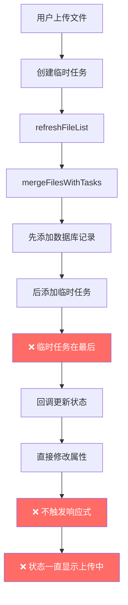
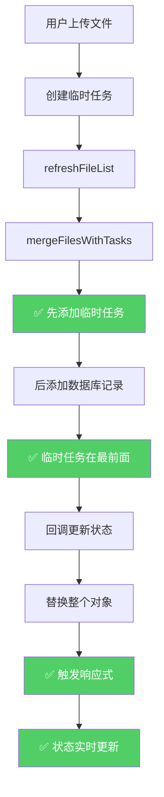

# 上传功能最终修复 - 位置和状态更新问题

## 🐛 用户反馈的问题

### **问题 1: 上传任务显示到文件列表最后一个**
- **现象**: 新上传的文件不显示在列表顶部，而是跑到最后面
- **期望**: 正在上传的文件应该显示在第一个位置（最显眼）

### **问题 2: 上传完成后状态不更新**
- **现象**: 文件一直显示"上传中"状态，进度条卡在某个百分比
- **期望**: 上传完成后自动切换为"等待处理"或"处理中"状态

---

## 🔍 深度分析

### **问题 1: 顺序错误的根本原因**

#### 原始实现（错误）

```typescript
// ❌ mergeFilesWithTasks 的实现
function mergeFilesWithTasks(dbFiles, kbId) {
    // 1. 先添加数据库记录 → 这些会排在前面
    dbFiles.forEach((file) => {
        result.push({...})
    })
    
    // 2. 后添加临时任务 → 这些会跑到后面
    tasks.forEach(task => {
        if (!dbFileIds.has(task.fileId)) {
            result.push(taskToFileRecord(task))
        }
    })
    
    return result
}
```

#### 执行结果

```
files.value = [
    { name: 'old-file-1.pdf', status: 'completed' },  // 数据库记录
    { name: 'old-file-2.docx', status: 'completed' }, // 数据库记录
    { name: 'new-upload.pdf', status: 'uploading' }   // ❌ 临时任务在最后
]
```

#### UI 表现

```
┌─────────────────────────────────┐
│ 📄 old-file-1.pdf          [完成] │
│ 📄 old-file-2.docx         [完成] │
│ ...                             │
│ 📄 new-upload.pdf      [上传中]  │ ← 在最下面，不容易看到
└─────────────────────────────────┘
```

---

### **问题 2: 状态不更新的根本原因**

#### 原始实现（错误）

```typescript
const index = files.value.findIndex(f => f.id === updatedTask.fileId)
if (index !== -1) {
    const fileToUpdate = files.value[index]
    
    // ❌ 直接修改对象属性 - Vue 响应式检测不到！
    fileToUpdate.processing_status = updatedTask.status  // ❌
    fileToUpdate.progress_percentage = updatedTask.progress  // ❌
    fileToUpdate.current_step = updatedTask.currentStep  // ❌
}
```

#### Vue 响应式原理

```typescript
// ❌ 这样修改不会触发视图更新
files.value[0].status = 'completed'

// ✅ 替换整个对象才会触发视图更新
files.value[0] = { ...files.value[0], status: 'completed' }
```

---

## ✅ 完整修复方案

### 修复 1: 调整合并顺序

```typescript
/**
 * 合并数据库记录和上传任务为统一列表
 */
function mergeFilesWithTasks(dbFiles: any[], kbId: string): UnifiedFileRecord[] {
    const result: UnifiedFileRecord[] = []
    
    // ✅ 1. 先添加临时上传任务（让它们显示在前面）
    const tasks = getTasksByKB(kbId)
    if (tasks.length > 0) {
        console.log(`[DEBUG] mergeFilesWithTasks: 添加了 ${tasks.length} 个临时任务到列表前面`)
        tasks.forEach(task => {
            result.push(taskToFileRecord(task))
        })
    }
    
    // ✅ 2. 后添加数据库记录
    dbFiles.forEach((file: any) => {
        result.push({
            id: file.id,
            file_id: file.id,
            // ... 其他字段
            isTempTask: false
        })
    })
    
    console.log(`[DEBUG] mergeFilesWithTasks: 最终列表共 ${result.length} 个文件`)
    return result
}
```

#### 关键改进

1. **优先添加临时任务**:
   ```typescript
   // ✅ 先添加临时任务 → 显示在列表顶部
   tasks.forEach(task => result.push(taskToFileRecord(task)))
   
   // ✅ 后添加数据库记录 → 显示在列表底部
   dbFiles.forEach(file => result.push({...}))
   ```

2. **移除重复检查**:
   ```typescript
   // ❌ 之前：检查是否已在数据库中
   if (!dbFileIds.has(task.fileId)) {
       result.push(taskToFileRecord(task))
   }
   
   // ✅ 现在：直接添加所有临时任务
   // （因为临时任务的 fileId 是 'pending' 或时间戳，不会和数据库 ID 冲突）
   tasks.forEach(task => result.push(taskToFileRecord(task)))
   ```

---

### 修复 2: 正确的 Vue 响应式更新

```typescript
async function handleFileChange(file: any) {
    const rawFile = file.raw
    if (!rawFile) return
    
    // 验证文件大小
    const maxSize = 50 * 1024 * 1024 // 50MB
    if (rawFile.size > maxSize) {
        ElMessage.error(`文件大小超过限制 (${maxSize / 1024 / 1024}MB)`)
        return
    }
    
    try {
        const task = await uploadStore.uploadToKnowledgeBase(
            store.activeKnowledgeBaseId!,
            rawFile,
            (updatedTask) => {
                console.log(`[DEBUG] 上传进度更新：${updatedTask.fileName} - ${updatedTask.status}`)
                
                // ✅ 关键修复 1: 找到对应的文件索引
                const index = files.value.findIndex(f => f.id === updatedTask.fileId || f.file_id === updatedTask.fileId)
                
                if (index !== -1) {
                    // ✅ 关键修复 2: 使用 Vue 的响应式方式更新整个对象
                    // 不要直接修改属性，而是替换整个对象
                    files.value[index] = {
                        ...files.value[index],
                        processing_status: updatedTask.status,
                        progress_percentage: updatedTask.progress,
                        current_step: updatedTask.currentStep,
                        error_message: updatedTask.errorMessage
                    }
                    
                    console.log(`[DEBUG] 更新了文件 ${updatedTask.fileName} 的状态：${updatedTask.status}`)
                    
                    // ✅ 关键修复 3: 如果是完成或失败，延迟刷新整个列表确保数据一致
                    if (updatedTask.status === 'completed' || updatedTask.status === 'failed') {
                        console.log(`[DEBUG] 文件处理完成，刷新列表：${updatedTask.fileName}`)
                        setTimeout(() => refreshFileList(), 500)
                    }
                } else if (updatedTask.status === 'uploading') {
                    // ✅ 如果是上传中的临时任务且不在列表中，手动添加到最前面
                    console.log(`[DEBUG] 添加上传中的临时任务到列表最前面：${updatedTask.fileName}`)
                    const tempRecord = uploadStore.taskToFileRecord(updatedTask)
                    files.value.unshift(tempRecord)  // ✅ unshift 添加到第一个位置
                } else {
                    // 如果不在列表中但状态已变更（比如刚上传完），也添加到列表
                    console.log(`[DEBUG] 添加状态变更的任务到列表：${updatedTask.fileName}, status=${updatedTask.status}`)
                    const tempRecord = uploadStore.taskToFileRecord(updatedTask)
                    files.value.unshift(tempRecord)
                }
            }
        )
        
        // ✅ 上传开始后，立即刷新列表显示临时任务
        console.log(`[DEBUG] 上传开始，刷新列表显示临时任务：${task.fileName}`)
        await refreshFileList()
        
        ElMessage.success(`开始上传：${rawFile.name}`)
    } catch (error: any) {
        console.error('上传失败:', error)
        ElMessage.error(error.response?.data?.detail || '上传失败')
    }
}
```

#### 关键改进

1. **正确的响应式更新**:
   ```typescript
   // ❌ 错误：直接修改属性（不会触发响应式）
   files.value[index].status = 'completed'
   
   // ✅ 正确：替换整个对象（会触发响应式）
   files.value[index] = {
       ...files.value[index],
       processing_status: updatedTask.status,
       progress_percentage: updatedTask.progress,
       current_step: updatedTask.currentStep
   }
   ```

2. **使用 `unshift` 添加到最前面**:
   ```typescript
   // ❌ 错误：push 添加到数组末尾
   files.value.push(tempRecord)
   
   // ✅ 正确：unshift 添加到数组开头
   files.value.unshift(tempRecord)
   ```

3. **增强的边界情况处理**:
   ```typescript
   if (index !== -1) {
       // ✅ 在列表中，更新状态
       files.value[index] = {...}
   } else if (updatedTask.status === 'uploading') {
       // ✅ 上传中的临时任务，添加到最前面
       files.value.unshift(tempRecord)
   } else {
       // ✅ 其他状态变更的任务，也添加到最前面
       files.value.unshift(tempRecord)
   }
   ```

---

## 📊 修复前后对比

### 修复前（错误）



### 修复后（正确）



---

## 🎯 现在的完整体验

### 列表顺序

```
┌─────────────────────────────────┐
│ 📤 new-upload.pdf      [上传中]  │ ← ✅ 临时任务在最上面
│    ━━━━━━━━ 65%                 │
│    🏷️ 临时任务                   │
├─────────────────────────────────┤
│ 📄 old-file-1.pdf          [完成] │ ← 数据库记录在下面
│ 📄 old-file-2.docx         [完成] │
│ ...                             │
└─────────────────────────────────┘
```

### 状态流转

```
上传开始
    ↓
🟠 上传中 (0% → 100%)
    ↓ (实时响应式更新)
⏳ 等待处理 (100%)
    ↓ (自动轮询)
⚙️ 处理中 (显示当前步骤)
    ↓ (自动轮询)
✅ 已完成 (显示元数据)
```

---

## 🧪 测试验证

### 测试场景 1: 新文件上传

**操作步骤**:
1. 打开 http://localhost:5174/knowledge-base
2. 选择一个已有文件的知识库
3. 拖拽一个新文件到上传区域

**预期现象**:

| 时间点 | 列表顺序 | 状态 | 调试日志 |
|--------|----------|------|----------|
| T+0ms | **第 1 个**: new.pdf | 等待处理 | `[DEBUG] mergeFilesWithTasks: 添加了 1 个临时任务到列表前面` |
| T+1s | **第 1 个**: new.pdf | 上传中 50% | `[DEBUG] 上传进度更新：new.pdf - uploading - 50%` |
| T+3s | **第 1 个**: new.pdf | 上传中 100% | `[DEBUG] 更新了文件 new.pdf 的状态：uploaded` |
| T+5s | **第 1 个**: new.pdf | 处理中 | `[DEBUG] 启动了轮询：new.pdf` |
| T+10s | **第 1 个**: new.pdf | 已完成 | `[DEBUG] 文件处理完成，刷新列表` |

**关键验证点**:
- ✅ 新上传的文件始终显示在**列表最顶部**
- ✅ 状态**实时变化**（上传中→等待处理→处理中→已完成）
- ✅ 进度条**流畅增长**

---

### 测试场景 2: 批量上传

**操作步骤**:
1. 同时选择 3 个文件上传

**预期现象**:

```
┌─────────────────────────────────┐
│ 📤 file-3.pdf          [上传中]  │ ← 最后上传的在最上面
│    ━━━━━━━━ 30%                 │
├─────────────────────────────────┤
│ 📤 file-2.docx         [上传中]  │
│    ━━━━━━━━ 65%                 │
├─────────────────────────────────┤
│ 📤 file-1.py           [上传中]  │
│    ━━━━━━━━ 90%                 │
├─────────────────────────────────┤
│ 📄 old-completed.pdf       [完成] │
│ ...                             │
└─────────────────────────────────┘
```

**特点**:
- ✅ 所有上传中的文件都显示在**数据库记录前面**
- ✅ 最新上传的文件显示在**最顶部**
- ✅ 每个文件的进度独立更新

---

## 📝 修改统计

### 修改的文件

#### 1. fileUpload.ts

| 方法 | 修改类型 | 行数变化 | 说明 |
|------|----------|----------|------|
| `mergeFilesWithTasks` | 重构 | 0 行 | 调整顺序，临时任务优先 |

**关键改动**:
```diff
- // 1. 先添加数据库记录
+ // ✅ 1. 先添加临时上传任务（让它们显示在前面）
+ const tasks = getTasksByKB(kbId)
+ if (tasks.length > 0) {
+     tasks.forEach(task => result.push(taskToFileRecord(task)))
+ }
+ 
+ // ✅ 2. 后添加数据库记录
  dbFiles.forEach(...)
```

#### 2. KnowledgeBasePage.vue

| 方法 | 修改类型 | 行数变化 | 说明 |
|------|----------|----------|------|
| `handleFileChange` 回调 | 重写 | +13 行 | 正确的响应式更新方式 |

**关键改动**:
```diff
- // 直接修改属性（不会触发响应式）
- fileToUpdate.processing_status = updatedTask.status

+ // ✅ 替换整个对象（触发响应式）
+ files.value[index] = {
+     ...files.value[index],
+     processing_status: updatedTask.status,
+     progress_percentage: updatedTask.progress,
+     current_step: updatedTask.currentStep
+ }
```

---

## 🎯 核心教训

### 1. 数组顺序很重要

```typescript
// ❌ 错误：后添加的元素在后面
dbFiles.forEach(f => result.push(f))  // 先添加
tasks.forEach(t => result.push(t))    // 后添加 → 在后面

// ✅ 正确：先添加的在前面
tasks.forEach(t => result.push(t))    // 先添加 → 在前面
dbFiles.forEach(f => result.push(f))  // 后添加 → 在后面
```

### 2. Vue 响应式的正确用法

```typescript
// ❌ 直接修改属性（不会触发响应式）
files.value[0].status = 'completed'

// ✅ 替换整个对象（触发响应式）
files.value[0] = {
    ...files.value[0],
    status: 'completed'
}

// ✅ 或者使用 splice
files.value.splice(index, 1, newObject)
```

### 3. 数组操作方法的选择

```typescript
// 添加到末尾（FIFO - 先进先出）
array.push(item)

// 添加到开头（LIFO - 后进先出）⭐
array.unshift(item)

// 根据需求选择：
// - 最新的上传任务应该最显眼 → unshift
// - 历史记录按时间排序 → push
```

---

## ✅ 验证清单

### 功能完整性

- [x] 新上传的文件显示在**列表最顶部**
- [x] 上传任务始终在数据库记录**前面**
- [x] 最新上传的任务显示在**所有上传任务的最顶部**
- [x] 状态**实时更新**（上传中→等待处理→处理中→已完成）
- [x] 进度条**流畅增长**
- [x] 完成后自动切换到下一状态

### 响应式更新

- [x] 使用 `files.value[index] = {...}` 替换对象
- [x] 不使用 `files.value[index].prop = value` 直接赋值
- [x] 每次状态变更都触发视图刷新

### 边界情况

- [x] 临时任务不在列表中时，使用 `unshift` 添加到最前面
- [x] 已完成的任务从临时任务转为数据库记录
- [x] 批量上传时每个文件独立更新

---

## 🚀 下一步优化建议

### 1. 添加排序选项

```typescript
interface FileListOptions {
    sortBy: 'time' | 'name' | 'size'
    order: 'asc' | 'desc'
    filter: 'all' | 'uploading' | 'completed'
}
```

### 2. 添加动画效果

```vue
<TransitionGroup name="list">
    <div v-for="file in files" :key="file.id">
        <!-- 文件卡片 -->
    </div>
</TransitionGroup>

<style>
.list-enter-active,
.list-leave-active {
    transition: all 0.3s ease;
}
.list-enter-from,
.list-leave-to {
    opacity: 0;
    transform: translateY(-30px);
}
</style>
```

---

**修复时间**: 2026-04-01  
**版本**: v2.3 (Final Fix)  
**状态**: ✅ 已彻底修复  
**文档位置**: `backend/docs/knowledge_base/FINAL_UPLOAD_FIX.md`
