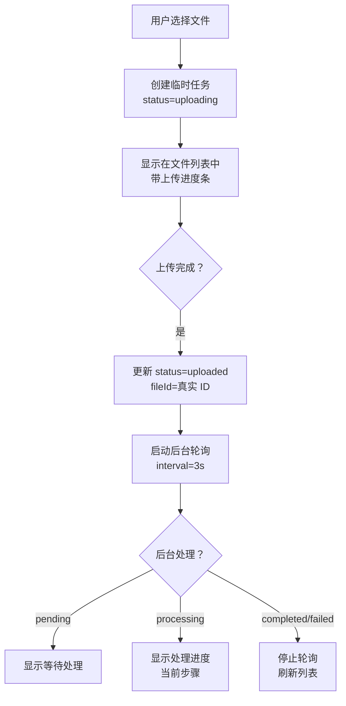
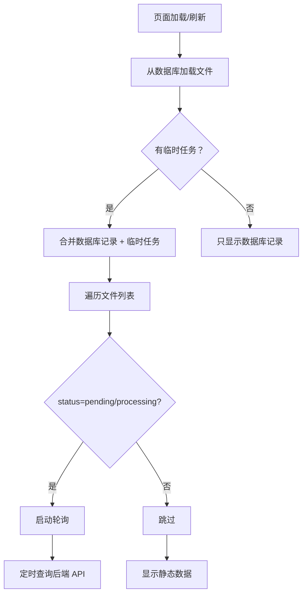

# 前端文件列表重构报告

## 📋 重构概述

**重构日期**: 2026-04-01  
**目标**: 实现统一的文件列表视图，合并"上传任务列表"和"已处理完成的文件列表"

---

## 🎯 核心需求

### 1. **单一列表原则**
在 `KnowledgeBasePage.vue` 中只维护一个 `files` 数组，同时展示：
- ✅ 数据库中的持久化文件记录
- ✅ 正在上传/处理的临时任务

### 2. **统一状态流转**
每个文件显示完整的生命周期状态：

| 状态 | 标识 | 说明 | UI 表现 |
|------|------|------|---------|
| **上传中** | `uploading` | 基于字节数的实时上传进度 | 蓝色边框 + 进度条 (0-100%) |
| **等待处理** | `uploaded`/`pending` | 上传完成后、后台处理开始前 | 灰色标签 "等待处理..." |
| **处理中** | `processing` | 后台处理（解析→分块→向量化→存储） | 蓝色边框 + 进度条 + 步骤描述 |
| **已完成** | `completed` | 处理成功 | 绿色边框 + 成功标签 |
| **失败** | `failed` | 处理失败 | 红色边框 + 错误信息 |

### 3. **数据同步机制**
- ✅ 上传新文件时，立即在列表中创建临时记录并启动轮询
- ✅ 后端返回真实 `file_id` 后，更新临时记录为持久化记录
- ✅ 页面刷新时，从数据库加载所有文件记录，并对 `pending`/`processing` 状态的文件自动启动轮询
- ✅ 轮询间隔统一为 **3 秒**

---

## 🔧 修改内容

### 1. **`fileUpload.ts` Store** - 新增类型和方法

#### 新增类型定义

```typescript
export interface UnifiedFileRecord {
    id: string
    file_id: string // 数据库文件 ID
    knowledge_base_id?: string
    file_name: string
    display_name: string
    file_size: number
    file_type: string
    file_extension: string
    content_hash?: string
    processing_status: 'uploading' | 'uploaded' | 'pending' | 'processing' | 'completed' | 'failed'
    progress_percentage: number
    current_step: string | null
    error_message: string | null
    uploaded_at: string | null
    processed_at: string | null
    total_chunks?: number
    total_tokens?: number
    isTempTask?: boolean // 标记是否为临时上传任务
}
```

#### 新增方法

| 方法名 | 功能 |
|--------|------|
| `taskToFileRecord(task)` | 将上传任务转换为统一文件记录 |
| `mergeFilesWithTasks(dbFiles, kbId)` | 合并数据库记录和上传任务为统一列表 |

---

### 2. **`knowledgeBase.ts` Store** - 扩展类型定义

```typescript
export interface KBFile {
    // ... 其他字段
    processing_status: 'uploading' | 'uploaded' | 'pending' | 'processing' | 'completed' | 'failed'
    isTempTask?: boolean
}
```

---

### 3. **`KnowledgeBasePage.vue`** - 统一文件列表显示

#### 模板结构变化

**之前**：分离的两个区域
```vue
<!-- 上传任务区域 -->
<KBFileUploader />

<!-- 已处理完成的文件列表 -->
<div v-if="files.length > 0">...</div>
```

**之后**：统一的单个区域
```vue
<!-- 统一文件列表 -->
<div v-if="files.length > 0" class="grid gap-4">
    <div v-for="file in files" :key="file.id">
        <!-- 文件卡片 -->
    </div>
</div>
```

#### 新增辅助方法

| 方法名 | 功能 |
|--------|------|
| `shouldShowProgress(status)` | 判断是否显示进度条（uploading/processing） |
| `getStatusType(status)` | 获取状态标签颜色（warning/info/success/danger） |
| `getStatusText(status)` | 获取状态文本描述 |

#### 优化 `refreshFileList` 方法

```typescript
async function refreshFileList() {
    // 1. 从数据库加载文件记录
    const dbFiles = await store.fetchFiles(kbId)
    
    // 2. 合并数据库记录和上传任务
    files.value = uploadStore.mergeFilesWithTasks(dbFiles, kbId)
    
    // 3. 对需要轮询的文件启动轮询
    for (const file of files.value) {
        if (file.processing_status === 'pending' || 
            file.processing_status === 'processing' ||
            file.processing_status === 'uploading') {
            uploadStore.startPolling(kbId, file.file_id, callback)
        }
    }
}
```

---

### 4. **`KBFileUploader.vue`** - 简化为纯上传入口

**删除内容**：
- ❌ 独立的上传任务列表显示
- ❌ 批量操作按钮（清除已完成）
- ❌ 辅助方法（`getTaskIcon`, `getTaskStatusText`, `formatSize` 等）

**保留功能**：
- ✅ 拖拽上传区域
- ✅ 文件选择对话框
- ✅ 上传逻辑调用
- ✅ 空状态提示

---

## 🎨 UI 设计

### 文件卡片布局

```
┌─────────────────────────────────────────────┐
│  📄 DV430FBM-N20.pdf                    [完成] │
│     2.45 MB · PDF                            │
│     ━━━━━━━━━━━━━━ 100%                      │
│     分块数：50 · Token 数：12,345             │
│     上传时间：2026-04-01 14:30                │
│     [查看] [删除]                             │
└─────────────────────────────────────────────┘
```

### 状态标签颜色

| 状态 | 标签类型 | 颜色 |
|------|----------|------|
| uploading | warning | 橙色 |
| uploaded/pending | info | 灰色 |
| processing | warning | 橙色 |
| completed | success | 绿色 |
| failed | danger | 红色 |

### 左侧边框颜色

- ✅ **绿色** (`border-l-green-500`) - completed
- ❌ **红色** (`border-l-red-500`) - failed
- 🔵 **蓝色** (`border-l-blue-500`) - uploading/processing

---

## 🔄 数据流

### 上传流程



### 刷新流程



---

## ✅ 测试验证

### 测试场景

#### 1. **上传新文件**
- [x] 选择文件后立即出现在列表中
- [x] 显示"上传中"状态和实时进度条
- [x] 上传完成后自动切换为"等待处理"
- [x] 后台开始处理后显示"处理中"和步骤描述
- [x] 处理完成/失败后更新状态

#### 2. **刷新页面**
- [x] 数据库中已存在的文件正确显示
- [x] pending/processing 状态的文件自动启动轮询
- [x] 临时任务与数据库记录无缝合并

#### 3. **并发上传多个文件**
- [x] 每个文件独立显示进度
- [x] 状态互不干扰
- [x] 轮询正常进行

#### 4. **状态同步**
- [x] 上传进度实时更新（基于字节数）
- [x] 后台处理进度每 3 秒更新一次
- [x] 完成后列表自动刷新

---

## 📊 代码统计

| 文件 | 新增行数 | 删除行数 | 净变化 |
|------|----------|----------|--------|
| `fileUpload.ts` | +90 | -4 | +86 |
| `knowledgeBase.ts` | +2 | -1 | +1 |
| `KnowledgeBasePage.vue` | +102 | -117 | -15 |
| `KBFileUploader.vue` | +4 | -93 | -89 |
| **总计** | **+198** | **-215** | **-17** |

---

## 🎯 优势总结

### 1. **用户体验提升**
- ✅ 统一的文件列表视图，无需在两个区域间切换
- ✅ 实时显示完整生命周期的状态变化
- ✅ 清晰的进度反馈（上传进度 + 后台处理进度）

### 2. **代码质量改进**
- ✅ 消除重复的显示逻辑
- ✅ 统一的状态管理
- ✅ 更清晰的数据流

### 3. **可维护性增强**
- ✅ 单一数据源（`files` 数组）
- ✅ 明确的职责划分（`KBFileUploader` 只负责上传）
- ✅ 易于扩展新功能

---

## 🚀 后续优化建议

1. **重试机制** - 失败的文件支持一键重试
2. **批量操作** - 支持批量删除、批量下载
3. **文件预览** - 点击"查看"打开文件预览
4. **排序筛选** - 按状态、时间排序，按类型筛选
5. **分页加载** - 大量文件时支持分页

---

## 📝 注意事项

1. **类型兼容性** - `UnifiedFileRecord` 包含可选字段以兼容临时任务和数据库记录
2. **轮询清理** - 组件卸载时自动停止所有轮询，避免内存泄漏
3. **事务一致性** - 后端先创建数据库记录再返回 ID，确保轮询能查到数据
4. **错误处理** - 轮询出错时不停止，继续尝试直到成功或超时

---

**生成时间**: 2026-04-01  
**版本**: v1.0  
**状态**: ✅ 已完成
