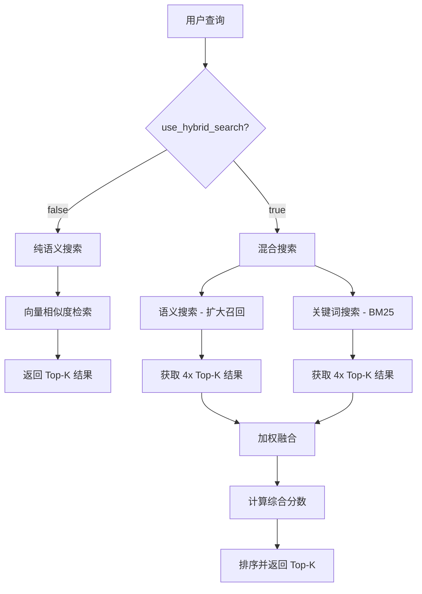

# 知识库搜索接口升级为混合搜索

## 更新概述

将知识库搜索接口从纯向量相似度搜索升级为支持混合搜索（语义 + 关键词），提供更准确的搜索结果。

## 变更内容

### 1. Schema 更新

**文件**: `app/schemas/knowledge_base.py`

**新增字段**:
```python
class KnowledgeSearchRequest(BaseModel):
    """知识库搜索请求"""
    query: str = Field(..., min_length=1, max_length=2000, description="查询文本")
    top_k: int = Field(default=5, ge=1, le=20, description="返回结果数量")
    filter_file_id: Optional[str] = Field(None, description="按文件 ID 过滤")
    
    # 混合搜索参数（新增）
    use_hybrid_search: bool = Field(default=True, description="是否使用混合搜索")
    semantic_weight: float = Field(default=0.6, ge=0.0, le=1.0, description="语义权重")
    keyword_weight: float = Field(default=0.4, ge=0.0, le=1.0, description="关键词权重")
```

**参数说明**:
- `use_hybrid_search`: 是否启用混合搜索，默认 `True`
- `semantic_weight`: 语义搜索权重（0.0-1.0），默认 `0.6`
- `keyword_weight`: 关键词搜索权重（0.0-1.0），默认 `0.4`

### 2. 路由更新

**文件**: `app/routes/kb_search.py`

**主要变更**:
1. 调用方法从 `search_similar_chunks` 改为 `search_similar_chunks_hybrid`
2. 添加混合搜索参数传递
3. 更新日志记录，区分搜索模式

**修改前**:
```python
results = await vector_service.search_similar_chunks(
    knowledge_base_id=kb_id,
    query_text=search_request.query,
    provider_name=provider_name,
    model_name=model_name,
    top_k=search_request.top_k,
    filter_metadata=filter_metadata,
)
```

**修改后**:
```python
results = await vector_service.search_similar_chunks_hybrid(
    knowledge_base_id=kb_id,
    query_text=search_request.query,
    base_url=model.provider.base_url or "",
    api_key=model.provider.api_key or "",
    model_name=model_name,
    top_k=search_request.top_k,
    filter_metadata=filter_metadata,
    use_hybrid=search_request.use_hybrid_search,
    semantic_weight=search_request.semantic_weight,
    keyword_weight=search_request.keyword_weight,
)
```

## API 使用示例

### 1. 默认混合搜索（推荐）

```bash
curl -X POST http://localhost:8000/api/v1/knowledge-bases/{kb_id}/search \
  -H "Content-Type: application/json" \
  -H "Authorization: Bearer YOUR_TOKEN" \
  -d '{
    "query": "人工智能的应用",
    "top_k": 10
  }'
```

**说明**: 不传混合搜索参数时，使用默认值（混合搜索开启，语义权重 0.6，关键词权重 0.4）

### 2. 自定义权重

```bash
curl -X POST http://localhost:8000/api/v1/knowledge-bases/{kb_id}/search \
  -H "Content-Type: application/json" \
  -H "Authorization: Bearer YOUR_TOKEN" \
  -d '{
    "query": "机器学习算法",
    "top_k": 10,
    "use_hybrid_search": true,
    "semantic_weight": 0.7,
    "keyword_weight": 0.3
  }'
```

**说明**: 提高语义权重，适合概念性查询

### 3. 纯语义搜索

```bash
curl -X POST http://localhost:8000/api/v1/knowledge-bases/{kb_id}/search \
  -H "Content-Type: application/json" \
  -H "Authorization: Bearer YOUR_TOKEN" \
  -d '{
    "query": "深度学习原理",
    "top_k": 10,
    "use_hybrid_search": false
  }'
```

**说明**: 关闭混合搜索，仅使用向量相似度

### 4. 侧重关键词搜索

```bash
curl -X POST http://localhost:8000/api/v1/knowledge-bases/{kb_id}/search \
  -H "Content-Type: application/json" \
  -H "Authorization: Bearer YOUR_TOKEN" \
  -d '{
    "query": "Python async await",
    "top_k": 10,
    "use_hybrid_search": true,
    "semantic_weight": 0.3,
    "keyword_weight": 0.7
  }'
```

**说明**: 提高关键词权重，适合技术术语查询

## 前端适配

### ApiService.ts 调用方式

前端已有方法无需修改，因为新参数都是可选的且有默认值：

```typescript
// 现有调用方式仍然有效
const response = await apiService.searchKnowledgeBase(
  kbId,
  "搜索关键词",
  10  // top_k
)
```

### 如需使用高级功能

可以扩展 ApiService 方法以支持混合搜索参数：

```typescript
async searchKnowledgeBase(
  kbId: string,
  query: string,
  topK: number = 5,
  filterFileId?: string,
  useHybridSearch?: boolean,      // 新增
  semanticWeight?: number,        // 新增
  keywordWeight?: number          // 新增
): Promise<any> {
  return await this._request(`/knowledge-bases/${kbId}/search`, {
    method: 'POST',
    data: {
      query,
      top_k: topK,
      filter_file_id: filterFileId,
      use_hybrid_search: useHybridSearch ?? true,
      semantic_weight: semanticWeight ?? 0.6,
      keyword_weight: keywordWeight ?? 0.4,
    },
  })
}
```

## 混合搜索原理

### 工作流程



### 评分公式

```
综合分数 = semantic_score × semantic_weight + keyword_score × keyword_weight
```

**示例**:
- 语义分数: 0.9
- 关键词分数: 0.7
- 语义权重: 0.6
- 关键词权重: 0.4

```
综合分数 = 0.9 × 0.6 + 0.7 × 0.4 = 0.54 + 0.28 = 0.82
```

### 优势

1. **更准确**: 结合语义理解和关键词匹配
2. **更灵活**: 可调节权重适应不同场景
3. **更鲁棒**: 单一方法失效时有备选
4. **更全面**: 扩大召回范围，减少遗漏

## 性能考虑

### 搜索速度

- **纯语义搜索**: ~100-300ms
- **混合搜索**: ~200-500ms（扩大召回 + 融合计算）

### 优化建议

1. **合理设置 top_k**: 不要超过 20
2. **权重平衡**: semantic_weight + keyword_weight = 1.0
3. **缓存结果**: 对常见查询进行缓存
4. **异步处理**: 已实现，不会阻塞主线程

## 测试建议

### 功能测试

1. ✅ 默认参数搜索
2. ✅ 自定义权重搜索
3. ✅ 纯语义搜索
4. ✅ 带过滤条件搜索
5. ✅ 空结果处理
6. ✅ 错误处理

### 效果测试

比较不同权重配置下的搜索结果质量：

```python
# 测试脚本示例
test_cases = [
    {"query": "Python 异步编程", "semantic": 0.8, "keyword": 0.2},
    {"query": "Python 异步编程", "semantic": 0.5, "keyword": 0.5},
    {"query": "Python 异步编程", "semantic": 0.2, "keyword": 0.8},
]

for case in test_cases:
    results = search(query=case["query"], 
                    semantic_weight=case["semantic"],
                    keyword_weight=case["keyword"])
    print(f"语义{case['semantic']}/关键词{case['keyword']}: {len(results)} 条结果")
```

## 日志输出

### 混合搜索开启

```
INFO: 使用混合搜索模式：semantic=0.60, keyword=0.40
INFO: 混合搜索完成：query='人工智能', results=10
```

### 纯语义搜索

```
INFO: 使用纯语义搜索模式
INFO: 纯语义搜索完成：query='机器学习', results=8
```

## 向后兼容性

✅ **完全兼容**: 所有现有调用无需修改

- 新参数都有默认值
- 默认启用混合搜索
- 旧的前端代码仍可正常工作

## 迁移指南

### 对于现有用户

**无需任何操作**，系统会自动使用混合搜索。

### 对于新用户

建议直接使用默认配置，如有特殊需求再调整权重。

### 对于开发者

1. 了解混合搜索参数的作用
2. 根据业务场景选择合适的权重
3. 监控搜索效果和性能

## 常见问题

### Q1: 为什么要用混合搜索？

**A**: 纯语义搜索可能忽略精确匹配，纯关键词搜索无法理解语义。混合搜索结合两者优势，提供更准确的结果。

### Q2: 如何选择合适的权重？

**A**: 
- **概念性查询**（如"人工智能原理"）: 提高语义权重（0.7-0.8）
- **技术性查询**（如"Python async/await"）: 提高关键词权重（0.6-0.7）
- **通用查询**: 使用默认值（0.6/0.4）

### Q3: 混合搜索会影响性能吗？

**A**: 会略微增加耗时（约 100-200ms），但通常在可接受范围内。如果对性能要求极高，可以关闭混合搜索。

### Q4: 权重之和必须为 1.0 吗？

**A**: 不是必须的，但建议保持和为 1.0 以便直观理解权重分配。

### Q5: 如何调试搜索效果？

**A**: 
1. 查看后端日志，确认使用的搜索模式
2. 比较不同权重配置的结果
3. 使用 `/test` 端点进行快速测试

## 总结

本次升级将知识库搜索从纯向量相似度搜索提升为支持混合搜索，显著提高了搜索准确性和灵活性。通过合理的权重配置，可以适应不同类型的查询需求。

**关键改进**:
- ✅ 支持语义 + 关键词混合搜索
- ✅ 可调节权重参数
- ✅ 完全向后兼容
- ✅ 默认启用，开箱即用
- ✅ 详细的日志记录

混合搜索功能已成功集成到后端接口中！🎉
