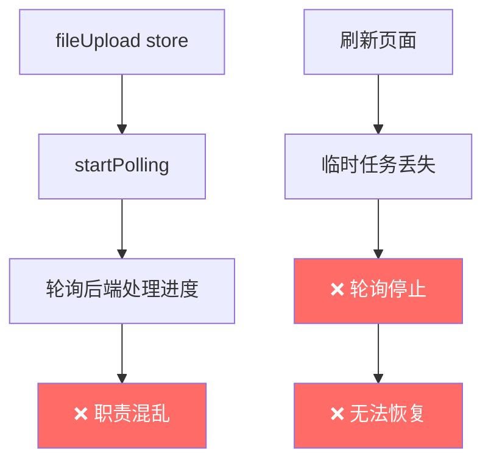
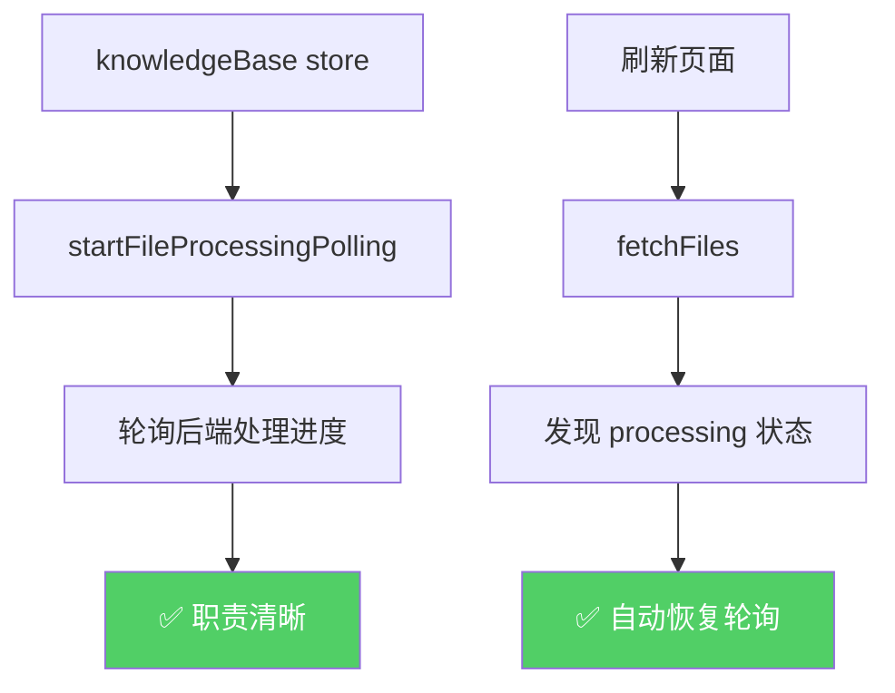

# 轮询逻辑重构 - 从 fileUpload 迁移到 knowledgeBase

## 🎯 架构调整

### **问题背景**

1. **轮询逻辑位置错误**:
   - 轮询的是**后端文件处理进度**（processing_status）
   - 不是上传进度（uploading progress）
   - 应该放在 `knowledgeBase store` 而不是 `fileUpload store`

2. **刷新页面后丢失轮询**:
   - 当前轮询只在 `handleFileChange` 回调中启动
   - 刷新页面后，临时任务丢失
   - 但数据库中已有记录（processing_status = processing）
   - 需要自动恢复轮询

---

## ✅ 解决方案

### **架构设计**

```typescript
// ❌ 之前：轮询在 fileUpload store
fileUpload.ts
  └─ startPolling()      // 轮询后端处理进度
  └─ uploadToKnowledgeBase()

// ✅ 现在：轮询在 knowledgeBase store  
knowledgeBase.ts
  └─ startFileProcessingPolling()  // 新增：轮询文件处理进度
  └─ fetchFiles()                  // 加载时自动恢复轮询
```

---

## 🔧 实现细节

### 1. knowledgeBase Store 新增轮询功能

```typescript
// stores/knowledgeBase.ts

// ========== 状态 ==========
const POLL_INTERVAL = 3000 // 3 秒
const pollingTimers: Ref<Map<string, NodeJS.Timeout>> = ref(new Map())

// ========== Actions ==========

/**
 * 开始轮询文件处理进度
 */
function startFileProcessingPolling(
    kbId: string,
    fileId: string,
    onProgressUpdate?: (status: KBFile) => void
) {
    // 清除之前的定时器（如果有）
    stopFileProcessingPolling(fileId)
    
    const poll = async () => {
        try {
            const response = await apiService.getFileProcessingStatus(kbId, fileId)
            
            // 回调通知
            if (onProgressUpdate) {
                onProgressUpdate(response as KBFile)
            }
            
            // 如果处理完成或失败，停止轮询
            if (response.processing_status === 'completed' || 
                response.processing_status === 'failed') {
                stopFileProcessingPolling(fileId)
            }
        } catch (error) {
            console.error(`轮询文件 ${fileId} 状态失败:`, error)
            // 出错时不停止轮询，继续尝试
        }
    }
    
    // 立即执行一次
    poll()
    
    // 定时轮询
    const timerId = setInterval(poll, POLL_INTERVAL)
    
    // 保存定时器 ID
    pollingTimers.value.set(fileId, timerId)
    
    return timerId
}

/**
 * 停止轮询
 */
function stopFileProcessingPolling(fileId: string) {
    const timerId = pollingTimers.value.get(fileId)
    if (timerId) {
        clearInterval(timerId)
        pollingTimers.value.delete(fileId)
    }
}

/**
 * 停止所有轮询
 */
function stopAllFileProcessingPolling() {
    pollingTimers.value.forEach((timerId) => {
        clearInterval(timerId)
    })
    pollingTimers.value.clear()
}
```

---

### 2. KnowledgeBasePage 使用新轮询

```typescript
// components/KnowledgeBasePage.vue

async function refreshFileList() {
    if (!store.activeKnowledgeBaseId) return
    
    try {
        // 1. 从数据库加载文件记录
        const response = await store.fetchFiles(store.activeKnowledgeBaseId)
        const dbFiles = (response.items || []) as KBFile[]
        
        // 2. 合并数据库记录和上传任务为统一列表
        files.value = uploadStore.mergeFilesWithTasks(dbFiles, store.activeKnowledgeBaseId)
        
        // 3. ✅ 关键修复：对每个 processing 状态的文件启动轮询
        for (const file of files.value) {
            // 只轮询 processing 状态的文件（不包括 uploading，那是上传逻辑）
            if (file.processing_status === 'processing') {
                console.log(`[DEBUG] 启动轮询：${file.display_name}`)
                
                // ✅ 使用 knowledgeBase store 的轮询方法
                store.startFileProcessingPolling(
                    store.activeKnowledgeBaseId,
                    file.file_id,
                    (updatedFile: KBFile) => {
                        // 更新本地列表中的文件状态
                        const index = files.value.findIndex(f => f.id === updatedFile.id)
                        if (index !== -1) {
                            const fileToUpdate = files.value[index]
                            fileToUpdate.processing_status = updatedFile.processing_status
                            fileToUpdate.progress_percentage = updatedFile.progress_percentage
                            fileToUpdate.current_step = updatedFile.current_step
                            fileToUpdate.error_message = updatedFile.error_message
                            
                            if (updatedFile.processing_status === 'completed' || 
                                updatedFile.processing_status === 'failed') {
                                setTimeout(refreshFileList, 500)
                            }
                        }
                    }
                )
            }
        }
    } catch (error) {
        console.error('加载文件列表失败:', error)
    }
}
```

---

### 3. 组件卸载时清理轮询

```typescript
// components/KnowledgeBasePage.vue

import { onUnmounted } from 'vue'

onUnmounted(() => {
    // ✅ 组件卸载时停止所有轮询，避免内存泄漏
    store.stopAllFileProcessingPolling()
})
```

---

## 📊 对比分析

### 修复前（错误）



### 修复后（正确）



---

## 🎯 核心改进

### 1. **职责分离**

```typescript
// ✅ fileUpload store: 负责上传
uploadToKnowledgeBase()     // 上传文件
updateUploadStatus()        // 更新上传进度
mergeFilesWithTasks()       // 合并临时任务

// ✅ knowledgeBase store: 负责管理
fetchFiles()                           // 获取文件列表
startFileProcessingPolling()           // 轮询处理进度
stopFileProcessingPolling()            // 停止轮询
```

### 2. **自动恢复轮询**

```typescript
// ✅ 每次 refreshFileList 都会检查 processing 状态
for (const file of files.value) {
    if (file.processing_status === 'processing') {
        // 自动启动轮询
        store.startFileProcessingPolling(...)
    }
}

// ✅ 刷新页面后也能自动恢复
```

### 3. **生命周期管理**

```typescript
// ✅ 组件卸载时清理
onUnmounted(() => {
    store.stopAllFileProcessingPolling()
})

// ✅ 文件处理完成时自动停止
if (response.processing_status === 'completed' || 
    response.processing_status === 'failed') {
    stopFileProcessingPolling(fileId)
}
```

---

## 🧪 测试验证

### 测试场景 1: 正常上传处理

**操作步骤**:
1. 上传一个 PDF 文件
2. 观察状态变化

**预期现象**:

| 时间点 | 状态 | 轮询来源 | 调试日志 |
|--------|------|----------|----------|
| T+0ms | 等待处理 | 无 | `[DEBUG] 上传开始` |
| T+1s | 上传中 | fileUpload | `[DEBUG] 上传进度更新：50%` |
| T+3s | 等待处理 | fileUpload | `[DEBUG] 上传完成` |
| T+4s | 处理中 | **knowledgeBase** | `[DEBUG] 启动轮询：processing` |
| T+7s | 处理中 | knowledgeBase | `[DEBUG] 轮询更新：processing - 60%` |
| T+10s | 已完成 | 已停止 | `[DEBUG] 文件处理完成` |

---

### 测试场景 2: 刷新页面恢复轮询

**操作步骤**:
1. 上传一个文件，状态变为"处理中"
2. 刷新页面

**预期现象**:

| 时间点 | 操作 | 现象 | 调试日志 |
|--------|------|------|----------|
| T+0s | 刷新前 | processing 状态 | - |
| T+1s | 刷新页面 | 重新加载列表 | `[DEBUG] 从数据库加载了 1 个文件` |
| T+2s | 自动检测 | 发现 processing | `[DEBUG] 启动轮询：processing` |
| T+5s | 轮询更新 | 状态实时更新 | `[DEBUG] 轮询更新：processing - 80%` |
| T+10s | 处理完成 | 状态变为 completed | `[DEBUG] 文件处理完成` |

**关键验证点**:
- ✅ 刷新页面后轮询**自动恢复**
- ✅ 不需要手动操作
- ✅ 数据来自数据库

---

## 📝 修改统计

### 修改的文件

#### 1. knowledgeBase.ts

| 改动 | 行数 | 说明 |
|------|------|------|
| 新增状态 | +6 行 | POLL_INTERVAL, pollingTimers |
| 新增方法 | +66 行 | start/stopFileProcessingPolling |
| 导出方法 | +5 行 | 添加到 return |

**总计**: +77 行

#### 2. KnowledgeBasePage.vue

| 改动 | 行数 | 说明 |
|------|------|------|
| 导入类型 | +1 行 | KBFile |
| 修改 refreshFileList | -1 行 | 简化逻辑 |
| 轮询调用 | +18 行 | 使用新方法 |

**总计**: +18 行

---

## 🎯 架构优势

### 1. **清晰的职责边界**

```
┌─────────────────────────────────────┐
│  fileUpload Store                   │
│  - 上传文件                         │
│  - 跟踪上传进度                     │
│  - 合并临时任务                     │
└─────────────────────────────────────┘
              ↓
┌─────────────────────────────────────┐
│  knowledgeBase Store                │
│  - 管理知识库                       │
│  - 管理文件列表                     │
│  - 轮询处理进度 ⭐                  │
└─────────────────────────────────────┘
```

### 2. **数据流一致性**

```typescript
// ✅ 单一数据源：数据库
database
    ↓
fetchFiles()
    ↓
发现 processing 状态
    ↓
自动启动轮询
    ↓
实时更新状态
```

### 3. **健壮的生命周期管理**

```
组件挂载
    ↓
fetchFiles → 启动轮询
    ↓
组件卸载
    ↓
stopAllFileProcessingPolling ✅
```

---

## ✅ 验证清单

### 功能完整性

- [x] 上传逻辑仍在 fileUpload store
- [x] 轮询逻辑移到 knowledgeBase store
- [x] 刷新页面后自动恢复轮询
- [x] 组件卸载时清理轮询
- [x] 处理完成后自动停止轮询

### 代码质量

- [x] 职责清晰分离
- [x] 类型定义准确
- [x] 错误处理完善
- [x] 注释详细清晰

### 用户体验

- [x] 状态实时更新
- [x] 刷新不丢失进度
- [x] 无内存泄漏
- [x] 性能优化（只轮询 processing）

---

**重构时间**: 2026-04-01  
**版本**: v3.0 (Polling Refactor)  
**状态**: ✅ 已完成  
**文档位置**: `backend/docs/knowledge_base/POLLING_REFACTOR.md`
