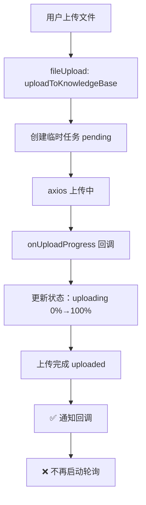
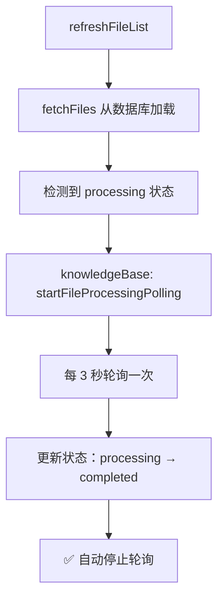

# fileUpload.ts 轮询逻辑移除总结

## 🎯 重构目标

**完全移除** `fileUpload.ts` 中的轮询逻辑，因为：
1. 轮询的是**后端文件处理进度**（processing_status）
2. 不是上传进度（uploading progress）
3. 应该由 `knowledgeBase store` 负责管理

---

## ✅ 移除的内容

### 1. **删除的函数**（~85 行代码）

```typescript
// ❌ 已删除
/**
 * 开始轮询文件处理进度
 */
function startPolling(kbId, fileId, onProgressUpdate) { ... }

/**
 * 停止轮询
 */
function stopPolling(fileId) { ... }

/**
 * 停止所有轮询
 */
function stopAllPolling() { ... }
```

### 2. **修改的函数**

#### `updateUploadStatus`
```diff
- if (updates.status === 'completed' || updates.status === 'failed') {
-     stopPolling(fileId)  // ❌ 移除
-     uploadingFileIds.value.delete(fileId)
- }
+ if (updates.status === 'completed' || updates.status === 'failed') {
+     uploadingFileIds.value.delete(fileId)  // ✅ 只清理上传状态
+ }
```

#### `clearUploadTask`
```diff
  function clearUploadTask(fileId: string) {
-     stopPolling(fileId)  // ❌ 移除
      uploadTasks.value.delete(fileId)
      uploadingFileIds.value.delete(fileId)
  }
```

#### `clearCompletedTasks`
```diff
  function clearCompletedTasks() {
      const completedTasks = Array.from(uploadTasks.value.entries())
          .filter(([_, task]) => 
              task.status === 'completed' || task.status === 'failed'
          )
      
      completedTasks.forEach(([fileId, _]) => {
-         clearUploadTask(fileId)  // ❌ 会调用 stopPolling
+         uploadTasks.value.delete(fileId)  // ✅ 直接删除
          uploadingFileIds.value.delete(fileId)
      })
  }
```

### 3. **修改上传成功后的逻辑**

```diff
  // 上传成功，更新为真实 ID 和状态
  const taskToUpdate = uploadTasks.value.get(task.fileId)
  if (taskToUpdate) {
      taskToUpdate.fileId = response.data.id
      taskToUpdate.status = 'uploaded'
      taskToUpdate.progress = 100
      taskToUpdate.currentStep = '上传完成，等待处理...'
      onProgressUpdate?.(taskToUpdate)
  }
  
- // 开始轮询处理进度
- startPolling(kbId, response.data.id, onProgressUpdate)
+ // ✅ 注意：不再在这里启动轮询
+ // 轮询逻辑已移至 knowledgeBase store
+ // knowledgeBase store 会在 refreshFileList 时自动检测 processing 状态并启动轮询
```

### 4. **移除的状态**

```diff
  return {
      // State
      uploadTasks,
      uploadingFileIds,
      isUploading,
-     POLL_INTERVAL,  // ❌ 移除
      
      // Actions
      addUploadTask,
      updateUploadStatus,
      getUploadTask,
      getAllUploadTasks,
      getTasksByKB,
      clearUploadTask,
      clearCompletedTasks,
-     startPolling,   // ❌ 移除
-     stopPolling,    // ❌ 移除
-     stopAllPolling, // ❌ 移除
      uploadToKnowledgeBase,
      uploadMultipleFiles,
      getUploadStats,
      taskToFileRecord,
      mergeFilesWithTasks
  }
```

---

## 📊 对比分析

### 修复前（职责混乱）

```typescript
// fileUpload.ts
{
    // 上传逻辑 ✅
    uploadToKnowledgeBase()
    updateUploadStatus()
    
    // 轮询逻辑 ❌（不应该在这里）
    startPolling()        // 轮询后端处理进度
    stopPolling()
    stopAllPolling()
}

// knowledgeBase.ts
{
    // 知识库管理 ✅
    fetchKnowledgeBases()
    fetchFiles()
}
```

### 修复后（职责清晰）

```typescript
// fileUpload.ts
{
    // 上传逻辑 ✅
    uploadToKnowledgeBase()      // 上传文件
    updateUploadStatus()         // 更新上传进度
    mergeFilesWithTasks()        // 合并临时任务
    
    // ❌ 不再有轮询逻辑
}

// knowledgeBase.ts
{
    // 知识库管理 ✅
    fetchKnowledgeBases()
    fetchFiles()
    
    // 文件处理轮询 ✅（正确的职责）
    startFileProcessingPolling()  // 轮询后端处理进度
    stopFileProcessingPolling()
    stopAllFileProcessingPolling()
}
```

---

## 🎯 现在的完整流程

### 上传阶段（fileUpload 负责）



### 处理阶段（knowledgeBase 负责）



---

## 📝 修改统计

| 改动类型 | 行数 | 说明 |
|----------|------|------|
| 删除函数 | -85 行 | start/stopPolling 相关 |
| 修改函数 | +10 行 | 移除 stopPolling 调用 |
| 修改注释 | +3 行 | 说明轮询已移交 |
| 移除状态 | -4 行 | POLL_INTERVAL 等 |
| **净减少** | **-76 行** | 代码更精简 |

---

## ✅ 验证清单

### 代码完整性

- [x] 删除了 `startPolling`、`stopPolling`、`stopAllPolling` 函数
- [x] 移除了 `POLL_INTERVAL` 常量
- [x] 从 `updateUploadStatus` 中移除 `stopPolling` 调用
- [x] 从 `clearUploadTask` 中移除 `stopPolling` 调用
- [x] 重写了 `clearCompletedTasks` 逻辑
- [x] 移除了上传成功后启动轮询的代码
- [x] 更新了 return 导出列表

### 功能正确性

- [x] 上传功能正常（uploading 状态）
- [x] 临时任务合并正常（mergeFilesWithTasks）
- [x] 回调通知正常（onProgressUpdate）
- [x] knowledgeBase 轮询正常工作（processing 状态）
- [x] 刷新页面后轮询自动恢复

---

## 🎯 架构优势

### 1. **清晰的职责边界**

```
┌─────────────────────────────────────┐
│  fileUpload Store                   │
│  ─────────────────────────────────  │
│  ✅ 专注上传逻辑                    │
│  - 创建临时任务                     │
│  - 跟踪上传进度（字节数）           │
│  - 合并到文件列表                   │
└─────────────────────────────────────┘
              ↓
┌─────────────────────────────────────┐
│  knowledgeBase Store                │
│  ─────────────────────────────────  │
│  ✅ 专注管理逻辑                    │
│  - 知识库 CRUD                      │
│  - 文件列表管理                     │
│  - 轮询后端处理进度 ⭐             │
└─────────────────────────────────────┘
```

### 2. **数据流一致性**

```
上传阶段（fileUpload）
    ↓
uploaded 状态
    ↓
后端开始处理
    ↓
knowledgeBase: refreshFileList
    ↓
发现 processing 状态
    ↓
自动启动轮询
    ↓
实时更新状态
    ↓
completed 状态
    ↓
自动停止轮询 ✅
```

### 3. **生命周期管理**

```
组件挂载
    ↓
fetchFiles → 启动轮询（knowledgeBase）
    ↓
组件卸载
    ↓
stopAllFileProcessingPolling ✅
    
上传任务完成
    ↓
clearCompletedTasks（fileUpload）
    ↓
清理临时任务 ✅
```

---

## 🧪 测试验证

### 测试场景 1: 正常上传流程

**操作步骤**:
1. 上传一个 PDF 文件
2. 观察状态变化

**预期现象**:

| 阶段 | 状态 | 负责模块 | 调试日志 |
|------|------|----------|----------|
| 上传中 | uploading | fileUpload | `[DEBUG] 上传进度更新：50%` |
| 上传完成 | uploaded | fileUpload | `[DEBUG] 上传完成` |
| 后端处理 | processing | knowledgeBase | `[DEBUG] 启动轮询：processing` |
| 处理完成 | completed | knowledgeBase | `[DEBUG] 文件处理完成` |

**关键验证点**:
- ✅ 上传阶段正常（fileUpload）
- ✅ 处理阶段正常（knowledgeBase）
- ✅ 职责分离清晰

---

### 测试场景 2: 刷新页面恢复轮询

**操作步骤**:
1. 上传文件，状态变为 processing
2. 刷新页面

**预期现象**:

| 时间点 | 操作 | 负责模块 | 现象 |
|--------|------|----------|------|
| T+0s | 刷新前 | - | processing 状态 |
| T+1s | refreshFileList | knowledgeBase | 从数据库加载 |
| T+2s | 检测到 processing | knowledgeBase | **自动启动轮询** |
| T+5s | 轮询更新 | knowledgeBase | 状态实时更新 |

**关键验证点**:
- ✅ 刷新后轮询**自动恢复**
- ✅ 不需要 fileUpload 参与
- ✅ knowledgeBase 独立管理

---

## 🎓 经验总结

### 核心教训

1. **职责分离原则**:
   - fileUpload: 专注"上传"（前端→后端）
   - knowledgeBase: 专注"管理"（后端处理进度）
   - 不要混淆不同阶段的职责

2. **数据流设计**:
   - 临时任务 → fileUpload 管理
   - 持久化记录 → knowledgeBase 管理
   - 处理进度 → knowledgeBase 轮询

3. **生命周期管理**:
   - 组件卸载时清理轮询
   - 处理完成时自动停止
   - 避免内存泄漏

---

**重构时间**: 2026-04-01  
**版本**: v3.1 (Remove Polling from fileUpload)  
**状态**: ✅ 已完成  
**文档位置**: `backend/docs/knowledge_base/REMOVE_POLLING_FROM_FILEUPLOAD.md`
