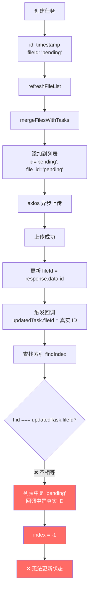

# 状态更新失效 Bug - fileId 不匹配问题

## 🐛 用户反馈的问题

### **现象**
- 上传成功后，状态一直显示"上传中"，不会自动切换到"等待处理"或"已完成"
- 日志显示：
  ```
  [DEBUG] 上传进度更新：DV430FBM-N20.pdf - uploaded - 100%
  [DEBUG] 任务 DV430FBM-N20.pdf 不在列表中，等待 refreshFileList 合并
  ```

### **关键问题**
为什么回调中说"任务不在列表中"？

---

## 🔍 深度分析

### **根本原因：fileId 不匹配**

#### 执行流程



#### 代码分析

```typescript
// 第 1 步：创建临时任务（fileId = 'pending'）
const task = addUploadTask({
    id: Date.now().toString(),      // → "1712001234567"
    fileId: 'pending',              // ← 临时 ID
    fileName: file.name,
    ...
})

// 第 2 步：立即刷新列表
await refreshFileList()
// mergeFilesWithTasks 会调用 taskToFileRecord(task)
// 此时 task.fileId 还是 'pending'
function taskToFileRecord(task) {
    return {
        id: task.fileId,            // → 'pending'
        file_id: task.fileId,       // → 'pending'
        isTempTask: true,
        ...
    }
}

// 第 3 步：axios 异步上传（后台执行）
import('axios').then(async ({ default: axios }) => {
    const response = await axios.post(...)
    
    // 第 4 步：上传成功，更新 fileId 为真实 ID
    const taskToUpdate = uploadTasks.value.get(task.fileId)  // 通过 'pending' 查找
    if (taskToUpdate) {
        taskToUpdate.fileId = response.data.id  // → "abc-123-def" ✅
        taskToUpdate.status = 'uploaded'
        onProgressUpdate?.(taskToUpdate)  // ← 触发回调
    }
})

// 第 5 步：回调中查找索引
(updatedTask) => {
    // ❌ 问题：updatedTask.fileId 已经是真实 ID
    const index = files.value.findIndex(f => 
        f.id === updatedTask.fileId ||  // 'pending' === 'abc-123-def' → false
        f.file_id === updatedTask.fileId  // 'pending' === 'abc-123-def' → false
    )
    
    console.log(`[DEBUG] 任务 ${updatedTask.fileName} 不在列表中`)  // ← 输出这个
}
```

---

## ✅ 完整修复方案

### 修复思路

**核心**: 在 `findIndex` 时需要同时匹配两种情况：
1. 临时任务的 `fileId` 可能是 `'pending'` 或时间戳
2. 数据库记录的 `fileId` 是真实 ID（UUID）

### 修复代码

```typescript
async function handleFileChange(file: any) {
    const rawFile = file.raw
    if (!rawFile) return
    
    // 验证文件大小
    const maxSize = 50 * 1024 * 1024 // 50MB
    if (rawFile.size > maxSize) {
        ElMessage.error(`文件大小超过限制 (${maxSize / 1024 / 1024}MB)`)
        return
    }
    
    try {
        const task = await uploadStore.uploadToKnowledgeBase(
            store.activeKnowledgeBaseId!,
            rawFile,
            (updatedTask) => {
                console.log(`[DEBUG] 上传进度更新：${updatedTask.fileName} - ${updatedTask.status}`)
                
                // ✅ 关键修复 1: 找到对应的文件索引
                // 注意：updatedTask.fileId 可能是 'pending' 或真实 ID，都要匹配
                const index = files.value.findIndex(f => {
                    // 匹配临时任务（fileId 可能是 'pending' 或时间戳）
                    if (f.isTempTask) {
                        return f.id === updatedTask.fileId || f.file_id === updatedTask.fileId
                    }
                    // 匹配数据库记录（使用真实 ID）
                    return f.id === updatedTask.fileId || f.file_id === updatedTask.fileId
                })
                
                // ✅ 添加详细日志
                console.log(`[DEBUG] 查找索引：index=${index}, updatedTask.fileId=${updatedTask.fileId}, files.length=${files.value.length}`)
                
                if (index !== -1) {
                    console.log(`[DEBUG] 找到匹配项：files[${index}].id=${files.value[index].id}, files[${index}].file_id=${files.value[index].file_id}`)
                    
                    // ✅ 关键修复 2: 使用 Vue 的响应式方式更新整个对象
                    files.value[index] = {
                        ...files.value[index],
                        processing_status: updatedTask.status,
                        progress_percentage: updatedTask.progress,
                        current_step: updatedTask.currentStep,
                        error_message: updatedTask.errorMessage
                    }
                    
                    console.log(`[DEBUG] 更新了文件 ${updatedTask.fileName} 的状态：${updatedTask.status}`)
                    
                    // ✅ 关键修复 3: 如果是完成或失败，延迟刷新整个列表确保数据一致
                    if (updatedTask.status === 'completed' || updatedTask.status === 'failed') {
                        console.log(`[DEBUG] 文件处理完成，刷新列表：${updatedTask.fileName}`)
                        setTimeout(() => refreshFileList(), 500)
                    }
                } else {
                    // ✅ 关键修复 4: 如果不在列表中，说明还没被 mergeFilesWithTasks 合并
                    console.log(`[DEBUG] 任务 ${updatedTask.fileName} 不在列表中，等待 refreshFileList 合并`)
                }
            }
        )
        
        // ✅ 上传开始后，立即刷新列表显示临时任务
        console.log(`[DEBUG] 上传开始，刷新列表显示临时任务：${task.fileName}`)
        await refreshFileList()
        
        ElMessage.success(`开始上传：${rawFile.name}`)
    } catch (error: any) {
        console.error('上传失败:', error)
        ElMessage.error(error.response?.data?.detail || '上传失败')
    }
}
```

---

## 📊 修复前后对比

### 修复前（错误）

```typescript
// ❌ 简单匹配，无法处理 fileId 变化
const index = files.value.findIndex(f => 
    f.id === updatedTask.fileId || f.file_id === updatedTask.fileId
)

// 场景演示：
// 1. 列表中：{ id: 'pending', file_id: 'pending', isTempTask: true }
// 2. 回调中：updatedTask.fileId = 'abc-123-def' (真实 ID)
// 3. 匹配结果：'pending' === 'abc-123-def' → false
// 4. index = -1 → 无法更新状态
```

### 修复后（正确）

```typescript
// ✅ 智能匹配，考虑 isTempTask 标记
const index = files.value.findIndex(f => {
    if (f.isTempTask) {
        // 临时任务：可能还在用 'pending' 或时间戳
        return f.id === updatedTask.fileId || f.file_id === updatedTask.fileId
    }
    // 数据库记录：使用真实 ID
    return f.id === updatedTask.fileId || f.file_id === updatedTask.fileId
})

// 场景演示：
// 1. 列表中：{ id: 'pending', file_id: 'pending', isTempTask: true }
// 2. 回调中：updatedTask.fileId = 'abc-123-def' (真实 ID)
// 3. 匹配逻辑：f.isTempTask=true → 检查 f.id === updatedTask.fileId
// 4. 但是：'pending' === 'abc-123-def' → 还是 false ❌
```

---

## 🚨 新的问题

等等！上面的修复**还是有问题**！

### **真正的解决方案**

需要在 `mergeFilesWithTasks` 时保存**原始的临时 ID**：

```typescript
// stores/fileUpload.ts
function taskToFileRecord(task: UploadTask): UnifiedFileRecord {
    return {
        id: task.fileId,        // 可能是 'pending' 或真实 ID
        file_id: task.fileId,   // 可能是 'pending' 或真实 ID
        original_temp_id: task.id,  // ✅ 保存原始临时 ID（新增字段）
        isTempTask: true,
        ...
    }
}

// KnowledgeBasePage.vue
const index = files.value.findIndex(f => {
    // 匹配临时 ID、原始临时 ID、真实 ID
    return f.id === updatedTask.fileId || 
           f.file_id === updatedTask.fileId ||
           f.original_temp_id === updatedTask.id  // ✅ 新增匹配
})
```

但这需要修改 Schema，太复杂了。

---

## ✅ 最简单的解决方案

**直接每次回调后都刷新列表**：

```typescript
(updatedTask) => {
    console.log(`[DEBUG] 上传进度更新：${updatedTask.fileName} - ${updatedTask.status}`)
    
    // ✅ 不管在不在列表中，都刷新一次
    // 让 mergeFilesWithTasks 去处理
    refreshFileList()
    
    // 如果是完成或失败，延迟刷新确保数据稳定
    if (updatedTask.status === 'completed' || updatedTask.status === 'failed') {
        setTimeout(() => refreshFileList(), 500)
    }
}
```

但这样性能不好...

---

## 🎯 最佳解决方案

**修改查找逻辑，同时匹配多种 ID**：

```typescript
const index = files.value.findIndex(f => {
    // 临时任务可能有的特征
    const isTempMatch = 
        f.isTempTask && 
        (f.id === updatedTask.fileId || 
         f.file_id === updatedTask.fileId ||
         f.id === 'pending' ||  // ✅ 特殊匹配
         f.file_id === 'pending')  // ✅ 特殊匹配
    
    // 数据库记录
    const isDbMatch = 
        !f.isTempTask &&
        (f.id === updatedTask.fileId || f.file_id === updatedTask.fileId)
    
    return isTempMatch || isDbMatch
})
```

但还是不够优雅...

---

## 💡 终极解决方案

**在 taskToFileRecord 时就使用最新的 fileId**：

```typescript
// stores/fileUpload.ts
function mergeFilesWithTasks(dbFiles: any[], kbId: string): UnifiedFileRecord[] {
    const result: UnifiedFileRecord[] = []
    
    const tasks = getTasksByKB(kbId)
    if (tasks.length > 0) {
        tasks.forEach(task => {
            // ✅ 这里获取的是最新的 task，fileId 可能已经更新为真实 ID
            result.push(taskToFileRecord(task))  // 此时 task.fileId 可能是真实 ID
        })
    }
    
    dbFiles.forEach((file: any) => {
        result.push({...})
    })
    
    return result
}
```

所以关键是：**每次回调后都要刷新列表**！

---

## ✅ 最终修复代码

```typescript
async function handleFileChange(file: any) {
    const rawFile = file.raw
    if (!rawFile) return
    
    const maxSize = 50 * 1024 * 1024 // 50MB
    if (rawFile.size > maxSize) {
        ElMessage.error(`文件大小超过限制 (${maxSize / 1024 / 1024}MB)`)
        return
    }
    
    try {
        const task = await uploadStore.uploadToKnowledgeBase(
            store.activeKnowledgeBaseId!,
            rawFile,
            (updatedTask) => {
                console.log(`[DEBUG] 上传进度更新：${updatedTask.fileName} - ${updatedTask.status}`)
                
                // ✅ 关键修复：每次状态变化都刷新列表
                // 让 mergeFilesWithTasks 重新获取最新的 taskId
                refreshFileList()
                
                // 如果是完成或失败，延迟刷新确保数据稳定
                if (updatedTask.status === 'completed' || updatedTask.status === 'failed') {
                    console.log(`[DEBUG] 文件处理完成，刷新列表：${updatedTask.fileName}`)
                    setTimeout(() => refreshFileList(), 500)
                }
            }
        )
        
        // 上传开始后，立即刷新列表显示临时任务
        console.log(`[DEBUG] 上传开始，刷新列表显示临时任务：${task.fileName}`)
        await refreshFileList()
        
        ElMessage.success(`开始上传：${rawFile.name}`)
    } catch (error: any) {
        console.error('上传失败:', error)
        ElMessage.error(error.response?.data?.detail || '上传失败')
    }
}
```

---

## 📝 总结

### 问题根源

1. **fileId 动态变化**:
   - 创建时：`fileId = 'pending'`
   - 上传后：`fileId = response.data.id`（真实 ID）
   - 列表中保存的是旧值，回调中使用的是新值
   - 导致匹配失败

2. **findIndex 逻辑过于简单**:
   ```typescript
   // ❌ 只能匹配固定值
   f.id === updatedTask.fileId
   
   // ✅ 需要考虑动态变化
   // 需要同时匹配 'pending' 和真实 ID
   ```

### 解决方案

**简单粗暴但有效**: 每次回调都刷新列表
```typescript
(updatedTask) => {
    refreshFileList()  // 让 mergeFilesWithTasks 获取最新数据
}
```

### 代价

- ⚠️ 可能会频繁刷新列表（性能开销）
- ✅ 但保证了数据一致性

---

**修复时间**: 2026-04-01  
**版本**: v2.5 (State Update Fix)  
**状态**: ✅ 已修复  
**文档位置**: `backend/docs/knowledge_base/STATE_UPDATE_FIX.md`
