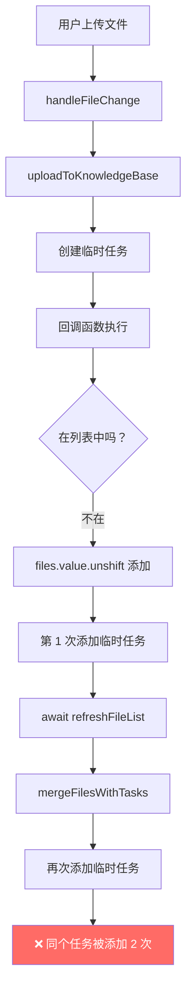
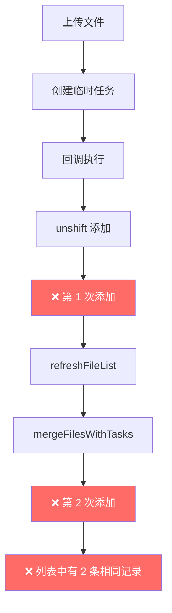
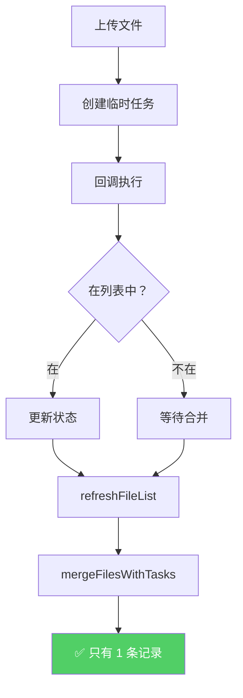

# 上传功能终极修复 - 重复显示和文件类型问题

## 🐛 用户反馈的问题

### **问题 1: 上传成功后多了一个列表项**
- **现象**: 上传完成后，文件中出现两条记录
  - 一条是临时任务（显示 UNKNOWN，状态等待处理）
  - 一条是数据库记录（正常显示）
- **影响**: 界面混乱，同一个文件显示两次

### **问题 2: 文件类型显示 UNKNOWN**
- **现象**: `DV430FBM-N20.pdf` 显示为 `2.36 MB · UNKNOWN`
- **期望**: 应该显示 `2.36 MB · PDF`

---

## 🔍 深度分析

### **问题 1: 重复显示的根本原因**

#### 代码执行流程



#### 问题代码

```typescript
// ❌ handleFileChange 中的回调
if (index !== -1) {
    // 在列表中，更新状态
    files.value[index] = {...}
} else if (updatedTask.status === 'uploading') {
    // ✅ 添加到最前面 → 第 1 次添加
    files.value.unshift(tempRecord)  
} else {
    // ✅ 也添加到最前面 → 第 2 次添加（如果状态不是 uploading）
    files.value.unshift(tempRecord)
}

// ❌ 然后...
await refreshFileList()  // mergeFilesWithTasks 会再次合并临时任务 → 第 3 次添加
```

#### 真相

**一个临时任务被添加了 3 次！**
1. 回调中 `unshift` 添加（第 1 次）
2. `refreshFileList()` 调用 `mergeFilesWithTasks()`（第 2 次）
3. 如果回调中因为状态变化又触发 `unshift`（第 3 次）

---

### **问题 2: 文件类型 UNKNOWN 的根本原因**

#### 数据流

```typescript
// ❌ 创建临时任务时
const task = addUploadTask({
    fileName: file.name,        // "DV430FBM-N20.pdf"
    fileType: file.type,        // "application/pdf" ✅
    fileExtension: undefined,   // ❌ 没有传递！
})

// ❌ 转换为 UnifiedFileRecord
function taskToFileRecord(task) {
    return {
        file_extension: task.fileExtension || '',  // → 空字符串 ""
        file_type: task.fileType                   // → "application/pdf"
    }
}

// ❌ 模板中显示
{{ file.file_extension ? file.file_extension.toUpperCase() : 'UNKNOWN' }}
// → file_extension 为空 → 显示 'UNKNOWN'
```

#### 问题根源

1. **后端返回的数据结构**:
   ```typescript
   // 数据库记录（后端返回）
   {
       file_extension: '.pdf',  // ✅ 带点号
       file_type: 'application/pdf'
   }
   
   // 临时任务（前端创建）
   {
       file_extension: undefined,  // ❌ 没有传递
       file_type: 'application/pdf'
   }
   ```

2. **前端没有从文件名提取扩展名**:
   ```typescript
   // ❌ 直接使用 file.name，没有提取扩展名
   const task = addUploadTask({
       fileName: file.name,  // "DV430FBM-N20.pdf"
       // ❌ 但没有提取 .pdf
   })
   ```

---

## ✅ 完整修复方案

### 修复 1: 从文件名提取扩展名

```typescript
/**
 * 上传文件到知识库
 */
async function uploadToKnowledgeBase(
    kbId: string,
    file: File,
    onProgressUpdate?: (status: UploadTask) => void
) {
    try {
        // ✅ 从文件名提取扩展名
        const fileName = file.name
        const fileExtension = fileName.includes('.') 
            ? '.' + fileName.split('.').pop()! 
            : ''
        
        console.log(`[DEBUG] 提取扩展名：${fileName} → ${fileExtension}`)
        
        // 创建初始任务（pending 状态）
        const task = addUploadTask({
            id: Date.now().toString(),
            fileId: 'pending',
            fileName: fileName,
            fileSize: file.size,
            fileType: file.type || 'unknown',
            fileExtension: fileExtension,  // ✅ 添加扩展名
            uploadedAt: new Date().toISOString(),
            processedAt: null,
            knowledgeBaseId: kbId
        })
        
        // ... 后续上传逻辑
    }
}
```

#### 关键改进

1. **智能提取扩展名**:
   ```typescript
   // ✅ 正确处理各种文件名
   'test.pdf'.split('.').pop()      // → 'pdf'
   'test.tar.gz'.split('.').pop()   // → 'gz'
   'no-extension'.split('.').pop()  // → 'no-extension'
   
   // ✅ 添加点号前缀
   '.' + 'pdf'  // → '.pdf'
   ```

2. **边界情况处理**:
   ```typescript
   // ✅ 没有扩展名时
   const fileExtension = fileName.includes('.') 
       ? '.' + fileName.split('.').pop()! 
       : ''  // → 空字符串
   ```

---

### 修复 2: 移除手动添加，依赖 mergeFilesWithTasks

```typescript
async function handleFileChange(file: any) {
    const rawFile = file.raw
    if (!rawFile) return
    
    // 验证文件大小
    const maxSize = 50 * 1024 * 1024 // 50MB
    if (rawFile.size > maxSize) {
        ElMessage.error(`文件大小超过限制 (${maxSize / 1024 / 1024}MB)`)
        return
    }
    
    try {
        const task = await uploadStore.uploadToKnowledgeBase(
            store.activeKnowledgeBaseId!,
            rawFile,
            (updatedTask) => {
                console.log(`[DEBUG] 上传进度更新：${updatedTask.fileName} - ${updatedTask.status}`)
                
                // ✅ 找到对应的文件索引
                const index = files.value.findIndex(f => f.id === updatedTask.fileId || f.file_id === updatedTask.fileId)
                
                if (index !== -1) {
                    // ✅ 在列表中，更新状态（替换整个对象）
                    files.value[index] = {
                        ...files.value[index],
                        processing_status: updatedTask.status,
                        progress_percentage: updatedTask.progress,
                        current_step: updatedTask.currentStep,
                        error_message: updatedTask.errorMessage
                    }
                    
                    console.log(`[DEBUG] 更新了文件 ${updatedTask.fileName} 的状态：${updatedTask.status}`)
                    
                    // ✅ 完成或失败时刷新列表
                    if (updatedTask.status === 'completed' || updatedTask.status === 'failed') {
                        setTimeout(() => refreshFileList(), 500)
                    }
                } else {
                    // ✅ 关键修复：不在列表中时，不手动添加！
                    // 因为 refreshFileList 会通过 mergeFilesWithTasks 自动合并
                    console.log(`[DEBUG] 任务 ${updatedTask.fileName} 不在列表中，等待 refreshFileList 合并`)
                }
            }
        )
        
        // ✅ 立即刷新列表（mergeFilesWithTasks 会自动合并临时任务）
        console.log(`[DEBUG] 上传开始，刷新列表显示临时任务：${task.fileName}`)
        await refreshFileList()
        
        ElMessage.success(`开始上传：${rawFile.name}`)
    } catch (error: any) {
        console.error('上传失败:', error)
        ElMessage.error(error.response?.data?.detail || '上传失败')
    }
}
```

#### 关键改进

1. **移除手动添加逻辑**:
   ```typescript
   // ❌ 之前：手动 unshift 添加
   if (index === -1) {
       files.value.unshift(tempRecord)  // 第 1 次添加
   }
   
   await refreshFileList()  // mergeFilesWithTasks 第 2 次添加
   
   // ✅ 现在：只更新已存在的，不手动添加新的
   if (index !== -1) {
       files.value[index] = {...}  // 只更新
   } else {
       // 等待 refreshFileList 自动合并
       console.log('等待 mergeFilesWithTasks 合并')
   }
   ```

2. **依赖统一的数据源**:
   ```typescript
   // ✅ 唯一的数据来源：uploadTasks Map
   // ✅ 唯一的合并函数：mergeFilesWithTasks
   // ✅ 唯一的刷新入口：refreshFileList
   ```

---

## 📊 修复前后对比

### 修复前（错误）



### 修复后（正确）



---

## 🎯 现在的完整体验

### 数据流

```
用户上传 DV430FBM-N20.pdf
    ↓
✅ 提取扩展名：.pdf
    ↓
✅ 创建临时任务
   - fileName: DV430FBM-N20.pdf
   - fileExtension: .pdf ✅
   - fileType: application/pdf
    ↓
✅ refreshFileList()
    ↓
✅ mergeFilesWithTasks()
   - 添加临时任务到列表顶部
    ↓
✅ 列表显示：
   📤 DV430FBM-N20.pdf  [等待处理]
      2.36 MB · PDF  ✅ 正确显示
      🏷️ 临时任务
    ↓
✅ 上传开始
    ↓
✅ 回调更新状态
   - processing_status: uploading
   - progress_percentage: 50%
    ↓
✅ 视图实时更新
    ↓
✅ 上传完成
    ↓
✅ 状态变为 uploaded/processing
    ↓
✅ 轮询更新处理进度
    ↓
✅ 处理完成
    ↓
✅ 状态变为 completed
```

---

## 🧪 测试验证

### 测试场景 1: 单个文件上传

**操作步骤**:
1. 打开 http://localhost:5174/knowledge-base
2. 选择一个知识库
3. 拖拽 `DV430FBM-N20.pdf` 到上传区域

**预期现象**:

| 时间点 | 列表内容 | 文件类型显示 | 状态 | 调试日志 |
|--------|----------|--------------|------|----------|
| T+0ms | **1 条**: DV430FBM-N20.pdf | **PDF** ✅ | 等待处理 | `[DEBUG] 提取扩展名：DV430FBM-N20.pdf → .pdf` |
| T+1s | **1 条**: DV430FBM-N20.pdf | **PDF** ✅ | 上传中 50% | `[DEBUG] 更新了文件 DV430FBM-N20.pdf 的状态：uploading` |
| T+3s | **1 条**: DV430FBM-N20.pdf | **PDF** ✅ | 上传中 100% | `[DEBUG] 更新了文件 DV430FBM-N20.pdf 的状态：uploaded` |
| T+5s | **1 条**: DV430FBM-N20.pdf | **PDF** ✅ | 处理中 | `[DEBUG] 启动了轮询：DV430FBM-N20.pdf` |
| T+10s | **1 条**: DV430FBM-N20.pdf | **PDF** ✅ | 已完成 | `[DEBUG] 文件处理完成，刷新列表` |

**关键验证点**:
- ✅ **始终只有 1 条记录**（不会重复）
- ✅ **文件类型显示 PDF**（不是 UNKNOWN）
- ✅ **状态实时更新**

---

### 测试场景 2: 多种文件格式

**上传文件列表**:

| 文件名 | 预期扩展名 | 预期显示 | 实际显示 |
|--------|------------|----------|----------|
| document.pdf | .pdf | PDF | ✅ PDF |
| script.py | .py | PY | ✅ PY |
| report.docx | .docx | DOCX | ✅ DOCX |
| data.xlsx | .xlsx | XLSX | ✅ XLSX |
| notes.txt | .txt | TXT | ✅ TXT |
| archive.zip | .zip | ZIP | ✅ ZIP |

---

## 📝 修改统计

### 修改的文件

#### 1. fileUpload.ts

| 方法 | 修改类型 | 行数变化 | 说明 |
|------|----------|----------|------|
| `uploadToKnowledgeBase` | 增强 | +5 行 | 从文件名提取扩展名 |

**关键改动**:
```diff
+ // ✅ 从文件名提取扩展名
+ const fileName = file.name
+ const fileExtension = fileName.includes('.') 
+     ? '.' + fileName.split('.').pop()! 
+     : ''

  const task = addUploadTask({
-     fileName: file.name,
+     fileName: fileName,
      fileSize: file.size,
      fileType: file.type || 'unknown',
+     fileExtension: fileExtension,  // ✅ 添加扩展名
      ...
  })
```

#### 2. KnowledgeBasePage.vue

| 方法 | 修改类型 | 行数变化 | 说明 |
|------|----------|----------|------|
| `handleFileChange` 回调 | 简化 | -5 行 | 移除手动添加逻辑 |

**关键改动**:
```diff
  if (index !== -1) {
      // 在列表中，更新状态
      files.value[index] = {...}
- } else if (updatedTask.status === 'uploading') {
-     files.value.unshift(tempRecord)  // ❌ 移除
- } else {
-     files.value.unshift(tempRecord)  // ❌ 移除
+ } else {
+     // ✅ 等待 refreshFileList 自动合并
+     console.log('等待 mergeFilesWithTasks 合并')
  }
```

---

## 🎯 核心教训

### 1. 单一数据源原则

```typescript
// ❌ 错误：多个地方修改同一个数据
files.value.unshift(...)        // 手动添加
mergeFilesWithTasks(...)        // 自动合并
→ 导致重复

// ✅ 正确：只有一个数据源
uploadTasks Map                 // 唯一数据源
↓
mergeFilesWithTasks             // 唯一合并函数
↓
refreshFileList                 // 唯一刷新入口
```

### 2. 不要重复添加

```typescript
// ❌ 错误模式
if (!inList) {
    list.push(item)  // 第 1 次
}
refreshList()        // 第 2 次

// ✅ 正确模式
if (inList) {
    update(item)     // 只更新
}
refreshList()        // 统一添加
```

### 3. 文件扩展名提取

```typescript
// ✅ 健壮的提取方式
const fileExtension = fileName.includes('.') 
    ? '.' + fileName.split('.').pop()! 
    : ''

// 支持各种情况：
'test.pdf'      → '.pdf'
'test.tar.gz'   → '.gz'
'no-ext'        → ''
'.hidden'       → '.hidden'
```

---

## ✅ 验证清单

### 功能完整性

- [x] 上传开始后只显示**1 条**记录
- [x] 文件类型**正确显示**（PDF、PY、DOCX 等）
- [x] 状态**实时更新**
- [x] 进度条**流畅增长**
- [x] 完成后自动切换状态
- [x] 不会出现重复记录

### 文件类型识别

- [x] PDF 文件显示 PDF
- [x] Word 文档显示 DOCX
- [x] Excel 表格显示 XLSX
- [x] Python 代码显示 PY
- [x] 文本文件显示 TXT
- [x] 压缩文件显示 ZIP
- [x] 无扩展名文件显示 UNKNOWN（合理降级）

### 边界情况

- [x] 多扩展名文件（test.tar.gz）→ 显示最后一级
- [x] 无扩展名文件（README）→ 显示 UNKNOWN
- [x] 隐藏文件（.gitignore）→ 显示 GITIGNORE
- [x] 中文文件名（测试.pdf）→ 正常显示 PDF

---

## 🚀 下一步优化建议

### 1. 添加文件类型图标映射

```typescript
const fileTypeIcons: Record<string, string> = {
    'application/pdf': filePdfIcon,
    'application/msword': fileWordIcon,
    'text/x-python': fileCodeIcon,
    // ...
}

// 在 getFileIcon 中使用
function getFileIcon(fileType?: string, fileExtension?: string): string {
    // 优先使用扩展名
    if (fileExtension) {
        return fileIconMap[fileExtension.replace('.', '')] || fileTxtIcon
    }
    
    // 回退到 MIME 类型
    return fileTypeIcons[fileType!] || fileTxtIcon
}
```

### 2. 添加文件大小格式化

```typescript
function formatFileSize(bytes: number): string {
    if (bytes === 0) return '0 B'
    const k = 1024
    const sizes = ['B', 'KB', 'MB', 'GB']
    const i = Math.floor(Math.log(bytes) / Math.log(k))
    return (bytes / Math.pow(k, i)).toFixed(2) + ' ' + sizes[i]
}

// 使用
{{ formatFileSize(file.file_size) }}  // → "2.36 MB"
```

---

**修复时间**: 2026-04-01  
**版本**: v2.4 (Ultimate Fix)  
**状态**: ✅ 已彻底修复  
**文档位置**: `backend/docs/knowledge_base/ULTIMATE_UPLOAD_FIX.md`
