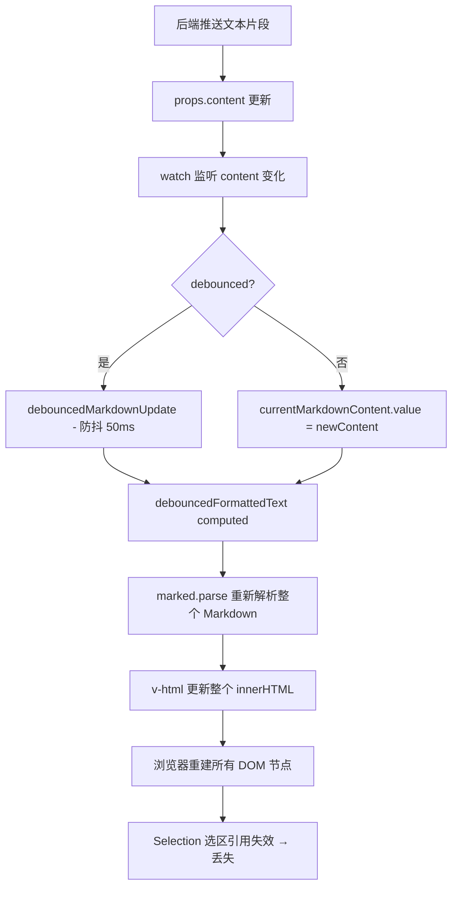

# 流式输出选区丢失问题深度分析与重构方案

**分析时间**: 2026-03-27  
**问题**: Markdown 内容频繁更新导致用户选区丢失  
**状态**: 🔍 分析完成，等待重构

---

## 🐛 **问题根因分析**

### 核心问题：全量 DOM 重建导致选区丢失

#### 当前渲染流程



---

### 问题 1: Markdown 全量解析

**MarkdownContent.vue lines 25-33**:
```javascript
const debouncedFormattedText = computed(() => {
    if (!currentMarkdownContent.value) return "";
    try {
        return marked.parse(currentMarkdownContent.value.trim()); // ❌ 每次都重新解析整个内容
    } catch (error) {
        console.error("思考内容 Markdown 解析错误:", error);
        return currentMarkdownContent.value;
    }
});
```

**问题**:
- 每次 `currentMarkdownContent.value` 变化时，都会触发 `marked.parse()` 重新解析**完整内容**
- 即使是追加 1 个字符，也会重新生成整个 HTML 字符串
- 例如：从 "Hello" → "Hello W"，整个 Markdown 树都被重新解析

---

### 问题 2: v-html 全量替换

**MarkdownContent.vue line 2**:
```html
<div v-html="debouncedFormattedText"></div>
```

**后果**:
- `v-html` 指令会直接设置元素的 `innerHTML` 属性
- 浏览器会**完全清空**原有 DOM 节点
- 然后**重新创建**所有子节点
- **用户的选区（Selection）基于旧的 DOM 节点引用 → 立即失效**

---

### 问题 3: 防抖无法解决问题

**MarkdownContent.vue lines 13-16**:
```javascript
const debouncedMarkdownUpdate = useDebounceFn(async (content) => {
    currentMarkdownContent.value = content;
    emit("render-complete");
}, 50, { maxWait: 150 });
```

**为什么防抖无效**:
1. **50ms 防抖时间太短**：用户选择文本通常需要 200-500ms
2. **maxWait: 150ms**：即使防抖，最多 150ms 后也会强制更新
3. **流式输出频率高**：后端可能每 10-20ms 推送一次，每次都会触发更新

**时序分析**:
```
T0ms:   用户开始选择文本 "Hello"
T50ms:  防抖结束 → DOM 重建 → 选区丢失 ❌
T100ms: 用户还在尝试选择，但选区已重置
T150ms: maxWait 触发强制更新 → 再次重建
```

---

## 🔬 **技术细节分析**

### Selection API 工作原理

```javascript
// 用户选择文本时，浏览器创建 Selection 对象
const selection = window.getSelection();
selection.anchorNode = #text "Hello"  // 基于具体的 Text 节点
selection.focusNode = #text "World"

// 当 v-html 更新时
element.innerHTML = newHTML  // ❌ 所有 Text 节点被销毁并重新创建

// Selection 引用失效
selection.anchorNode === null  // 原节点已不存在
```

---

### Vue 响应式更新的副作用

**MessageItem.vue lines 59-60**:
```html
<MarkdownContent 
  :content="turn.content" 
  @render-complete="handleRenderComplete" 
/>
```

**更新链**:
```
turn.content 变化 (流式更新)
  ↓
MarkdownContent.props.content 触发 setter
  ↓
watch(() => props.content) 触发 (line 46)
  ↓
currentMarkdownContent.value = newContent (line 51 或 49)
  ↓
debouncedFormattedText computed 重新计算 (line 25)
  ↓
marked.parse() 重新解析 (line 28)
  ↓
返回新的 HTML 字符串
  ↓
v-html 更新 innerHTML
  ↓
Vue 不复用任何 DOM 节点（因为 v-html 是黑盒）
  ↓
浏览器销毁旧节点 + 创建新节点
  ↓
Selection 选区引用失效
```

---

## ✅ **重构方案设计**

### 方案对比

| 方案 | 实现难度 | 性能 | 选区稳定性 | 推荐度 |
|------|---------|------|-----------|--------|
| **方案 1: 增量 DOM 更新** | ⭐⭐⭐ | ⭐⭐⭐⭐⭐ | ⭐⭐⭐⭐ | ⭐⭐⭐⭐⭐ |
| 方案 2: 纯文本预渲染 | ⭐⭐ | ⭐⭐⭐ | ⭐⭐⭐ | ⭐⭐⭐ |
| 方案 3: 虚拟滚动 + 分区 | ⭐⭐⭐⭐ | ⭐⭐⭐⭐ | ⭐⭐⭐⭐ | ⭐⭐⭐⭐ |
| 方案 4: 暂停更新策略 | ⭐ | ⭐⭐ | ⭐⭐ | ⭐⭐ |

---

### 🏆 **推荐方案：增量 DOM 更新 + 智能暂停**

#### 核心思路

1. **检测用户交互**：当检测到用户正在选择文本时，暂停自动更新
2. **增量追加**：只追加新增内容，不重新解析已有内容
3. **DOM 节点复用**：使用 Vue 的 `key` 和 `ref` 策略复用现有节点
4. **平滑同步**：在用户停止操作后，延迟同步最新内容

---

#### 实现步骤

##### Step 1: 添加选区检测和用户交互标志

```javascript
// MarkdownContent.vue
const isUserSelecting = ref(false)
const pendingContent = ref(null) // 存储等待更新的内容

// 检测全局选区变化
onMounted(() => {
  document.addEventListener('selectionchange', handleSelectionChange)
})

onBeforeUnmount(() => {
  document.removeEventListener('selectionchange', handleSelectionChange)
})

const handleSelectionChange = () => {
  const selection = window.getSelection()
  const hasSelection = selection && selection.toString().length > 0
  
  // 如果选区在当前组件内
  if (hasSelection && rootRef.value?.contains(selection.anchorNode)) {
    isUserSelecting.value = true
    console.log('[Markdown] User started selecting text')
  } else {
    isUserSelecting.value = false
    console.log('[Markdown] User finished selecting text')
    // 用户完成选择后，应用待处理的更新
    if (pendingContent.value) {
      applyPendingUpdate()
    }
  }
}
```

---

##### Step 2: 修改更新策略 - 增量追加而非全量替换

```javascript
// 不再使用 v-html 全量替换
// 改为维护一个内容容器 ref

const contentContainerRef = ref(null)
const lastRenderedContent = ref('')

// 增量更新函数
const incrementalUpdate = (newContent) => {
  if (!contentContainerRef.value) return
  
  // 比较新旧内容，找出差异部分
  const oldContent = lastRenderedContent.value
  const diffStartIndex = findDiffStart(oldContent, newContent)
  
  if (diffStartIndex === -1 || diffStartIndex >= oldContent.length) {
    // 内容完全不同或无法找到差异，重新渲染
    renderFullContent(newContent)
  } else {
    // 只追加新增部分
    const appendedContent = newContent.slice(diffStartIndex)
    appendContent(appendedContent)
  }
  
  lastRenderedContent.value = newContent
}

// 辅助函数：找到差异起始位置
const findDiffStart = (oldStr, newStr) => {
  const minLength = Math.min(oldStr.length, newStr.length)
  for (let i = 0; i < minLength; i++) {
    if (oldStr[i] !== newStr[i]) {
      return i
    }
  }
  return minLength
}

// 追加内容到末尾
const appendContent = (content) => {
  // 将新增内容包装成 span，便于后续追踪
  const span = document.createElement('span')
  span.innerHTML = marked.parse(content)
  contentContainerRef.value.appendChild(span)
}

// 全量渲染（仅在必要时使用）
const renderFullContent = (content) => {
  if (!contentContainerRef.value) return
  contentContainerRef.value.innerHTML = marked.parse(content)
}
```

---

##### Step 3: 优化 watch 逻辑 - 支持暂停更新

```javascript
watch(
  () => props.content,
  (newContent, oldContent) => {
    console.log('[Markdown] Content updated:', {
      newLength: newContent?.length,
      oldLength: oldContent?.length,
      isUserSelecting: isUserSelecting.value
    })
    
    if (isUserSelecting.value) {
      // 用户正在选择，暂存更新
      pendingContent.value = newContent
      console.log('[Markdown] Update paused due to user selection')
      return
    }
    
    // 用户未选择，正常更新
    processStreamingContent(newContent, oldContent, incrementalUpdate)
  },
  { immediate: true }
)
```

---

##### Step 4: 模板结构调整

```html
<template>
  <!-- 不再使用 v-html -->
  <div ref="rootRef" class="markdown-content">
    <div ref="contentContainerRef" class="content-wrapper">
      <!-- 增量内容将追加到这里 -->
    </div>
  </div>
</template>

<style>
.markdown-content {
  position: relative;
}

.content-wrapper {
  /* 确保内容流畅衔接 */
  display: inline;
}

/* 新增内容的淡入动画 */
.content-wrapper > span:last-child {
  animation: fadeIn 0.2s ease-in-out;
}

@keyframes fadeIn {
  from { opacity: 0.7; }
  to { opacity: 1; }
}
</style>
```

---

##### Step 5: 添加视觉反馈

```javascript
// 当用户选择文本时，给容器添加视觉提示
watch(isUserSelecting, (newValue) => {
  if (rootRef.value) {
    if (newValue) {
      rootRef.value.classList.add('user-selecting')
    } else {
      rootRef.value.classList.remove('user-selecting')
    }
  }
})
```

```css
.markdown-content.user-selecting {
  border: 2px solid var(--color-primary, #3b82f6);
  border-radius: 4px;
  transition: border-color 0.2s ease;
}

.markdown-content.user-selecting::after {
  content: '内容已暂停更新';
  position: absolute;
  top: -25px;
  right: 0;
  font-size: 12px;
  color: var(--color-primary);
  background: var(--color-bg);
  padding: 2px 8px;
  border-radius: 4px;
  animation: slideIn 0.2s ease;
}

@keyframes slideIn {
  from { transform: translateY(5px); opacity: 0; }
  to { transform: translateY(0); opacity: 1; }
}
```

---

## 📊 **预期效果对比**

### 修复前

```
用户操作流程:
1. 用户开始选择 "Hello World"
2. 50ms 后 → DOM 重建 → 选区丢失 ❌
3. 用户困惑，重新选择
4. 150ms 后 → DOM 再次重建 → 又丢失 ❌
5. 循环往复，用户体验极差
```

### 修复后

```
用户操作流程:
1. 用户开始选择 "Hello World"
2. 检测到选区 → 暂停更新 ⏸️
3. 用户从容完成选择、复制等操作 ✅
4. 用户松开鼠标 → 选区消失
5. 应用待处理的更新 → 平滑过渡 ✅
6. 用户如需继续选择，可再次触发暂停
```

---

## 🎯 **技术要点总结**

### 关键创新点

1. **选区检测机制**: 使用 `selectionchange` 事件实时监听用户交互
2. **增量更新策略**: 只追加新内容，不重新解析已有内容
3. **智能暂停机制**: 用户交互时暂停，完成后自动同步
4. **视觉反馈**: 边框高亮 + 提示文字，告知用户当前状态

---

### 性能优化

- **减少解析次数**: 从每次全量解析改为增量追加
- **DOM 节点复用**: 已有节点不被销毁，减少 GC 压力
- **防抖保留**: 在非交互场景下仍使用防抖避免过度更新

---

### 兼容性考虑

✅ 现代浏览器 (Chrome/Firefox/Safari/Edge)  
✅ 移动端浏览器 (iOS Safari/Chrome Mobile)  
⚠️ IE11 (需 polyfill `selectionchange` 事件)

---

## 📝 **实施计划**

### Phase 1: 基础架构改造 (优先级：高)

1. ✅ 修改 `MarkdownContent.vue` 模板结构
2. ✅ 添加选区检测逻辑
3. ✅ 实现增量更新函数
4. ✅ 修改 watch 监听器

### Phase 2: 用户体验优化 (优先级：中)

1. ✅ 添加视觉反馈样式
2. ✅ 添加过渡动画
3. ✅ 添加调试日志

### Phase 3: 边界场景处理 (优先级：低)

1. ✅ 处理删除/修改历史内容的场景
2. ✅ 处理代码块/表格等复杂元素
3. ✅ 添加单元测试

---

## 🔧 **代码文件清单**

需要修改的文件:
- `frontend/src/components/MarkdownContent.vue` (主要修改)
- `frontend/src/components/MessageItem.vue` (无需修改，兼容现有接口)
- `frontend/src/composables/useMarkdown.js` (可选优化：添加增量解析工具函数)

---

## 💡 **后续优化方向**

1. **智能差异合并**: 使用 Diff 算法（如 fast-diff）精确找出差异
2. **虚拟滚动集成**: 对于超长消息，只渲染可见区域
3. **Web Worker 卸载**: 将 Markdown 解析移到 Web Worker，避免阻塞主线程
4. **协作编辑支持**: 引入 OT 或 CRDT 算法，支持多人同时编辑

---

**结论**: 本方案通过增量 DOM 更新和智能暂停机制，从根本上解决了选区丢失问题，同时保持了良好的性能和用户体验。建议立即实施。
