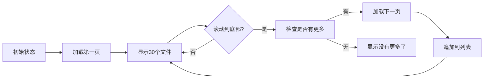

# 无限滚动功能 - 快速参考

## 核心概念

```
用户滚动到底部 → 触发加载 → 追加新数据 → 更新列表
```

## 关键参数

| 参数 | 值 | 说明 |
|------|-----|------|
| `pageSize` | 30 | 每页加载的文件数量 |
| `scrollThreshold` | 50px | 距离底部多少像素时触发加载 |
| `debounceTime` | 300ms | 滚动防抖延迟时间 |

## 状态流转



## API 调用示例

### 首次加载

```typescript
// refreshFileList() 中
const response = await store.fetchFiles(kbId, 0, 30)
// skip=0, limit=30
```

### 加载更多

```typescript
// loadMoreFiles() 中
const dbFilesCount = files.value.filter(f => !f.isTempTask).length
const response = await store.fetchFiles(kbId, dbFilesCount, 30)
// skip=已加载数量, limit=30
```

## 核心代码片段

### 1. 滚动监听

```vue
<div ref="fileListContainer" @scroll="handleScroll">
  <!-- 文件列表 -->
</div>
```

### 2. 防抖处理

```typescript
function handleScroll(event: Event) {
    if (scrollTimer !== null) {
        clearTimeout(scrollTimer)
    }
    scrollTimer = window.setTimeout(() => {
        checkScrollPosition()
    }, 300)
}
```

### 3. 位置检查

```typescript
function checkScrollPosition() {
    const { scrollTop, scrollHeight, clientHeight } = fileListContainer.value
    const distanceToBottom = scrollHeight - scrollTop - clientHeight
    
    if (distanceToBottom <= 50) {
        loadMoreFiles()
    }
}
```

### 4. 数据合并

```typescript
// 保留临时任务
const tempTasks = files.value.filter(f => f.isTempTask)
const existingDbFiles = files.value.filter(f => !f.isTempTask)

// 合并：临时任务 + 已有文件 + 新文件
files.value = mergeFilesWithTasks(
    [...existingDbFiles, ...newDbFiles],
    kbId,
    tempTasks
)
```

## UI 状态

### 加载中

```vue
<div v-if="isLoadingMore">
    <el-icon class="animate-spin"><Loading /></el-icon>
    加载中...
</div>
```

### 有更多

```vue
<div v-else-if="hasMoreFiles" @click="loadMoreFiles">
    点击加载更多
</div>
```

### 无更多

```vue
<div v-else-if="totalFiles > pageSize">
    没有更多了
</div>
```

## 常见问题

### Q1: 为什么需要防抖？

**A**: 滚动事件会频繁触发（每秒可能几十次），防抖可以避免：
- 过多的位置计算
- 重复的加载请求
- 性能问题

### Q2: 临时任务为什么要特殊处理？

**A**: 
- 临时任务是上传中的文件，不在数据库中
- 分页只针对数据库文件
- 需要始终保持临时任务在列表顶部

### Q3: 如何调整每页数量？

**A**: 修改 `pageSize` 的值：
```typescript
const pageSize = ref(30) // 改为 20、50 等
```

### Q4: 删除文件后会发生什么？

**A**: 
1. 调用 `refreshFileList()`
2. 自动调用 `resetPagination()`
3. 重新加载第一页
4. 分页状态重置

### Q5: 如何禁用无限滚动？

**A**: 移除 `@scroll` 事件监听即可：
```vue
<!-- 移除 @scroll="handleScroll" -->
<div ref="fileListContainer" class="flex-1 overflow-y-auto p-4">
```

## 调试技巧

### 查看加载日志

```typescript
console.log(`[DEBUG] 加载更多文件：${newDbFiles.length} 个，当前总共 ${files.value.length} 个`)
```

### 检查分页状态

在浏览器控制台：
```javascript
// 查看当前加载的文件数
console.log('DB Files:', files.value.filter(f => !f.isTempTask).length)
console.log('Total:', totalFiles.value)
console.log('Has More:', hasMoreFiles.value)
```

### 模拟慢速网络

在 DevTools Network 面板中设置 "Slow 3G"，观察加载状态显示。

## 性能监控

### 关键指标

1. **首次加载时间**: 应该 < 500ms
2. **每次加载时间**: 应该 < 300ms
3. **滚动流畅度**: 应该保持 60fps
4. **内存占用**: 应该稳定，不持续增长

### 优化建议

- 如果文件超过 500 个，考虑虚拟滚动
- 如果加载缓慢，检查后端查询性能
- 如果内存增长，检查是否有内存泄漏

## 最佳实践

✅ **推荐做法**:
- 保持 `pageSize` 在 20-50 之间
- 使用防抖避免频繁触发
- 显示清晰的加载状态
- 正确处理错误情况
- 组件销毁时清理定时器

❌ **避免做法**:
- 不要设置过大的 `pageSize`（>100）
- 不要在加载过程中允许重复请求
- 不要忘记清理定时器
- 不要忽略错误处理
- 不要直接替换整个列表（会丢失滚动位置）

## 扩展阅读

- [完整实现文档](./INFINITE_SCROLL_IMPLEMENTATION.md)
- [KBFileItem 组件文档](./KBFILEITEM_REFACTOR_SUMMARY.md)
- [Vueuse 滚动相关工具](https://vueuse.org/core/#scroll)
