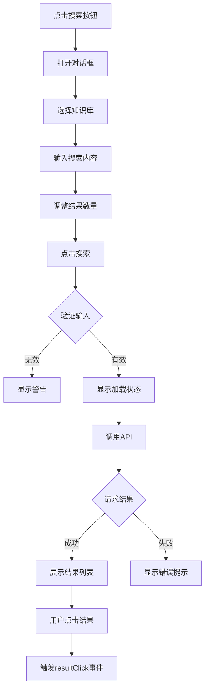

# KBSearchDialog 知识库搜索组件实现总结

## 功能概述

在 `KnowledgeBasePage.vue` 中集成了独立的知识库混合搜索组件 `KBSearchDialog.vue`，提供语义搜索和关键词匹配功能。

## 架构设计

### 1. 后端接口集成 ✅

**接口**: `POST /api/v1/knowledge-bases/{kb_id}/search`

**请求参数**:
```typescript
{
  query: string           // 查询文本（必填）
  top_k?: number          // 返回结果数量（1-20，默认5）
  filter_file_id?: string // 按文件ID过滤（可选）
}
```

**响应数据**:
```typescript
{
  query: string
  results: [
    {
      content: string           // 分块内容
      metadata: object          // 元数据（包含file_id, chunk_index等）
      similarity: number        // 相似度分数（0-1）
      file_name?: string        // 来源文件名
    }
  ]
  total: number                 // 结果总数
}
```

**当前实现**: 
- ✅ 向量相似度搜索（语义搜索）
- ⚠️ 混合搜索（待后端扩展）

### 2. 前端组件开发 ✅

#### 组件位置
```
src/components/KnowledgeBasePage/KBSearchDialog.vue
```

#### 组件职责
- 知识库选择
- 搜索输入
- 结果展示
- 关键词高亮
- 加载状态管理

#### Props 定义

```typescript
interface Props {
  modelValue: boolean              // 对话框可见性（v-model）
  knowledgeBases: KnowledgeBase[]  // 知识库列表
  defaultKbId?: string | null      // 默认选中的知识库ID
}
```

#### Events 定义

```typescript
const emit = defineEmits<{
  'update:modelValue': [value: boolean]  // 对话框关闭
  resultClick: [result: SearchResult]    // 点击搜索结果
}>()
```

### 3. UI/UX 设计 ✅

#### 界面布局

```
┌──────────────────────────────────┐
│  知识库搜索                   [×] │
├──────────────────────────────────┤
│  知识库:   [下拉选择 ▼]          │
│  搜索内容: [文本输入框]           │
│  结果数量: [---●------] 10       │
│                      [🔍 搜索]   │
├──────────────────────────────────┤
│  找到 5 条结果      [清空结果]   │
│  ┌────────────────────────────┐  │
│  │ 相似度: 95.2%         #1   │  │
│  │ 📄 document.pdf            │  │
│  │ 这是匹配的文本内容...       │  │
│  │ 分块 #3                    │  │
│  └────────────────────────────┘  │
│  ┌────────────────────────────┐  │
│  │ ...                        │  │
│  └────────────────────────────┘  │
├──────────────────────────────────┤
│                      [关闭]      │
└──────────────────────────────────┘
```

#### 交互流程



### 4. 核心功能实现

#### 4.1 搜索表单

```vue
<el-form :model="searchForm">
  <el-form-item label="知识库">
    <el-select v-model="searchForm.kbId">
      <el-option v-for="kb in knowledgeBases" ... />
    </el-select>
  </el-form-item>

  <el-form-item label="搜索内容">
    <el-input
      v-model="searchForm.query"
      type="textarea"
      :rows="3"
      @keyup.enter.ctrl="handleSearch"
    />
  </el-form-item>

  <el-form-item label="结果数量">
    <el-slider 
      v-model="searchForm.topK" 
      :min="1" 
      :max="20" 
      show-input
    />
  </el-form-item>
</el-form>
```

**特性**:
- ✅ 支持 Ctrl+Enter 快捷搜索
- ✅ 滑块调节结果数量（1-20）
- ✅ 实时显示滑块数值

#### 4.2 搜索结果展示

```vue
<div class="result-item" @click="handleResultClick(result)">
  <!-- 相似度分数 -->
  <el-tag type="success">
    相似度: {{ (result.similarity * 100).toFixed(1) }}%
  </el-tag>

  <!-- 来源文件 -->
  <el-tag type="info">
    <Document /> {{ result.file_name || '未知文件' }}
  </el-tag>

  <!-- 内容预览（带高亮） -->
  <div class="content-preview line-clamp-3">
    {{ highlightText(result.content, searchForm.query) }}
  </div>

  <!-- 元数据 -->
  <div class="text-xs text-gray-400">
    分块 #{{ result.metadata.chunk_index }}
  </div>
</div>
```

**特性**:
- ✅ 相似度百分比显示
- ✅ 来源文件标识
- ✅ 关键词高亮
- ✅ 最多显示3行（line-clamp-3）
- ✅ 可点击查看详情

#### 4.3 关键词高亮

```typescript
function highlightText(text: string, query: string): string {
  if (!query || !text) return text
  
  try {
    const keywords = query.trim().split(/\s+/).filter(k => k.length > 0)
    let highlighted = text
    
    keywords.forEach(keyword => {
      const regex = new RegExp(`(${keyword})`, 'gi')
      highlighted = highlighted.replace(
        regex, 
        '<mark class="bg-yellow-200 dark:bg-yellow-700 px-0.5 rounded">$1</mark>'
      )
    })
    
    return highlighted
  } catch (e) {
    return text
  }
}
```

**特性**:
- ✅ 不区分大小写
- ✅ 支持多关键词
- ✅ 暗黑模式适配
- ✅ 异常处理

#### 4.4 状态管理

```typescript
// 搜索状态
const isSearching = ref(false)     // 是否正在搜索
const hasSearched = ref(false)     // 是否已执行搜索
const searchResults = ref([])      // 搜索结果列表

// 三种状态展示
1. 初始状态: "输入关键词开始搜索"
2. 加载中: "搜索中..." + 旋转图标
3. 空结果: "未找到相关结果"
4. 有结果: 结果列表
```

### 5. 父组件集成 ✅

#### KnowledgeBasePage.vue 修改

**1. 导入组件**
```typescript
import { KBSearchDialog } from './KnowledgeBasePage'
```

**2. 添加状态**
```typescript
const showSearchDialog = ref(false)
```

**3. 添加搜索按钮**
```vue
<div class="flex items-center gap-2">
  <el-button @click="showSearchDialog = true">
    <el-icon><Search /></el-icon>
    搜索
  </el-button>
  <el-button type="primary" @click="showUploadModal = true">
    <Upload /> 上传文件
  </el-button>
</div>
```

**4. 使用组件**
```vue
<KBSearchDialog
  v-model="showSearchDialog"
  :knowledge-bases="store.knowledgeBases"
  :default-kb-id="store.activeKnowledgeBaseId"
/>
```

### 6. API 服务方法

ApiService.ts 已有方法：
```typescript
async searchKnowledgeBase(
  kbId: string,
  query: string,
  topK: number = 5,
  filterFileId?: string
): Promise<any>
```

**调用示例**:
```typescript
const response = await apiService.searchKnowledgeBase(
  kbId,
  "人工智能",
  10
)
```

## 技术要点

### 1. v-model 双向绑定

```vue
<!-- 父组件 -->
<KBSearchDialog v-model="showSearchDialog" />

<!-- 子组件 -->
const dialogVisible = computed({
  get: () => props.modelValue,
  set: (value) => emit('update:modelValue', value)
})
```

### 2. 计算属性优化

```typescript
const canSearch = computed(() => {
  return searchForm.value.kbId && 
         searchForm.value.query.trim().length > 0
})
```

**优势**:
- 自动禁用无效搜索
- 提升用户体验

### 3. 监听器应用

```typescript
watch(dialogVisible, (visible) => {
  if (visible) {
    // 设置默认知识库
    if (!searchForm.value.kbId && props.defaultKbId) {
      searchForm.value.kbId = props.defaultKbId
    }
  } else {
    // 关闭时清空
    clearResults()
    searchForm.value.query = ''
  }
})
```

**作用**:
- 打开时自动选中当前知识库
- 关闭时清理状态

### 4. 样式隔离

```vue
<style scoped>
/* 滚动条美化 */
.results-content::-webkit-scrollbar {
  width: 6px;
}

/* 高亮样式 */
:deep(mark) {
  padding: 0 2px;
  border-radius: 2px;
}

/* 暗黑模式 */
.dark .results-content::-webkit-scrollbar-thumb {
  background-color: rgba(75, 85, 99, 0.5);
}
</style>
```

## 代码变更统计

| 文件 | 变更类型 | 行数变化 |
|------|---------|---------|
| KBSearchDialog.vue | 新增 | +340 |
| KnowledgeBasePage.vue | 修改 | +25 |
| ApiService.ts | 已有 | 0 |
| index.ts | 修改 | +1 |
| **总计** | - | **+366 行** |

## 功能特性清单

### ✅ 已实现

1. **知识库选择**
   - 下拉选择目标知识库
   - 自动选中当前知识库

2. **搜索输入**
   - 多行文本输入
   - Ctrl+Enter 快捷搜索
   - 输入验证

3. **结果数量控制**
   - 滑块调节（1-20）
   - 实时显示数值

4. **结果展示**
   - 相似度百分比
   - 来源文件名称
   - 内容预览（3行截断）
   - 分块索引

5. **关键词高亮**
   - 多关键词支持
   - 不区分大小写
   - 暗黑模式适配

6. **状态反馈**
   - 加载动画
   - 空结果提示
   - 错误提示
   - Toast 通知

7. **交互体验**
   - 点击结果项
   - 清空结果
   - 关闭自动清理

8. **UI/UX**
   - 简洁大气设计
   - 暗黑模式兼容
   - 滚动条美化
   - 悬停效果

### 🔲 未来扩展

1. **混合搜索**
   - 语义权重调节
   - 关键词权重调节
   - BM25 算法集成

2. **高级过滤**
   - 按文件类型过滤
   - 按日期范围过滤
   - 按相似度阈值过滤

3. **结果操作**
   - 复制结果内容
   - 导出搜索结果
   - 收藏重要结果

4. **性能优化**
   - 搜索结果缓存
   - 虚拟滚动（大量结果）
   - 防抖搜索

5. **智能提示**
   - 搜索历史
   - 热门搜索词
   - 自动补全

## 测试建议

### 功能测试

1. ✅ 选择不同知识库搜索
2. ✅ 输入不同关键词搜索
3. ✅ 调整结果数量
4. ✅ 查看搜索结果
5. ✅ 点击结果项
6. ✅ 清空结果
7. ✅ 关闭对话框

### 边界测试

1. ✅ 空搜索词
2. ✅ 超长搜索词
3. ✅ 特殊字符
4. ✅ 无结果情况
5. ✅ 网络错误
6. ✅ API 超时

### UI 测试

1. ✅ 暗黑模式显示
2. ✅ 响应式布局
3. ✅ 滚动条显示
4. ✅ 高亮效果
5. ✅ 加载动画

## 注意事项

### 1. API 依赖

确保后端接口正常运行：
```bash
# 测试接口
curl -X POST http://localhost:8000/api/v1/knowledge-bases/{kb_id}/search \
  -H "Content-Type: application/json" \
  -d '{"query": "测试", "top_k": 5}'
```

### 2. 向量模型

搜索需要配置向量模型：
- 知识库必须设置 embedding_model_id
- 向量模型必须可用
- 向量数据库必须有数据

### 3. 性能考虑

- 单次搜索最多返回 20 条结果
- 建议 top_k 设置为 5-10
- 大量分块时搜索可能较慢

### 4. 用户体验

- 提供清晰的加载状态
- 空结果时给出友好提示
- 支持快捷操作（Ctrl+Enter）

## 最佳实践

✅ **推荐做法**:
- 使用默认知识库 ID
- 合理设置结果数量（5-10）
- 利用关键词高亮
- 处理所有错误情况
- 提供清晰的状态反馈

❌ **避免做法**:
- 不要设置过大的 top_k
- 不要忽略加载状态
- 不要缺少错误处理
- 不要直接展示原始数据
- 不要忘记清理状态

## 扩展阅读

- [Element Plus Dialog](https://element-plus.org/zh-CN/component/dialog.html)
- [Vue 3 Composition API](https://cn.vuejs.org/guide/extras/composition-api-faq.html)
- [向量搜索原理](https://www.pinecone.io/learn/vector-similarity/)

## 总结

本次实现成功地为知识库页面添加了独立的搜索组件，提供了完整的搜索功能和良好的用户体验。通过合理的组件设计和状态管理，确保了功能的稳定性和可维护性。

关键技术点：
- ✅ 完整的搜索流程
- ✅ 关键词高亮显示
- ✅ 多种状态管理
- ✅ 暗黑模式兼容
- ✅ 响应式设计
- ✅ 完善的错误处理

搜索组件已成功集成，用户可以方便地在知识库中进行语义搜索！🎉
